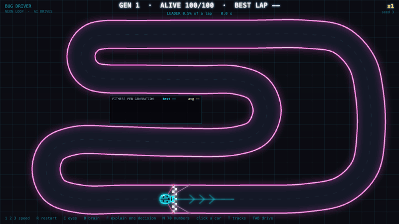

# Build it yourself: a car that teaches itself to drive



> **In 30 seconds**
> - You'll build Bug Driver from an empty folder. It's a little car in your web browser that learns to drive by itself.
> - You won't write the code yourself. You'll give the same instructions we gave to **Claude Code**, an AI assistant that writes and runs code on your computer. These are the real prompts from [PROMPTS.md](PROMPTS.md), in order.
> - Each chapter has the prompt to paste, what you should see, a checkpoint to tell you it worked, and the one or two ideas it teaches.
> - No experience needed. Every new word is explained the first time it appears.
> - Plan on 4 to 8 hours, over a few sittings.

**How to read a chapter.** Every chapter has the same parts:

- **Paste this:** the prompt. It's the real text from PROMPTS.md. Where we had to change something for you (our project had a video, a GitHub account and files you don't have), the prompt says *(adapted)*. A list right under it shows every change: what was removed, and what was replaced with what. Everything else is word for word.
- **What you should see:** what the game looks like afterwards. The `[SCREENSHOT: …]` spots are where pictures will go.
- **Checkpoint:** a quick test. If your game passes it, you're on track.
- **Yours will differ / should look similar:** your car learns from random numbers, and your Claude Code writes its own code. Your numbers won't match the video's, so each chapter says which ones will differ and what should still look the same.
- **What you just learned:** the idea behind the step, in a sentence or two.

The [beginner guide](HOW-IT-WORKS.md) explains *why* everything works. This one is about *doing* it.

---

## 0. Before you start

### What you need

- **A computer** with macOS, Windows or Linux. Claude Code lists its exact requirements (operating system versions, memory) on its [official setup page](https://code.claude.com/docs/en/setup). Check there before you start.
- **An internet connection.** Claude Code runs on Anthropic's servers, so it needs to be online.
- **Node.js, version 18 or newer.** Node.js is a program that runs JavaScript (the language of web pages) outside the browser. Claude Code will use it to test your game.
- **Claude Code, with a plan or account that includes it.** Claude Code needs a Claude subscription or an Anthropic API key. An API key is a password that lets a program use Claude, billed by how much you use. Which plans include Claude Code changes over time, so check the [Claude Code overview](https://code.claude.com/docs/en/overview) and the [pricing page](https://claude.com/pricing). We don't quote prices here, because we can't promise they're still right when you read this.
- **Time:** about 4 to 8 hours in total. Some steps run for several minutes while the computer trains 100 cars for 100 generations.

> **Usage costs and limits apply.** Every prompt uses up part of your plan's usage, or costs money on an API key. The bigger steps (chapters 5, 6, 9 and 10 run long experiments) use the most. You may hit a usage limit in the middle of the guide. That's normal: wait for it to reset, then continue where you stopped. Your files stay where they are.

### Open a terminal

A **terminal** is a window where you type commands instead of clicking. You only need a few of them.

- **Mac:** open the app called *Terminal* (search for it with Spotlight, ⌘ Space).
- **Windows:** open *PowerShell* from the Start menu.
- **Linux:** open *Terminal*.

Three commands you'll use:
- `cd folder-name` goes into a folder ("change directory"), and `cd ..` goes back up one.
- `ls` (Mac/Linux) or `dir` (Windows) lists what's in the folder you're in.
- `mkdir folder-name` makes a new folder.

### Install Node.js

Download the version marked **LTS** ("long-term support", the stable one) from [nodejs.org](https://nodejs.org/en/download) and install it. Then open a new terminal and type:

```text
node -v
```

> **Checkpoint 0.1:** it prints something like `v22.11.0`. Any number from 18 up is fine.

### Install Claude Code

Follow the [official setup page](https://code.claude.com/docs/en/setup), which always has the current command. At the time of writing, the page's recommended command was:

- **Mac or Linux:** `curl -fsSL https://claude.ai/install.sh | bash`
- **Windows, in PowerShell:** `irm https://claude.ai/install.ps1 | iex`

Then check it:

```text
claude --version
```

> **Checkpoint 0.2:** it prints a version number. If it says "command not found", close the terminal, open a new one, and try again.

### Git (recommended)

**Git** keeps save points of your project. Each save point is a **commit**: a snapshot of every file, with a short note saying what changed. If Claude Code ever breaks something, you can go back to the last commit. Claude Code makes the commits for you. You just need git installed:

- **Mac:** type `git --version`. If git isn't installed, the Mac offers to install it for you; say yes.
- **Windows:** install it from [git-scm.com](https://git-scm.com/downloads).
- **Linux:** it's usually already there. If not, install the `git` package.

### Make your project folder and start Claude Code

```text
mkdir bug-driver
cd bug-driver
claude
```

The first time, Claude Code asks you to log in. Follow its instructions.

You now have Claude Code waiting for a message, inside an empty folder. Everything it creates goes into this folder.

> **Checkpoint 0.3:** type `hello` and press Enter. Claude Code answers. Ask it "which folder are we in?", and it names your bug-driver folder.

### How working with Claude Code goes

- You paste a prompt and press Enter. Claude Code plans, writes files and runs commands.
- **It asks before it acts.** When it wants to create a file or run a command, it asks you first. Read what it wants to do. For this project, saying yes is fine as long as it stays inside your bug-driver folder.
- **Wait until it's finished.** Long steps can take a while. It tells you when it's done, and usually what it built and what it found.
- **It may ask you a question.** Answer in plain words.
- **If something looks wrong, just say so**, the way you'd tell a friend: "the car is too small to see". Chapter 3 is two prompts of exactly that kind.
- **Starting fresh is fine.** You can close Claude Code and start it again later in the same folder (`cd bug-driver`, then `claude`). It reads the project's rules file, CLAUDE.md, every time, so the rules carry over.

### How to play your game

From chapter 2 on there's a game to look at. Open a **second** terminal window and go into the folder (`cd bug-driver`), then type:

```text
npx serve
```

`npx` runs a small tool without installing it. `serve` is a tiny web server: a program that hands your game's files to your browser, like a website would. It prints an address such as `http://localhost:3000`. **localhost** means "this computer". Open that address in Chrome, Firefox, Edge or Safari. Leave this terminal running while you play. After each chapter, reload the page to see the newest version.

Why not just double-click `index.html`? Browsers don't let a page opened straight from a file load the other files it needs (its "modules"), so the game would stay blank.

> **Yours will differ:** nothing yet.
>
> **Should look similar:** an empty folder, and Claude Code running in it.

---

## 1. The project and its rules

The first prompt doesn't build any game yet. It writes the project's **rules** into a file called CLAUDE.md. Claude Code reads this file every time it starts, so the rules work like its memory for this project: plain JavaScript only, everything explained in plain English, honest numbers.

### Paste this *(adapted from [PROMPTS.md entry 1](PROMPTS.md#1-project-setup))*

```text
We're starting a small project. Don't build the game yet — only set up the project.

Make this folder its own git repo.

Files:
- CLAUDE.md, the rules for this project:
  - What it is: a small car that learns to drive by itself in the browser (neural network + genetic algorithm).
  - Plain HTML5 + Canvas + vanilla JS, ES modules, no frameworks, NO ML libraries. The neural network and the evolution are written from scratch and must stay readable, because I want to understand them.
  - Every core idea (sensor/ray, neuron, layer, activation, fitness, selection, crossover/mutation, generation) lives in a clearly named function with a one-line plain-English comment.
  - Deterministic: one seeded RNG for everything (initial brains, mutations, spawns). Same seed = same evolution. Never Math.random().
  - ?autoplay=1&seed=N runs hands-free.
  - Numbers shown on screen (sensor distances, weights, outputs, fitness) must be the real values from the simulation, never decorative.
  - One commit per feature/fix.
  - After every prompt I send, append to PROMPTS.md: the prompt verbatim, then 2–3 lines on what was built and what broke. Never edit earlier entries.
  - After every commit, add a DEVLOG.md entry with real numbers (generation, best distance/lap time, how many cars finished).
  - Be honest: never invent or exaggerate problems for drama. If nothing broke, write "nothing broke". Corrections are new commits, never rewritten history.
  - The game must stay playable after every commit.
  - Visual style: neon (dark background, cyan hero, glowing pixel look). The car is a small bug-shaped car.
- README.md: one paragraph placeholder.
- PROMPTS.md and DEVLOG.md with headers only. Add this very prompt as the first PROMPTS.md entry.
- LICENSE: MIT, with my name.
```

**Changes from the original:**
- "We're starting episode 02 of CodeMask." → "We're starting a small project."
- The whole first section (create ~/Desktop/bug-driver, set CodeMask as the git author, create a private GitHub repo and push to it) → "Make this folder its own git repo." You don't need GitHub; your project stays on your computer.
- Removed from "What it is": "for a 'how to' video titled …".
- "because we explain them on screen" → "because I want to understand them".
- Removed: "The beginner guide will link to these by name."
- "?autoplay=1&seed=N runs hands-free for recording footage." → "?autoplay=1&seed=N runs hands-free."
- "One commit per feature/fix, authored as CodeMask." → "One commit per feature/fix."
- Removed from the DEVLOG rule: "Mark moments that would make a good Short with 🎬." (that was for our video).
- "Visual style: CodeMask neon, like Bug Survivor (…)" → "Visual style: neon (…)".
- "LICENSE: MIT, 'CodeMask'." → "LICENSE: MIT, with my name."

**Words in this prompt:**
- **Canvas:** the part of a web page a program can draw on.
- **Vanilla JS:** plain JavaScript, with no extra libraries.
- **ES modules:** splitting the code into several files that use each other.
- **Seeded RNG:** a random-number generator that gives the same "random" numbers every time you start it from the same number, the **seed**.
- **Neural network** and **genetic algorithm:** come in chapters 5 and 6.

### What you should see

Claude Code creates five files: CLAUDE.md, README.md, PROMPTS.md, DEVLOG.md and LICENSE. It also makes a first commit.

[SCREENSHOT: the project folder with the five files, and CLAUDE.md open, showing the rules]

> **Checkpoint 1:** open CLAUDE.md (any text editor will do). It lists the rules above. In the terminal, `git log --oneline` shows one commit.

> **Yours will differ:** the exact wording and layout of CLAUDE.md, and the commit message.
>
> **Should look similar:** the same rules, in a file Claude Code will read every time.

**What you just learned:** you write the rules down once, in CLAUDE.md, and Claude Code follows them in every later step. *Deterministic* means the same seed always gives the same result. That will let you replay and compare runs exactly.

---

## 2. A track and a car you can drive

Now the actual game. First three more rules, then a race track and a car you drive with the arrow keys. No AI yet: you're the driver.

### Paste this *(adapted from [PROMPTS.md entry 2](PROMPTS.md#2-three-new-rules-then-step-1-a-track-and-a-car-i-can-drive))*

```text
First, two additions to CLAUDE.md (one commit, "docs: ..."):
- Fixed timestep: the simulation advances in fixed steps of 1/60 s, independent of the frame rate and rendering. Determinism must hold on any monitor.
- Simulation and rendering are separate. The simulation can run at x1, x10, and "max" (no rendering, as fast as possible), and headless in Node for tests and benchmarks.

Then, Step 1: a track and a car I can drive myself.

- One closed-loop track on a dark neon canvas: two glowing wall lines (inner and outer), a few real turns including one tight hairpin, a start/finish line. The whole track fits on screen.
- Store the track as data (an ordered list of centerline points plus a width), so later we can add more tracks and encode a track into a share link.
- Invisible checkpoints along the track, in order. They'll be used later to measure how far a car got, and they make sure a lap only counts if you drive the whole loop in the right direction.
- The car: small bug-shaped car, cyan, pixel-neon style, with simple arcade physics: acceleration, braking, steering that depends on speed, a bit of friction. It should feel fun to drive with arrow keys/WASD, not floaty, not twitchy.
- Hitting a wall = crash: the car stops, a short neon spark, "CRASHED" and R to restart. No sliding along walls.
- HUD: current lap time, best lap, lap counter. Best lap is saved in localStorage.
- Record my inputs every step during each lap, so my best lap can be replayed later as a "ghost" (we'll need it for the race). Store the best lap's inputs, not positions.

Before committing: drive it yourself with synthetic inputs, check that a full lap counts, a wrong-way or shortcut lap doesn't, and crashing works. Tell me your best lap time from a scripted driver, so I know what a decent time looks like. Update PROMPTS.md and DEVLOG.md as the rules say.
```

**Changes from the original:**
- "three additions" → "two additions".
- Removed the third rule: "PROMPTS.md is public and English-only: …" (our prompts were partly in another language, and our PROMPTS.md is public. Yours is your own).

**Words in this prompt:**
- **Fixed timestep:** the game world moves forward in equal small steps (60 a second), whatever your screen does. That's what makes replays exact.
- **Rendering:** drawing the picture.
- **Headless:** running without any picture, just the numbers. Fast, and good for tests.
- **HUD:** the text on top of the game (times, counters).
- **localStorage:** a small notebook your browser keeps for each website.
- **Synthetic inputs** / **scripted driver:** Claude Code drives the car with a little program instead of a keyboard, to test it.

### What you should see

Start the game (see "How to play your game" in chapter 0) and reload the page. You get a dark track with glowing walls and a small cyan bug car on the start line.

[SCREENSHOT: the track with its hairpin, the car on the start line, and the lap time HUD]

> **Checkpoint 2:**
> - The arrow keys (or WASD) drive the car.
> - Hitting a wall stops it with a spark and "CRASHED", and R restarts.
> - Driving once around in the right direction counts a lap and shows its time.
> - Reload the page: your best lap is still there.
> - Claude Code told you a lap time for its scripted driver.

> **Yours will differ:** the track's shape, the car's look, and the lap times. Our scripted driver did 17.20 s carefully and 12.88 s at its fastest. Yours depends on your track.
>
> **Should look similar:** a loop with one tight hairpin; a car that's fun to steer; a lap that only counts when you drive all the way round.

**What you just learned:**
- The track is just data: a list of points and a width. The walls and the invisible **checkpoints** (lines across the road) are computed from it.
- The game moves in fixed steps of 1/60 s. That's why a "ghost" can replay your lap exactly: it only needs your key presses, step by step.

---

## 3. Make it yours: two feedback prompts

After our first drive, two things bothered us: the car was hard to see, and the road was too narrow. These two prompts are that feedback. **Use them only if you notice the same thing.** If your car is easy to see and your road wide enough, skip them. And if something else bothers you, describe it in your own words. That is exactly how these prompts started.

### Paste this, if your car is hard to see *(adapted from [PROMPTS.md entry 3](PROMPTS.md#3-the-car-is-hard-to-see))*

```text
Feedback from my first test drive: the car is hard to see.

1. Car readability: make the car about 1.5–2× bigger on screen and clearly a ladybug from above: round shell, a center line, dots, a small head, glowing cyan outline. If the hitbox changes, tell me the new size, and re-run the reference laps so the numbers stay honest.
2. Add a subtle direction arrow or chevrons on the track near the start, so it's obvious which way to drive.

Update PROMPTS.md and DEVLOG.md as usual.
```

**Changes from the original:** removed item 3: "Add to CLAUDE.md: 'DEVLOG/PROMPTS updates go in a separate commit: docs: devlog for <hash>.'" That rule is about how we split commits. You don't need it.

**Words in this prompt:** **hitbox:** the invisible outline the game uses to decide whether the car touched a wall. **Reference laps:** the scripted driver's lap times from chapter 2.

### Paste this, if the road is too tight *(adapted from [PROMPTS.md entry 4](PROMPTS.md#4-the-road-is-too-tight))*

```text
Test drive feedback: steering and physics feel good, keep them exactly as they are. But the road is too tight.

1. Widen the road to about 90 px. Keep the same layout and turns, including the hairpin. If the track no longer fits on screen at 90 px, adjust the layout slightly (shorter straights or a smaller loop) rather than shrinking the road. Tell me what you changed.
2. Bump PHYSICS_VERSION (old records and ghosts become invalid), move the checkpoints to the new centerline, and re-run the reference laps (cautious, fastest, and how many of the scripted settings crash) so I can compare with the old width.
3. Don't touch the car physics or the hitbox.

Update PROMPTS.md and DEVLOG.md as usual.
```

**Changes from the original:**
- "Widen the road from 64 px to about 90 px." → "Widen the road to about 90 px." (your road may not be 64 px).
- "crash count out of the same 980 settings" → "how many of the scripted settings crash" (980 was how many settings our scripted driver tried; yours may try a different number).
- "compare with 64 px" → "compare with the old width".

**Words in this prompt:**
- **px** (pixels): the tiny dots a screen is made of.
- **PHYSICS_VERSION:** a version number for "how the car moves". When it changes, old lap records no longer count, because they were driven under different rules.

### What you should see

A bigger, clearly bug-shaped car, chevrons (arrows) pointing the way past the start line, and a wider road.

[SCREENSHOT: the bigger ladybug car on the wider road, with the chevrons past the start line]

> **Checkpoint 3:** the car is easy to follow while you drive. The road is wider, but the car steers exactly as before. Claude Code reported new reference lap times, and told you your old best lap no longer counts.

> **Yours will differ:** whether you needed these prompts at all, and the numbers. Our 90 px road gave 17.25 s careful and 12.68 s fastest, with 543 of 980 scripted settings crashing.
>
> **Should look similar:** feedback in plain words is enough; Claude Code turns it into changes.

**What you just learned:** you don't have to know *how* to fix something, only to describe what's wrong. And a version number for the physics keeps records honest: a lap driven under old rules never gets compared with laps under new ones.

---

## 4. Freeze the physics, give the car eyes

From here on, the car's physics and the track stay exactly as they are. Every later comparison (you against the AI, generation against generation) depends on that. Then the car gets "eyes": five invisible feelers that measure how far away the walls are.

### Paste this *(adapted from [PROMPTS.md entry 5](PROMPTS.md#5-physics-freeze-then-step-2-give-the-car-eyes))*

```text
Physics freeze: the car physics, hitbox, track and the current PHYSICS_VERSION are now final. Add to CLAUDE.md: "Physics and track are frozen at the current PHYSICS_VERSION. Do not change them without asking me first: any change invalidates my ghost lap and all training." Commit that separately.

Then, Step 2: give the car eyes.

- Add 5 distance sensors (rays) fanned out in front of the car: −60°, −30°, 0°, +30°, +60° from the heading, each up to 200 px long. Each ray reports the distance to the nearest wall along it (200 if nothing within range).
- Put this in clearly named functions with one-line plain-English comments, e.g. castRay() ("how far can the car see in one direction") and readSensors() ("the car's whole view of the world: 5 numbers").
- Also define the brain's future input now: the 5 distances normalized to 0..1 (1 = wall touching the car, 0 = nothing in range), plus the car's speed normalized to 0..1. That's 6 numbers, the only things the car will ever know. Function: getInputs(), with a comment saying so.
- Visuals: draw the rays as thin glowing lines from the car, turning from cyan (far) to pink-red (close), with a small dot where each hits the wall.
- Explain overlay: press E to toggle. When on, each ray shows its real distance in px next to the hit point, and a small panel lists the 6 input values with labels (left 60°, left 30°, ahead, right 30°, right 60°, speed). These are the exact numbers the brain will get. When off, just the rays.
- Rays are visual and informational only: they must not change the physics, the ghost, or determinism.

Check: drive a scripted lap and confirm the ray distances are right at a few known spots (straight in the middle of the road: side rays symmetric; facing a wall up close: front ray small). Tell me those numbers. Update PROMPTS.md and DEVLOG.md.
```

**Changes from the original:**
- "the car physics, hitbox, track (90 px) and PHYSICS_VERSION 3 are now final" → "the car physics, hitbox, track and the current PHYSICS_VERSION are now final". Your width and version number may be different.
- "frozen at PHYSICS_VERSION 3" → "frozen at the current PHYSICS_VERSION".
- Removed: "The beginner guide will link to these."
- Removed: "and mark a 🎬 if the E overlay looks good for a Short" (that was for our video).

**Words in this prompt:**
- **Ray:** a straight line shot out from the car until it hits a wall, like a whisker.
- **Normalized to 0..1:** squeezed into the range from 0 to 1, so every input is on the same scale.
- **Overlay:** extra information drawn on top of the game.

### What you should see

Five thin lines fan out from the front of the car and change colour as you get close to a wall. Press E, and each line shows its distance, with a panel of the 6 input numbers.

[SCREENSHOT: the car with its 5 rays and the E panel showing the 6 inputs]

> **Checkpoint 4:**
> - On a straight, in the middle of the road, the left and right rays show about the same distance.
> - Drive slowly at a wall: the front ray's number shrinks, and its input in the E panel climbs towards 1.
> - All 6 inputs always stay between 0 and 1.
> - The car still drives exactly as before.

> **Yours will differ:** the exact distances at any spot.
>
> **Should look similar:** symmetric side rays in the middle of a straight; an input near 1 when a wall is very close.

**What you just learned:** the car's whole view of the world is 6 numbers: 5 distances and its speed. Everything it will ever "decide" comes from those. Freezing the physics now keeps every later comparison fair.

---

## 5. A brain, and 100 cars with random brains

Now the AI part begins. Each car gets a tiny **neural network**, a "brain" that turns the 6 input numbers into 4 key presses: gas, brake, left, right. At first the brains are completely random, so 100 cars do 100 random things.

### Paste this *(adapted from [PROMPTS.md entry 6](PROMPTS.md#6-step-3-a-brain-and-100-cars-with-random-brains))*

```text
Step 3: a brain, and 100 cars with random brains. No evolution yet — this step is only about generation 1.

The brain (from scratch, in its own file, every function with a one-line plain-English comment):
- A tiny neural network: 6 inputs (from getInputs) → 6 hidden neurons (tanh) → 4 outputs (sigmoid).
- The 4 outputs are the same 4 keys I press: gas, brake, left, right. An output above 0.5 means that key is held this step. The AI drives with exactly my controls, no special powers.
- That's 70 numbers in total (weights + biases). Keep them in one flat array, so "the whole brain is 70 numbers" is literally true in the code, and later evolution can copy and mutate that array.
- Clearly named functions: neuron() ("multiply each input by its weight, add them up, add the bias, squash"), layer(), think(inputs) → which keys to press. Initial weights: seeded random in −1..1.

The population:
- 100 cars start together on the start line. They don't collide with each other, only with walls.
- A car is out when it crashes, or when it makes no progress (no new checkpoint) for 3 seconds, so cars spinning in place or driving backwards don't run forever. A generation ends when every car is out, or after 60 seconds.
- Progress for now = number of checkpoints passed in the right order, plus a fraction toward the next one. Name it fitness() with a plain-English comment. Show the current leader highlighted (brighter, slightly bigger), the rest semi-transparent. Crashed cars stay where they crashed as dim wrecks: generation 1 should look like glorious chaos.
- HUD in AI mode: generation number, cars still alive (e.g. "ALIVE 37/100"), leader's progress in %.

Modes and speed:
- A toggle between "I drive" and "AI drives" (key: Tab). My manual mode, lap timer and ghost recording stay exactly as they are.
- Speed keys in AI mode: 1 = x1, 2 = x10, 3 = max (no rendering until the generation ends).
- ?autoplay=1&seed=N starts straight in AI mode.
- The E explain overlay also works in AI mode for the leader: its rays, its 6 inputs, and its 4 outputs as numbers with the pressed keys lit.

Check, headless: run generation 1 for seeds 1–5 and report for each: how many cars barely moved, how many went backwards, how many crashed in the first 2 seconds, the best progress %, and how the best car got out (crash or stall). Don't change anything based on those numbers — they're the honest starting point. Update PROMPTS.md and DEVLOG.md.
```

**Changes from the original:** removed ", and 🎬-mark the best-looking chaos seed" at the end.

**Words in this prompt:**
- **Neuron:** takes some numbers, multiplies each by its own **weight** (how much that number counts), adds them up, adds one more number (the **bias**), then "squashes" the total into a small range.
- **tanh** and **sigmoid:** the two squash functions. tanh gives −1 to 1, sigmoid gives 0 to 1.
- **Hidden neurons:** the ones in the middle, between inputs and outputs.
- **Fitness:** a score for how well a car did. Here: how far it got.
- **Seed 1–5:** five different starting points for the random numbers.

### What you should see

Press Tab: 100 cars appear on the start line and drive off in all directions. Most stop or crash within seconds, the ALIVE counter drops fast, and maybe one lucky car gets a long way round.

[SCREENSHOT: generation 1, with 100 cars in chaos around the start and the HUD showing ALIVE dropping]

> **Checkpoint 5:**
> - Tab switches between you driving and the AI driving, and the arrow keys still work in your mode.
> - In AI mode the HUD shows the generation (1), ALIVE n/100 and the leader's %.
> - Within a few seconds most cars have stalled or crashed. The cars that stalled drop out together after 3 seconds without progress.
> - Keys 1, 2, 3 change the speed.
> - Claude Code reported a small table for seeds 1 to 5.

> **Yours will differ:** every count. In our seed 3, 76 cars barely moved and the three-second rule took them out, and 24 drove into a wall. Our best car per seed got 14.5% to 65.1% of the way round.
>
> **Should look similar:** glorious chaos. Almost no car gets far, and one or two get much further than the rest by pure luck.

**What you just learned:** a neural network is just multiplying and adding, then squashing. The car's whole brain is 70 numbers: 36 + 6 + 24 + 4 weights and biases. With random numbers you get random driving, and that's the starting point evolution needs.

---

## 6. Your ghost lap, then evolution

Two things in this chapter. First you save your own best lap as a file, so the AI can race it later. Then **evolution**: the best cars of each generation become the parents of the next, with a few small random changes. Generation after generation, the cars get better, and nobody writes a single driving rule.

### 6a. Save your best lap

Drive a few laps (manual mode, Tab back if needed) until you have a lap you're happy with. Then:

### Paste this *(written for this guide; see the note below)*

```text
Add a key G in manual mode that downloads my best lap as a ghost file (start state + all inputs + lap time + PHYSICS_VERSION), named me-ghost.json. I'll press G and tell you where the file went. Then move it into ghosts/me.json and commit it. From now on the scoreboard uses this file, not localStorage. Verify by replaying it headless and confirming it reproduces the same lap time to the step.
```

Press G in the game, then tell Claude Code where the file went, the way we did in [entry 13](PROMPTS.md#13-my-exam-ghost) (our message was only the path). On a Mac it's usually something like:

```text
'~/Downloads/me-ghost.json'
```

**Why this prompt is different:** our original ([entry 7](PROMPTS.md#7-export-my-ghost-then-step-4-evolution), its last paragraph) said "export my current best lap … from localStorage into a file". Our Claude Code then read the lap straight out of the browser's own storage files on disk. That depends on your browser and your system, so here the game gets a download key instead. It's the same idea we used later for the Exam track (entry 10, "a ghost download (G)"). The rest of the sentence ("From now on … to the step") is word for word.

> **Checkpoint 6a:** ghosts/me.json exists, and Claude Code says that replaying it gives exactly your lap time.

### 6b. Evolution

### Paste this *(adapted from [PROMPTS.md entry 7](PROMPTS.md#7-export-my-ghost-then-step-4-evolution))*

```text
Step 4: evolution.

How a new generation is made (each step its own clearly named function with a one-line plain-English comment):
- fitness(): how far the car got along the track (checkpoints in order + fraction to the next). If it completed a lap, add a bonus that's bigger the faster the lap. In plain English: "go as far as you can; if you finish, finish fast."
- selection(): rank all 100 by fitness and keep the top 10 as parents.
- elitism: the single best car's brain goes to the next generation unchanged, so the best can never get worse.
- mutate(): every child is a copy of one parent's 70 numbers (parents picked weighted by rank), where each number has a 10% chance to be nudged by a small seeded random amount (gaussian, sigma 0.3). No crossover. Keep it simple enough to explain in one sentence.
- nextGeneration(): puts it together: 1 elite + 99 mutated children.
- Everything uses the one seeded RNG: same seed = the exact same evolution, generation by generation.

Tracking:
- Per generation: best fitness, average fitness, how many cars finished a lap, best lap time. Show a small live chart in the corner (best and average over generations) and "GEN 12 · ALIVE 37/100 · BEST LAP 15.42" in the HUD.
- Every car remembers its parent's id, so we can later draw the champion's family tree.
- Save the champion's 70 numbers at generations 1, 5, 10, 20, 40 and 80 into a champions JSON file (and localStorage in the browser). We'll race these against my ghost later. Use the generation number only, never pick "nice-looking" ones.
- When the leader finishes its first ever lap, flash "FIRST LAP — GEN N".

Check, headless, and don't tune anything based on it:
- Run seeds 1–5 for 100 generations each. For every seed report: the generation of the first completed lap, the best lap time at generations 1, 5, 10, 20, 40, 80, 100, and how long the run took in Node.
- Compare with the reference laps.
- If a seed has no completed lap by generation 100, say so plainly: per our rules that's the story, not something to fix quietly.
- Tell me which seed you'd suggest as my "official" one and why, using only these numbers.

Update PROMPTS.md and DEVLOG.md.
```

**Changes from the original:**
- "Tracking (for the video and the guide):" → "Tracking:".
- Removed "(🎬 moment)" after the first-lap flash.
- "Compare with the reference laps (cautious 17.25 s, fastest scripted 12.68 s, theoretical floor 11.93 s)." → "Compare with the reference laps." Those were our numbers; Claude Code knows yours.
- "as the 'official' one for the video and why" → "as my 'official' one and why".
- "Update PROMPTS.md and DEVLOG.md, 🎬-mark the first-lap moment for the official seed." → "Update PROMPTS.md and DEVLOG.md."
- Removed the last paragraph (exporting the ghost). Step 6a did that.

**Words in this prompt:**
- **Generation:** one round of 100 cars driving.
- **Selection:** keeping the best.
- **Elitism:** copying the very best unchanged.
- **Mutation:** a small random change, like a typo when copying.
- **Crossover:** mixing two parents. Not used here, to keep things simple.
- **Gaussian, sigma 0.3:** the random nudges are usually small (around 0.3) and only rarely big.
- **Champion:** the best car of a generation.

> **This step takes a while.** Training 5 seeds for 100 generations each ran for about 5 to 6 minutes per seed on our laptop. Let Claude Code run it. It also uses more of your usage than a short prompt.

### What you should see

Press Tab, then 2 (×10). The HUD now says GEN and BEST LAP, and a small chart in the corner climbs as the generations go by. At some point "FIRST LAP — GEN N" flashes.

[SCREENSHOT: the HUD "GEN 12 · ALIVE … · BEST LAP …" and the climbing fitness chart]

[SCREENSHOT: the "FIRST LAP — GEN N" flash]

> **Checkpoint 6b:**
> - In AI mode the generation number goes up by itself, and the chart's best line rises.
> - Within a few to a few dozen generations, one car finishes a whole lap.
> - After that, the best lap time keeps falling: fast at first, then more and more slowly.
> - Claude Code's report has a row for each of the 5 seeds.
> - Restart with the same seed (`?autoplay=1&seed=3`, say): the same thing happens again, exactly.

> **Yours will differ:** when the first lap comes, how fast the cars get, and which seed is best. Our seed 3 first finished a lap in generation 4 (38.18 s) and reached 12.47 s by generation 80. Our seed 1 never finished a lap at all in 100 generations; it got stuck at the hairpin. If one of yours gets stuck too, that's a real result, not a bug.
>
> **Should look similar:** no lap at first, then a first lap, then quick improvement that slows down. At least one seed should end up faster than your own lap.

**What you just learned:** evolution is only three steps, repeated: score every car, keep the best, copy them with small random changes. Nobody tells the car how to take a corner. Because everything runs on a seed, a run can be repeated exactly.

---

## 7. Watch the brain think

The cars drive well now, but how? This chapter makes the brain visible: every connection, every number, and the full calculation behind one single decision.

### Paste this *(adapted from [PROMPTS.md entry 8](PROMPTS.md#8-step-5-let-us-see-the-brain-think))*

```text
Step 5: let us see the brain think.

1. Live brain panel (toggle with B), for the leader, or any car I click on:
   - 6 input nodes on the left with labels and live values (left 60°, left 30°, ahead, right 30°, right 60°, speed), 6 hidden nodes, 4 output nodes on the right labeled GAS, BRAKE, LEFT, RIGHT.
   - Connections drawn for all weights: thickness = how big the weight is, cyan = positive, pink = negative.
   - Nodes glow by their current value. An output node lights up fully when its key is pressed (> 0.5).
   - It's the real network from brain.js, drawn every frame from the real numbers. Nothing faked or smoothed.

2. "Explain one decision" (key F): freezes the simulation and shows, for one output (cycle with ←/→), the full calculation in plain numbers:
   each input × its weight, the sum, + bias, → squash → final value → "pressed" or "not pressed".
   Do it for one hidden neuron too (it feeds the output), so the whole path from "the wall is 43 px away" to "press LEFT" is on screen. Unfreeze with F again.
   Every number shown must equal what think() actually computed in that step. Add a test that checks this for 100 random frames, to 1e-9.

3. The 70 numbers (key N): a compact grid of all 70 weights/biases of the selected brain, colored cyan/pink by sign and brightness by size. Two brains can be shown side by side, e.g. my official seed's champion of generation 1 vs generation 80, so you can see "same shape, different numbers".

4. Champion viewer: load any saved champion (seed + generation) and run it alone on the track, with rays and brain panel. URL: ?champion=3-40 and a small picker in the UI. Show its lap time when it finishes, and it must match the time recorded during evolution exactly.

Determinism must stay intact (panels are read-only). Update PROMPTS.md and DEVLOG.md.
```

**Changes from the original:**
- "e.g. the seed 3 champion of generation 1 vs generation 80" → "e.g. my official seed's champion of generation 1 vs generation 80". (`?champion=3-40` stays as an example of the format: seed 3, generation 40. Use your own seed.)
- Removed item 5 (it recorded our official seed and scoreboard in our video's plan file).
- Removed ", 🎬-mark the best 'explain one decision' frame (…)".

**Words in this prompt:** **node:** one circle in the drawing, one neuron or input. **Frame:** one picture of the animation, one step of the game. **1e-9:** 0.000000001; "to 1e-9" means the shown numbers and the real ones agree to at least 9 decimal places.

### What you should see

[SCREENSHOT: the B panel, with 6 inputs, 6 hidden nodes, 4 outputs and cyan/pink connections of different thickness]

[SCREENSHOT: the F freeze, the calculation for one output, from inputs × weights to "pressed"]

[SCREENSHOT: the N grid, showing two brains' 70 numbers side by side]

> **Checkpoint 7:**
> - B shows the network, and the output that's lit is the key the car is pressing right now.
> - F freezes the game. Add up the numbers on screen with a calculator: they give the sum it shows.
> - N shows 70 coloured squares.
> - `?champion=<seed>-<generation>` runs one champion alone, and its lap time matches the one recorded during training.

> **Yours will differ:** every weight and every value.
>
> **Should look similar:** a network where a few thick connections dominate, and a decision you can follow from "the wall is close" to "press a key".

**What you just learned:** there's no magic inside: a decision is a few multiplications and additions you could do by hand. The "intelligence" is only in which 70 numbers evolution found.

---

## 8. Race your champion

Time to see how good the AI really is. Your ghost (your saved best lap) and a champion drive at the same time, on the same track, and the game shows who's ahead.

### Paste this *(adapted from [PROMPTS.md entry 9](PROMPTS.md#9-step-6-the-race))*

```text
Step 6, me vs the AI

- Race mode: my ghost (ghosts/me.json) and one saved champion drive their best laps at the same time on the track, each from its own recorded start state. Cars don't collide. Me: cyan ladybug. AI: yellow ladybug. Label both ("ME", "GEN 10").
- On screen during the race: elapsed time, live gap ("AI +3.2 s ahead"), and a big result at the finish ("AI WINS by 13.23 s" / "ME WINS by 3.62 s").
- If the champion never completed a lap (e.g. generation 1), it drives until it crashes or stalls, and I win by default. Show where it got out.
- Best lap vs best lap on both sides, and say so in small print in the UI. A champion races its best lap, not its standing-start first lap.
- Scoreboard screen (key S, and URL ?scoreboard=N for seed N): the 6 fixed generations of my official seed (1, 5, 10, 20, 40, 80), my time, its time, the winner of each row, and the running total. Built only from the saved files, nothing typed in by hand.
- URLs for recording: ?race=3-10 (seed 3, gen 10 vs me), ?scoreboard=3, plus ?autoplay=1 to start immediately.
- Tests: each race result equals the recorded lap times; the scoreboard total is computed from the files.
- Update PROMPTS.md and DEVLOG.md.
```

**Changes from the original:**
- "# Part 2: Step 6, me vs the AI" → "Step 6, me vs the AI" (our prompt had a Part 1 about the guide).
- "my ghost (ghosts/me-v3.json, 26.40 s)" → "my ghost (ghosts/me.json)".
- "(e.g. seed 3 gen 1)" → "(e.g. generation 1)".
- "The gen 40 champion races its 12.53 s lap, not its standing-start first lap." → "A champion races its best lap, not its standing-start first lap."
- "(key S, and URL ?scoreboard=3): the 6 fixed generations of seed 3 (…) … and the running total → 4:2 AI" → "(key S, and URL ?scoreboard=N for seed N): the 6 fixed generations of my official seed (…) … and the running total".
- "the scoreboard total equals 4:2, computed from the files" → "the scoreboard total is computed from the files".
- Removed: the guide chapter line, and "🎬-mark the race where the AI first beats me (gen 10)".
- The example URLs (`?race=3-10`, `?scoreboard=3`) stay as written: they show the format. Use your own seed number.

**Words in this prompt:** **ghost:** your recorded lap, replayed exactly. **Standing start:** starting from zero speed. A champion's best lap usually starts already moving, at the start line.

### What you should see

[SCREENSHOT: a race: cyan "ME" and yellow "GEN 10" cars on track, the live gap at the top]

[SCREENSHOT: the scoreboard with 6 rows and the running total]

> **Checkpoint 8:**
> - `?race=<seed>-10` starts a race between your ghost and that champion.
> - The gap changes as they drive, and the result says who won and by how much.
> - The scoreboard (S) has six rows and a total.

> **Yours will differ:** the score. In our seed 3, generations 1 and 5 lost to my lap and generation 10 was already faster (4:2 to the AI).
>
> **Should look similar:** early champions lose to you. Somewhere between generation 5 and 40 a champion beats you, and after that the later ones beat you by more.

**What you just learned:** a fair comparison needs the same start, the same track and the same rules: best lap against best lap. Your lap is a **benchmark**, a fixed yardstick you measure the AI against. It's not about you against the machine.

---

## 9. Did it learn, or memorize?

Your champion is fast on its own track. But does it know how to *drive*, or did it only learn this one track by heart? To find out fairly, you decide on the test **before** you see any result.

### Paste this *(adapted from [PROMPTS.md entry 10](PROMPTS.md#10-step-7a-did-it-learn-or-memorize))*

```text
Step 7a: does the car know how to drive, or did it just memorize one track?

Pre-register first (one commit, before any testing):
- Add 4 new tracks, same format, same road width, same physics. Physics and car stay frozen; these are new tracks, not changes to my first track.
  - "Mirrored": my first track driven the other way round.
  - "Zigzag": many quick left-right turns, no hairpin.
  - "Wide Sweepers": long fast curves, one tight corner at the end.
  - "Exam": a held-out track for later, with a mix of everything, including a hairpin turning the opposite way to my first track's. Nobody trains on Exam, ever.
- Write in DEVLOG, before running anything: the 4 tracks, that Zigzag + Wide Sweepers will be the extra training tracks in Step 7b, that Exam is held out, and the exact tests below. Commit with the track data's SHA-256 in the message. After this commit the tracks never change.

Then test, and don't change anything based on the results:
- Run every saved champion of my official seed (gens 1, 5, 10, 20, 40, 80) alone on each new track. Report for each: lap time, or how far it got (%) and how it got out (crash/stall, where).
- Also the gen 80 champions of the other seeds, for comparison.
- Show me the most telling failure: ideally the champion that beat me crashing on a track it has never seen.

Me on the Exam track:
- Add Exam as a drivable track in manual mode (track picker), with its own lap timer and ghost recording, saved to ghosts/me-exam.json. I'll drive it for the first time, and my best of my first 3 laps counts. Don't show me any AI result on Exam before I drive.

Update PROMPTS.md and DEVLOG.md. Report the results table and tell me when Exam is ready for me to drive.
```

**Changes from the original:**
- "same road width (90 px)" → "same road width".
- "not changes to Neon Loop" → "not changes to my first track". Our first track is called Neon Loop; yours may have no name.
- "'Neon Loop Mirrored': Neon Loop driven the other way round (clockwise)." → "'Mirrored': my first track driven the other way round."
- "the opposite way to Neon Loop's" → "the opposite way to my first track's".
- "Run every saved seed 3 champion" → "Run every saved champion of my official seed".
- "the gen 80 champions of seeds 2, 4 and 5" → "the gen 80 champions of the other seeds".
- "Screenshot or record the most telling failure (🎬): ideally the champion that beat me by 14 s crashing in the first corner of a track it has never seen." → "Show me the most telling failure: ideally the champion that beat me crashing on a track it has never seen."
- Removed the paragraph about writing guide chapter 7 in both levels.

**Words in this prompt:**
- **Pre-register:** write down what you'll test, and how, before you test it, so a result can't change the question afterwards.
- **Held out:** kept aside; the cars never train on it, so it's a real test.
- **SHA-256:** a fingerprint of the track data; if anyone changed a single number, the fingerprint would change.

### What you should see

Press T in manual mode: a track picker with 5 tracks. DEVLOG.md has the pre-registration *above* the results.

[SCREENSHOT: the track picker with the 5 tracks]

[SCREENSHOT: a champion on the mirrored track, at the moment it fails]

> **Checkpoint 9:**
> - DEVLOG.md has a pre-registration entry. In `git log`, its commit comes before the results.
> - Claude Code reported a table: every champion on every new track.
> - Exam is drivable, and no AI result for it was shown yet.

> **Yours will differ:** which tracks your champions can drive, and where they fail. Ours drove Zigzag and Wide Sweepers fine, but every generation 80 champion failed the mirrored hairpin. The crash in the first corner we expected never happened. Your champions may fail somewhere else, or not at all. If they drive everything fine, that's your honest result.
>
> **Should look similar:** the champions are fastest on the track they trained on, and the best one there is not always the best on a new track.

**What you just learned:**
- **Overfitting** means learning one thing so well that the learning doesn't carry over. Think of a student who memorized last year's exam answers.
- The only fair way to check is a test the AI never trained on, decided before you look.

---

## 10. The exam, and one more try

Now you drive the Exam track yourself. Then the AI trains on three tracks instead of one, and only then do the champions take the exam.

### 10a. Your Exam lap

Drive Exam (press T, pick Exam). Your first 3 completed laps count. When you're done, the game lets you download your Exam ghost. Then:

### Paste this *(adapted from [PROMPTS.md entry 11](PROMPTS.md#11-my-exam-lap-step-7b-and-the-exam))*

```text
I drove Exam: 3 counted laps, best <your time> s.  ## 1. My Exam ghost Move it to ghosts/me-exam.json, check it's from my first 3 counted laps, and replay it headless to the step. Commit. From now on that's my official Exam time. ## 2. Step 7b, exactly as pre-registered - Train my official seed from scratch for 100 generations on 3 tracks: my first track + Zigzag + Wide Sweepers. Every car drives all 3 tracks; its fitness is the sum of its 3 single-track fitness scores. Everything else (population, top 10, elitism, mutation 10% / sigma 0.3) unchanged. Save champions at gens 1, 5, 10, 20, 40, 80, 100 to a multi-track champions file. - Don't change the training set, the method or the Exam track based on any result. If it fails, that's the result. ## 3. The exam (only now, after my lap is saved) Run on Exam and on Mirrored, and report lap time or how far it got and how it got out: - the old single-track champions of my official seed (gens 10, 20, 80) - the new multi-track champions (gens 10, 20, 80, 100) Then race my Exam ghost (<your time> s) against the best of them: ?race=exam&champion=..., same "best lap vs best lap" rules. ## 4. Write-up - DEVLOG: the results, plainly. If multi-track training doesn't help on Exam, say why it plausibly didn't as "our best explanation". - Update PROMPTS.md.
```

**Changes from the original:**
- "best 21.37 s" and "(21.37 s)" → "best <your time> s" and "(<your time> s)". **Put in your own time.**
- "Train seed 3" → "Train my official seed".
- "Neon Loop + Zigzag + Wide Sweepers" → "my first track + Zigzag + Wide Sweepers".
- "to champions/seed-3-multi.json" → "to a multi-track champions file".
- "on Neon Loop Mirrored" → "on Mirrored".
- "the old single-track seed 3 champions" → "the old single-track champions of my official seed".
- In the write-up, removed the example "(e.g. none of the 3 training tracks has a right-hand hairpin)" and "and that we noticed this risk after Step 7a but kept the pre-registered plan". Both were about our own results.
- Removed "Guide chapter 7 in both levels: add the exam results and the race." and the 🎬 note.
- Our prompt is all on one line (that's how it was sent), so it's kept that way.

**A real mistake, kept in on purpose.** When we sent this prompt, the "21.37 s" was actually a lap on Zigzag, not on Exam. Claude Code noticed this, because there was no Exam ghost file anywhere, and stopped. So the exam waited until a real Exam lap existed. Claude Code checks what you tell it. Make sure your Exam lap really is on Exam.

If your Exam file is in your Downloads folder, tell Claude Code its path, the way we did in [entry 13](PROMPTS.md#13-my-exam-ghost) (this is the whole prompt, word for word, except that it's your path):

```text
'~/Downloads/me-exam.json'
```

> **Checkpoint 10a:**
> - ghosts/me-exam.json exists and replays to exactly your lap time.
> - The 3-track training ran for 100 generations, and its champions are saved.
> - The exam table covers both the old and the new champions, on Exam and on Mirrored.
> - A race against your Exam ghost ran.

### 10b. One more try (only if your exam calls for it)

We added this step *after* seeing our exam result: every 3-track champion crashed in Exam's right-hand hairpin, and none of our 3 training tracks had one. If your exam shows a clear gap like that, you can do the same. Decide it now, say so openly, and pre-register it again. If your exam went fine, skip it.

### Paste this, if you decide to *(adapted from [PROMPTS.md entry 14](PROMPTS.md#14-step-7c-one-more-try-decided-after-the-exam))*

```text
Step 7c, decided after seeing the exam, and we'll say so openly.

Pre-register in DEVLOG first (commit before training):
- Why: <what your exam showed, in one sentence>.
- Plan: train my official seed from scratch for 100 generations on 4 tracks: my first track, Mirrored, Zigzag, Wide Sweepers. Fitness = sum of the 4. Everything else unchanged. Champions at gens 1, 5, 10, 20, 40, 80, 100 → a 4-track champions file.
- Test: those champions on Exam, once, after training. Exam is still never trained on. Note that this is the second time Exam is used for testing.
- Whatever happens is the result. No retries, no tuning.

Then run it, report the table (all 4 training tracks + Exam), race my Exam ghost against the best on Exam. Update PROMPTS.md and DEVLOG.md.
```

**Changes from the original:**
- "Why: Exam showed every multi-track champion crashing in the right-hand hairpin, and none of the 3 training tracks has one." → "Why: <what your exam showed, in one sentence>."
- "train seed 3" → "train my official seed"; "Neon Loop, Neon Loop Mirrored, Zigzag, Wide Sweepers" → "my first track, Mirrored, Zigzag, Wide Sweepers"; "→ champions/seed-3-multi4.json" → "→ a 4-track champions file".
- Removed "and add it to chapter 7 in both guides" and the 🎬 note.

[SCREENSHOT: the exam table, single-track vs multi-track champions on Exam]

[SCREENSHOT: the Exam race, your ghost against the best champion]

> **Yours will differ:** whether training on more tracks helps, and by how much. For us, training on 3 tracks did **not** help on Exam (all 3-track champions crashed there). Training on 4 tracks, Mirrored included, did: that champion drove Exam cleanly and beat my Exam lap by 18.77 s.
>
> **Should look similar:** a car does best on the kinds of turns it has practised. When a test exposes a gap, the fix is better practice, and you decide it before you look again.

**What you just learned:** the honest way to improve after a test is to say what you saw, change one thing, write the plan down first, and test again once. Training on more varied tracks is how a car learns to *drive*, not just to remember one road.

---

## 11. Make your own track

Last step: a track editor, so you (and anyone you send a link to) can build new tracks and see how the champions cope.

### Paste this *(adapted from [PROMPTS.md entry 12](PROMPTS.md#12-step-8-things-for-viewers))*

```text
Exam rule first: until my ghosts/me-exam.json exists, nothing in this step may run any AI car on the Exam track, and Exam must not appear in the editor, in share links or in any test that runs a brain on it.

Step 8: things for viewers.

1. Track editor (key T opens a picker, plus an "Edit / new track" button):
   - Draw a closed loop by clicking points; drag points to adjust; the road width is fixed (physics stays frozen).
   - Live validation with a plain message: road crosses itself, a turn is too tight for the car, the track doesn't fit on screen. Can't drive or train until it's valid.
   - Start line and direction are set automatically at the first point; checkpoints are generated like on our tracks.

2. Share links:
   - Encode a track into the URL (compact and URL-safe, e.g. ?t=...), so a link opens exactly that track. Decode with validation; a broken link shows a friendly error, never a crash.
   - "Copy link" button. Also a link for "my track + this champion", so someone can share "watch my car fail on your track".

3. On any track (built-in or custom):
   - Drive it yourself (lap timer, ghost).
   - Test a saved champion on it (pick seed + generation, including the multi-track ones).
   - Train from scratch on it, live, with the speed keys and the chart, in the browser. Seeded, so the same track + seed gives the same result.

4. Replay check: tools/replay-check.js runs a fixed set of scenarios headless (my ghost, three champion laps, 3 generations of my official seed's evolution, one custom track from a share link) and compares against stored golden results. Add --update for intentional changes. Every future step must keep it green.

Update PROMPTS.md and DEVLOG.md.
```

**Changes from the original:**
- Removed the "Small guide fixes" paragraph (it fixed wording in our guide).
- "the road width is fixed at 90 px" → "the road width is fixed".
- "(my Neon Loop ghost, three champion laps, 3 generations of seed 3 evolution, …)" → "(my ghost, three champion laps, 3 generations of my official seed's evolution, …)".
- Removed item 5 (the guide chapter about the editor) and the 🎬 note.

**Words in this prompt:**
- **Validation:** checking the track is drivable before you're allowed to use it.
- **URL-safe:** made only of characters that can go in a web address.
- **Golden results:** a saved copy of results known to be right. Later runs are compared against it, so any change in the simulation, however tiny, shows up.

### What you should see

[SCREENSHOT: the editor with a track being drawn, and a validation message such as "a turn is too tight"]

[SCREENSHOT: a champion driving (or failing) on your own track]

> **Checkpoint 11:**
> - You can draw a closed track, and an impossible one shows a plain message.
> - "Copy link" gives an address that opens exactly that track in a new tab.
> - A champion can be tested on your track, and training can start there.
> - In the terminal, `node tools/replay-check.js` says every scenario is identical.

> **Yours will differ:** your tracks, and how your champions handle them.
>
> **Should look similar:** a champion trained on one track often struggles on a track with a different kind of turn. The share link reopens exactly the same track every time.

**What you just learned:** a whole track fits in a short web address, because the track is only a list of points. And a "replay check" is a simple, strong habit: keep the results you know are right, and compare every change against them.

---

## 12. Bonus: the same numbers on every computer

Optional, and a bit more technical. It's the last thing we fixed. The same run gave the exact same lap times on every computer we tried, but not exactly the same *last digits* in some hidden numbers, depending on the version of Node. This prompt finds out why and fixes it.

### Paste this *(adapted from [PROMPTS.md entry 15](PROMPTS.md#15-the-same-numbers-on-every-node-version))*

```text
npm test must work for a viewer on current Node (20, 22, 24):
   - Fix the test script so node --test finds the tests on Node 22+ (e.g. explicit glob/file list).
   - Investigate why the replay/determinism test fails on Node 20. Find the exact cause
     (Math.* differences between V8 versions? sort stability? something else?).
     If the official numbers (my official seed's lap times) are NOT
     reproducible on other Node versions, don't hide it: pin the version (.nvmrc + "engines")
     and say clearly in README which Node version reproduces my numbers.
     If it can be made identical across versions without changing the official run's results, do that.
   - Report results per Node version (18/20/22/24 — use npx node@X or nvm if available).
```

**Changes from the original:**
- Removed the "b)" in front (it was part b of a longer prompt).
- "(seed 3: gen 19 = 12.67, gen 80 = 12.47, etc.)" → "(my official seed's lap times)".
- "which Node version reproduces the video's numbers" → "which Node version reproduces my numbers".

Only use this prompt if your tests fail on a newer Node version (or if you're curious). On one Node version, everything is already exact.

> **Checkpoint 12:** `npm test` passes on the Node version you have, and Claude Code explains what (if anything) differed between versions.

> **Yours will differ:** whether there's anything to fix at all.
>
> **Should look similar:** ours turned out to be the math functions (`Math.sin`, `Math.log` and friends). Different JavaScript engines may round their very last digit differently. The fix was to give the simulation its own copies of those functions.

**What you just learned:** computers can disagree in the last digit of a calculation, and a strict test is what notices. "Same seed, same result" only holds if every part of the calculation is the same everywhere.

---

## 13. When something goes wrong, and what to try next

### When something goes wrong

- **The page is blank.** Open it through `npx serve` (chapter 0), not by double-clicking the file. Still blank? Ask Claude Code: "the page is blank; check the browser console for errors". The **console** is where the browser lists errors. Claude Code can tell you how to open it.
- **"Port already in use".** Another `serve` is still running. Close the old terminal window, or use the new address `serve` prints.
- **Claude Code changed something you didn't want.** Say so: "undo your last change". With git, every step is a commit, so going back is always possible.
- **A checkpoint doesn't match.** Describe what you see instead, in plain words, and ask Claude Code to check its work against the prompt. Most fixes are one sentence of feedback.
- **The tests fail.** Ask "run the tests and fix what fails, without changing the physics". Read what it found: sometimes the test was wrong, sometimes the code.
- **You hit a usage limit.** Wait until it resets (Claude Code tells you when), then start Claude Code again in the same folder. CLAUDE.md, PROMPTS.md and DEVLOG.md keep track of where you are.
- **Claude Code wants to do something outside your folder.** Say no, and ask it to stay in the project folder.

### What to try next

Change one thing at a time, write down what you expect first, and compare with the golden results:
- a higher or lower mutation rate (10% → 5% or 20%);
- more hidden neurons (6 → 10);
- a 6th sensor, pointing backwards;
- a track that is all right-hand turns.

Every experiment is one prompt: say what to change, what to measure, and "don't tune anything based on the results".

### Read on

- [How it works](HOW-IT-WORKS.md): why all of this works, chapter by chapter, with the video.
- [Deep dive](DEEP-DIVE.md): every detail and every number of our build.
- [PROMPTS.md](PROMPTS.md): every prompt we used, word for word, with what happened after each.
