# Deep dive: a self-driving car AI, in full detail

This is the full-detail version of the guide: every table, every precise number, every function name. For the short, simple version, start with [HOW-IT-WORKS.md](HOW-IT-WORKS.md).

This guide explains every part of Bug Driver: a small car that teaches itself to drive. You don't need to know anything about AI. You don't even need to code. Every word that might be new is explained the first time it shows up, and it's also in the [glossary](#glossary) at the end.

Every number in this guide is real. It comes from the actual program, not from a made-up example. Each one has a "reproduce it" note, so you can check it yourself. All the pictures are drawn by the program too, from real runs: `node tools/figures.js` redraws every one of them, and writes the numbers it used to [docs/img/figure-data.json](docs/img/figure-data.json).

**Chapters**
0. [What we're building](#0-what-were-building)
1. [The world](#1-the-world)
2. [Eyes](#2-eyes)
3. [Brain](#3-brain)
4. [Evolution](#4-evolution)
5. [Reading a brain](#5-reading-a-brain)
6. [Me vs the AI](#6-me-vs-the-ai)
7. [Did it learn, or memorize?](#7-did-it-learn-or-memorize)
- [Glossary](#glossary)

---

## 0. What we're building

**The one idea:** a little car learns to drive a race track by itself, using nothing but 70 numbers and a lot of trial and error.

**Analogy:** imagine 100 blindfolded drivers on a track. Nobody tells them how to drive, and nobody gets better during a drive. But the ones who get furthest pass their driving habits on to their children, with small copying mistakes. Some of those mistakes happen to help. After many generations, the children of the children drive well. That is exactly what happens here (chapter 4).

**Key figure**

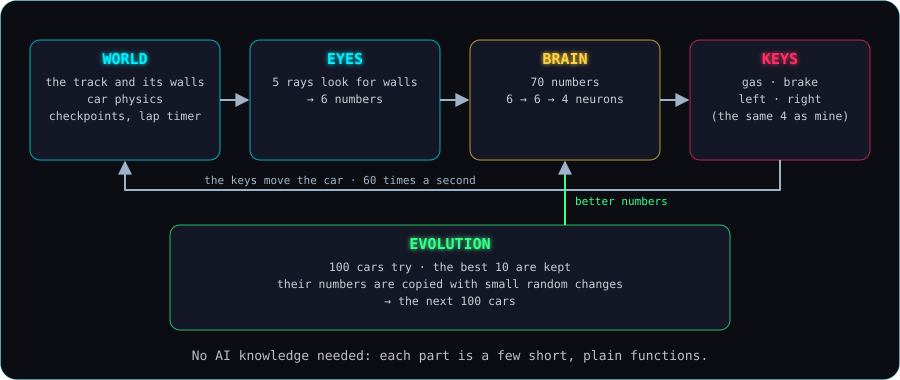

*The four parts. The **world** is the track and the car. The **eyes** look for walls and turn what they see into 6 numbers. The **brain** turns those 6 numbers into 4 key presses: gas, brake, left, right. These are the same 4 keys I use when I drive myself. **Evolution** sits around all of it: it keeps the best brains and makes slightly changed copies of them for the next round.*

The whole program is a [simulation](#glossary): a pretend world that runs inside the computer, with its own rules. This one runs in a web browser. It is written in plain JavaScript, a common programming language, with no AI library at all. Every part is a handful of short functions. A **function** is a small, named piece of code that does one job, like `castRay()`, "how far can the car see in one direction". This guide links to them by name.

**No AI knowledge needed.** Here is the plan, one chapter at a time:
- **The world** (chapter 1): a track, a car, and rules that never change.
- **Eyes** (chapter 2): 5 lines that measure how far away the walls are.
- **Brain** (chapter 3): 70 numbers that turn what the car sees into which keys to press.
- **Evolution** (chapter 4): keep the brains that drove furthest, copy them with small changes, repeat.
- **Reading a brain** (chapter 5): we freeze one moment and follow a decision from "wall at 23 px" to "press LEFT".

**Real numbers:** in our official run (seed 3, see chapter 4) the first car to finish a lap appeared in generation 4. Its lap took 38.18 seconds. By generation 80 the best car drove a lap in 12.47 seconds. My own best lap, driving with the arrow keys, is 26.40 seconds.
*Reproduce it: `node tools/evolution-report.js 3`, then look in `runs/seed-3.json`. My lap is `ghosts/me-v3.json`.*

**What actually happened:** this project is built on camera with an AI coding assistant, one prompt at a time. Everything that went wrong is written down in [DEVLOG.md](DEVLOG.md) and kept in the git history. Nothing was tuned in secret to make the story nicer.

**The prompt:** [PROMPTS.md, entry 1: project setup](PROMPTS.md#1-project-setup).

**In the code:** the entry point is `src/main.js`. The simulation lives in `src/sim/`, the drawing in `src/render/`, and the browser glue (keyboard, saving) in `src/game/`.

---

## 1. The world

**The one idea:** before anything can learn, it needs a world with fixed rules: a track with walls, a car that obeys simple physics, and a clock that ticks exactly the same way every time.

**Analogy:** a board game. The board (the track) and the rules (how the car moves) never change while you play. If two people make exactly the same moves, the game ends exactly the same way.

**Key figure**

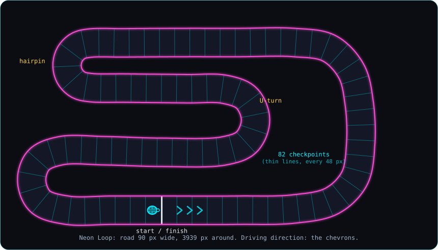

*The real track, "Neon Loop". The two pink lines are the walls. The thin cyan lines across the road are the 82 invisible checkpoints. The white line is the start and finish. The chevrons (>>>) show the driving direction. The ladybug is the car, on its starting spot.*

### The track
The track is stored as data: a list of 35 points that trace the middle of the road, plus a width. The program draws a smooth curve through the points and puts a wall on each side. Because the track is just a list of numbers, it can later be shared as a link.

The road is 90 px wide and 3939 px around. A **px** (pixel) is one dot on the screen; the whole screen is 1280 × 720 px.

### Checkpoints
**Checkpoints** are invisible lines across the road, one every 48 px, 82 in total. A lap only counts if the car crosses every checkpoint in order, in the right direction, and then the start line. They also tell us how far a car got. That matters a lot in chapter 4.

We tested the cheats. Driving the whole loop backwards counts nothing. Driving over the start line, reversing back over it and crossing again counts nothing. Skipping 62 of the 82 checkpoints (by teleporting the car in a test) counts nothing.
*Reproduce it: `npm test`, the tests in `tests/step1.test.js`.*

### The car and my controls
The car is a ladybug from above. Its **hitbox**, the shape the program uses to decide whether it touched a wall, is 36 px long and 26 px wide and follows the round shell. I drive it with 4 keys: gas, brake, left, right. Simple arcade physics:
- It speeds up when I hold gas, up to 330 px per second.
- It slows down fast when I brake.
- It slows down a little by itself when I let go.
- It steers less when it's going very fast. At top speed it turns about half as sharply as at medium speed.

Touching a wall is a crash. The car stops dead, and that's the end of its run. It doesn't slide along the wall.

### The clock: a fixed timestep
The simulation moves forward in small, equal **steps**, each one sixtieth of a second long. Every step, the program reads which keys are held, moves the car a little, and checks the walls and checkpoints. That's it.

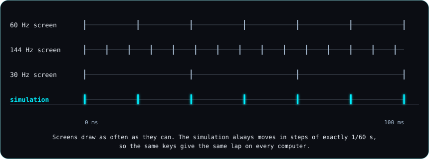

*Screens refresh at different speeds: 60, 144, or 30 times a second. The simulation ignores that and always moves in steps of exactly one sixtieth of a second. That's called a **fixed timestep**.*

Why it matters: if the step length changed with the screen, the same key presses would give a slightly different lap on a different computer. With a fixed timestep, the same key presses always give exactly the same lap.

### One seed: same seed, same everything
Later we need random numbers, for the first brains and for the small changes in evolution. A computer can make random-looking numbers from a starting number called a **seed**. The same seed always gives the same list of "random" numbers. We use one seed for everything, so the same seed replays the exact same evolution, every car and every crash.
*Reproduce it: run `node tools/evolution-report.js 3` twice. Both runs write exactly the same generation history to `runs/seed-3.json`; only the line saying how long it took differs. The test `tests/step5.test.js` checks the first 6 generations against the saved file.*

**Real numbers:** my best lap is stored as a **ghost**: where the car started, plus the keys I held on every one of the 1584 steps. Replaying those keys through the simulation drives exactly the same lap again, to the step: 1584 steps, 26.40 seconds.
*Reproduce it: `node --test tests/ghost.test.js`.*

For comparison, a hand-written test driver (just a script that follows the middle of the road and slows down for curves; no AI) gets:
- 17.25 s with careful settings.
- 12.68 s with its fastest of 980 settings.
- The theoretical floor, flat out on the middle line all the way round, is 11.93 s.
*Reproduce it: `node tools/reference-lap.js`.*

### Why the road went from 64 to 90 px

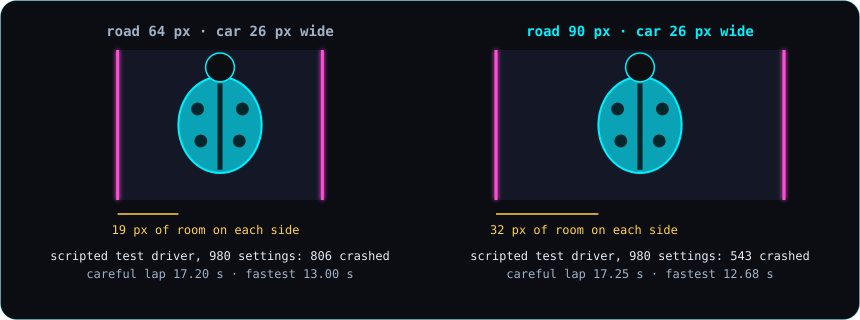

*The car to scale on the old 64 px road and the new 90 px road. The room on each side grew from 19 px to 32 px.*

The road started at 64 px. Then two things happened, both from real test drives:
1. **The car was too hard to see.** It was redrawn as a bigger ladybug (26 px wide instead of 16). Now it only had 19 px to spare on each side.
2. **The road felt too tight.** So it went to 90 px. The layout stayed the same, but at 90 px the old hairpin would have pinched its inner wall into an almost-sharp point. So the hairpin was redrawn as a round half-circle, and the top straight moved down 15 px so the wall wouldn't run into the lap timer at the top of the screen.

The hand-written test driver shows the difference. Out of the same 980 settings, 806 crashed on the 64 px road and 543 on the 90 px road.
*Reproduce it: `node tools/reference-lap.js` (the 64 px numbers are in DEVLOG.md, entry "A bigger ladybug you can actually see").*

After that, the physics, the car's shape and the track were **frozen**: changing them now would make my ghost lap and every training run invalid.

**What actually happened**
- Two of the first tests failed. Both times the bug was in the test, not in the game.
- The car was hard to see, and then the road felt tight. Two fixes, each its own commit.
- An unwanted system file (`.DS_Store`) slipped into a commit and was removed in the next one.
- When I test-drove it, the steering and physics felt right, so they were kept exactly as they were.

**The prompts:** [entry 2: the track and the car](PROMPTS.md#2-three-new-rules-then-step-1-a-track-and-a-car-i-can-drive), [entry 3: the car is hard to see](PROMPTS.md#3-the-car-is-hard-to-see), [entry 4: the road is too tight](PROMPTS.md#4-the-road-is-too-tight).

**In the code**
- `buildTrack()` in `src/sim/track.js`: turns the 35 points and the width into walls, checkpoints and a start spot.
- `stepCar()` in `src/sim/car.js`: moves the car one step for the keys held.
- `steeringGrip()` in `src/sim/car.js`: how sharply the car can turn at its current speed.
- `hitWall()` in `src/sim/car.js`: does the car's hitbox touch a wall?
- `crossedCheckpoint()` and `updateLaps()` in `src/sim/laps.js`: lap counting with checkpoints.
- `stepWorld()` in `src/sim/world.js`: one step of the whole world.
- `STEP` in `src/sim/constants.js`: the fixed step, one sixtieth of a second.
- `makeRng()` in `src/sim/rng.js`: the seeded random number generator.
- `replayGhost()` in `src/sim/ghost.js`: drives a recorded lap again from its keys.


**The full code**

`crossedCheckpoint()`: first it measures how much of the car's last move went along the track's direction (positive means forward). Then it checks whether that move crossed the checkpoint line. Only a forward crossing counts.

<!-- full-code src/sim/laps.js crossedCheckpoint -->
```js
// Did the car's center cross this checkpoint during the last step, moving forward along the track?
export function crossedCheckpoint(car, cp) {
  const movedX = car.x - car.prevX;
  const movedY = car.y - car.prevY;
  const forward = movedX * cp.tx + movedY * cp.ty;
  if (forward <= 0) return false;
  return segmentHit(car.prevX, car.prevY, car.x, car.y, cp.ax, cp.ay, cp.bx, cp.by) >= 0;
}
```
<!-- /full-code -->

---

## 2. Eyes

**The one idea:** the car can't see the track; it only knows how far away the wall is in 5 directions, plus how fast it's going: 6 numbers, nothing else.

**Analogy:** a bat in the dark, or a car's parking sensors. They don't see a picture. They only hear "something is 23 px away, that way".

**Key figure**

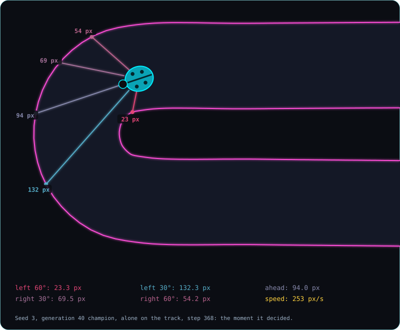

*A real moment at the hairpin. The 5 lines are the car's eyes, called **rays**. Each one goes out until it hits a wall, up to 200 px. It turns from cyan (far) to pink-red (close). The labels are the real distances. (This is the seed 3, generation 40 champion, alone on the track, at step 368.)*

The 5 rays point straight ahead, 30° to each side, and 60° to each side. Each eye sits on the car's outline, not in its middle, so "0 px" really means the wall is touching the car. The front eye is 21 px from the car's center, the 30° eyes 15.9 px, and the 60° eyes 12.4 px.

### Six numbers between 0 and 1
The brain (chapter 3) gets 6 numbers: the 5 distances and the speed. Before it gets them, each one is turned into a number between 0 and 1:
- **Eyes:** a wall touching the car is 1. Nothing within 200 px is 0. In between, the closer the wall, the closer to 1.
- **Speed:** standing still is 0. Flat out (330 px/s) is 1. Reversing also counts as 0.

| distance to the wall | 0 px | 50 px | 100 px | 150 px | 200 px or more |
| --- | --- | --- | --- | --- | --- |
| number the brain gets | 1.00 | 0.75 | 0.50 | 0.25 | 0.00 |

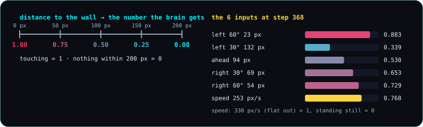

*Left: the scale from distance to number. Right: the 6 real inputs at the hairpin moment.*

Why bother? Raw distances go from 0 to 200, while speed goes from 0 to 330. The brain multiplies everything by its own numbers (chapter 3). If one input were hundreds and another were tiny, the big one would drown out the small one. Putting everything between 0 and 1 gives every input a fair say. Turning a number into this common 0-to-1 scale is called **normalizing** it.

> **Interactive later:** drag the car around the track and watch the 5 rays and the 6 numbers change live.

**Real numbers** (the hairpin moment, seed 3 generation 40 champion, step 368):

| eye | distance | input |
| --- | --- | --- |
| left 60° | 23.3 px | 0.883 |
| left 30° | 132.3 px | 0.339 |
| ahead | 94.0 px | 0.530 |
| right 30° | 69.5 px | 0.653 |
| right 60° | 54.2 px | 0.729 |
| speed | 253 px/s | 0.768 |

The left 60° eye is very close to the inner wall of the hairpin (23.3 px), so its number is high: 0.883. Ahead is 94 px. That's the far side of the hairpin, which the car is turning around.
*Reproduce it: `node tools/figures.js`, then `frame.view` and `frame.inputs` in `docs/img/figure-data.json`.*

**Are the eyes right?** On a straight, in the middle of the road, the two 60° eyes measure 39.58 px and 39.47 px. Drawing it out on paper gives 39.52 px. The tiny difference is because the road there is tilted by a fifth of a degree. A second test checks 150 rays from a real lap a completely different way: it walks along each ray in quarter-pixel steps until it leaves the road. The worst disagreement was 0.34 px.
*Reproduce it: `node --test tests/step2.test.js`.*

Looking doesn't change anything. A lap where the car reads its eyes every step is identical, to the last digit, to one where it doesn't.

**What actually happened**
- One new test failed on its first run. Its test wall was too short for a 30° ray to reach it. The eyes were fine.
- The rays were too faint on screen and were made brighter.
- In the game, pressing E shows the real distances and the 6 numbers. That screen looked good enough to be its own short video.

**The prompt:** [entry 5: give the car eyes](PROMPTS.md#5-physics-freeze-then-step-2-give-the-car-eyes).

**In the code**
- `castRay()` in `src/sim/sensors.js`: how far can the car see in one direction.
- `readSensors()` in `src/sim/sensors.js`: the car's whole view of the world, 5 distances.
- `eyePosition()` in `src/sim/sensors.js`: where each eye sits on the car's outline.
- `getInputs()` in `src/sim/sensors.js`: the only 6 numbers the car will ever know.
- `inputsFromView()` in `src/sim/sensors.js`: the same 6 numbers, from distances already measured.


**The full code**

`getInputs()`: measure the 5 distances, then hand them and the speed to `inputsFromView()`.

<!-- full-code src/sim/sensors.js getInputs -->
```js
// The brain's input: the only 6 numbers the car will ever know.
// 5 eyes, each 0..1 (1 = wall touching the car, 0 = nothing in range), then speed 0..1 (reversing counts as 0).
export function getInputs(car, walls) {
  return inputsFromView(readSensors(car, walls), car.speed);
}
```
<!-- /full-code -->

`inputsFromView()`: each distance becomes 1 minus (distance divided by 200), so 0 px gives 1 and 200 px gives 0. The speed becomes speed divided by 330, kept between 0 and 1.

<!-- full-code src/sim/sensors.js inputsFromView -->
```js
// The same 6 numbers, from 5 distances already measured with readSensors() and the car's speed.
export function inputsFromView(distances, speed) {
  const inputs = [];
  for (const distance of distances) {
    inputs.push(1 - distance / SENSOR_RANGE);
  }
  const speedShare = speed / CAR.maxSpeed;
  inputs.push(Math.max(0, Math.min(1, speedShare)));
  return inputs;
}
```
<!-- /full-code -->

---

## 3. Brain

**The one idea:** the brain is 70 numbers; it multiplies what the car sees by those numbers, adds things up, and the result decides which of the 4 keys to press.

**Analogy:** a panel of judges with scorecards. Each judge looks at the same 6 facts. Each one cares about some facts more than others: their "weights". The judges give their scores to 4 final judges, one per key. If a final judge's score is high enough, that key gets pressed.

**Key figure**

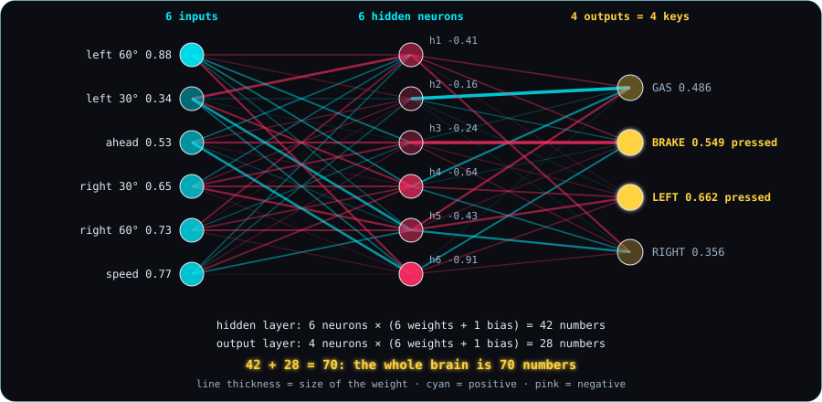

*The real brain of the seed 3 generation 40 champion, at the hairpin moment. The 6 inputs are on the left, the 6 "hidden" neurons in the middle, and the 4 outputs (the keys) on the right. Every line is one weight: thicker means a bigger weight, cyan means positive, pink means negative. BRAKE and LEFT are lit: both are pressed.*

### One neuron
A **neuron** is the brain's smallest part. It does four things, always the same four:
1. Multiply each input by its own number, called a **weight**.
2. Add them all up.
3. Add one more number, called the **bias**.
4. **Squash** the result into a tidy range.

That's all. A big pile of these is a **neural network**.

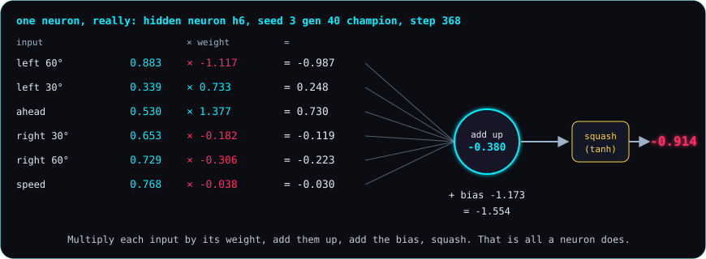

*One real neuron (hidden neuron h6) at the hairpin moment, worked through.*

**Real numbers** (hidden neuron h6, seed 3 generation 40 champion, step 368):

| input | value | × weight | = |
| --- | --- | --- | --- |
| left 60° | 0.883 | × −1.117 | −0.987 |
| left 30° | 0.339 | × 0.733 | 0.248 |
| ahead | 0.530 | × 1.377 | 0.730 |
| right 30° | 0.653 | × −0.182 | −0.119 |
| right 60° | 0.729 | × −0.306 | −0.223 |
| speed | 0.768 | × −0.038 | −0.030 |

Add up the last column: −0.380. Add the bias, −1.173: that gives −1.554. Squash it: **−0.914**. That's what this neuron passes on.
*Reproduce it: `node tools/figures.js`, then `frame.hidden[5]` in `docs/img/figure-data.json` (h6 is number 5, counting from 0). The game shows the same numbers: open `index.html?champion=3-40`, press B, then F when it enters the hairpin.*

### Squash: tanh and sigmoid
A sum can be any size: 0.2, or 40, or −300. **Squashing** turns any number into a tidy one, so nothing runs off to infinity. Big stays big, small stays small, and everything lands in a fixed range. We use two kinds. Both are called **activation functions**:
- **tanh** for the 6 hidden neurons: the result is always between −1 and 1.
- **sigmoid** for the 4 keys: the result is always between 0 and 1. Above 0.5 means the key is pressed.

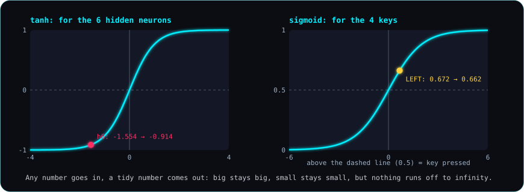

*Left: tanh. Hidden neuron h6's −1.554 comes out as −0.914. Right: sigmoid. The LEFT key's 0.672 comes out as 0.662, which is above 0.5, so LEFT is pressed.*

> **Interactive later:** a slider for each weight of one neuron, with the sum, the squash and the "pressed / not pressed" updating as you drag.

### The whole network: 6 → 6 → 4
- The 6 inputs go into 6 **hidden neurons**. They're called "hidden" only because you never see them from outside; they sit between the eyes and the keys. Each hidden neuron has 6 weights (one per input) and 1 bias.
- The 6 hidden results go into 4 **output neurons**, one per key: GAS, BRAKE, LEFT, RIGHT. Each has 6 weights (one per hidden neuron) and 1 bias.
- Each output above 0.5 means that key is held this step. The AI drives with exactly my 4 keys, no special powers.

A group of neurons that all look at the same inputs is called a **layer**. So this brain has two layers.

**The whole brain is 70 numbers.** Count them:
- hidden layer: 6 neurons × (6 weights + 1 bias) = 42
- output layer: 4 neurons × (6 weights + 1 bias) = 28
- 42 + 28 = **70**

In the code, it's literally one list of 70 numbers. Nothing else is stored. Everything a car "knows" about driving is in those 70 numbers.

### Generation 1: random brains, glorious chaos
At the start, nobody knows good numbers. So the first 100 brains get 70 random numbers each, between −1 and 1, from the seed. These 100 cars together are **generation 1**. They start together, and they can't hit each other, only the walls.

A car is out when it crashes, or when it goes 3 seconds without reaching a new checkpoint. That second rule catches cars that spin in place or drive backwards. A generation ends when every car is out, or after 60 seconds.

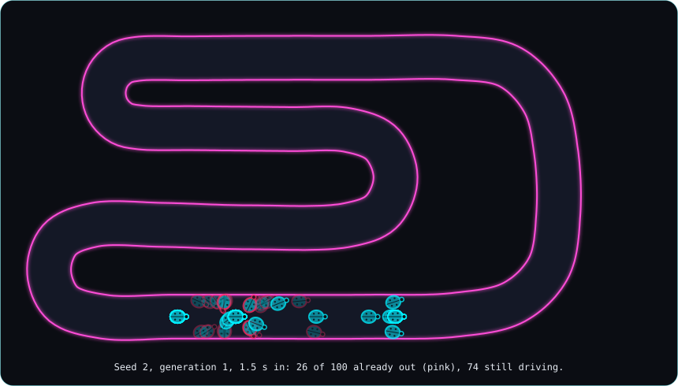

*Seed 2, generation 1, 1.5 seconds in: 26 of the 100 cars have already crashed (pink), 74 are still going, mostly nowhere.*

Generation 1 for 5 different seeds:

| seed | barely moved | went backwards | crashed in the first 2 s | best car got | best car was out by |
| --- | --- | --- | --- | --- | --- |
| 1 | 57 | 16 | 25 | 14.5% of a lap | a crash at 2.97 s |
| 2 | 46 | 17 | 28 | 20.6% | a stall at 6.97 s |
| 3 | 61 | 20 | 14 | 65.1% | a crash at 11.40 s |
| 4 | 68 | 5 | 22 | 49.6% | a crash at 6.52 s |
| 5 | 48 | 23 | 28 | 50.6% | a crash at 6.62 s |

"Barely moved" means never got one car length (36 px) away from the start. "Went backwards" means it ended more than 36 px behind the start. A car can be in more than one column. No car finished a lap.
*Reproduce it: `node tools/generation-report.js`.*

Seed 3's best random brain got 65% of the way round on pure luck. Random numbers can sometimes drive a bit. They just can't drive well.

**What actually happened**
- About 50 cars that never moved all sat on exactly the same spot. Drawn half see-through on top of each other, the pile looked like one bright, live car, even when only 2 cars were still driving. Now wrecks on the same spot are drawn once.
- One output was 0.49982 but showed as "0.500", right at the line between pressed and not pressed. Values that close to 0.5 now show more decimals.

**The prompt:** [entry 6: a brain, and 100 cars with random brains](PROMPTS.md#6-step-3-a-brain-and-100-cars-with-random-brains).

**In the code**
- `neuron()` in `src/sim/brain.js`: multiply each input by its weight, add them up, add the bias, squash.
- `layer()` in `src/sim/brain.js`: several neurons looking at the same inputs.
- `tanh()` and `sigmoid()` in `src/sim/brain.js`: the two squash functions.
- `outputs()` in `src/sim/brain.js`: the 4 key values for 6 inputs.
- `think()` in `src/sim/brain.js`: which keys to press, every output above 0.5.
- `randomBrain()` in `src/sim/brain.js`: 70 seeded random numbers between −1 and 1.
- `BRAIN_SIZE` in `src/sim/brain.js`: 70.
- `createGeneration()` and `stepGeneration()` in `src/sim/generation.js`: 100 cars, the stall rule, the 60-second limit.


**The full code**

`neuron()`: a running total of input × weight, then + bias, then squash. The weights of neuron *n* sit side by side in the 70-number list, followed by its bias.

<!-- full-code src/sim/brain.js neuron -->
```js
// One neuron: multiply each input by its weight, add them up, add the bias, squash.
export function neuron(inputs, brain, start, squash) {
  let sum = 0;
  for (let i = 0; i < inputs.length; i++) {
    const weight = brain[start + i];
    sum += inputs[i] * weight;
  }
  const bias = brain[start + inputs.length];
  sum += bias;
  return squash(sum);
}
```
<!-- /full-code -->

`think()`: the 4 outputs, each compared with 0.5. The four keys are separate bits (gas 1, brake 2, left 4, right 8), so adding them up gives one number that says which keys are held.

<!-- full-code src/sim/brain.js think -->
```js
// Which keys to press this step: every output above 0.5 is a key held down.
export function think(brain, inputs) {
  const [gas, brake, left, right] = outputs(brain, inputs);
  let keys = 0;
  if (gas > 0.5) keys += UP;
  if (brake > 0.5) keys += DOWN;
  if (left > 0.5) keys += LEFT;
  if (right > 0.5) keys += RIGHT;
  return keys;
}
```
<!-- /full-code -->

`stepGeneration()`: one tick for every car that's still driving. Look (`readSensors`), turn what it sees into numbers (`inputsFromView`), think, move (`stepWorld`). Then keep score: the best lap, the last new checkpoint, and whether it's now out by crash, stall (3 s without a new checkpoint) or time (60 s).

<!-- full-code src/sim/generation.js stepGeneration -->
```js
// Advances every car that's still driving by one step (1/60 s): look, think, press keys, move.
export function stepGeneration(gen) {
  if (gen.over) return [];
  gen.step++;
  const events = [];
  let driving = 0;
  for (let index = 0; index < gen.cars.length; index++) {
    const c = gen.cars[index];
    if (c.out) continue;
    c.view = readSensors(c.world.car, gen.track.walls);
    c.inputs = inputsFromView(c.view, c.world.car.speed);
    c.keys = think(c.brain, c.inputs);
    const happened = stepWorld(c.world, c.keys);
    for (const e of happened) {
      if (e.type === 'lap' && (c.bestLapSteps === null || e.steps < c.bestLapSteps)) c.bestLapSteps = e.steps;
      events.push({ ...e, index });
    }
    if (c.world.laps.checkpointsPassed > c.progressSeen) {
      c.progressSeen = c.world.laps.checkpointsPassed;
      c.lastProgressStep = gen.step;
    }
    if (c.world.car.crashed) c.out = 'crash';
    else if (gen.step - c.lastProgressStep >= STALL_STEPS) c.out = 'stall';
    else if (gen.step >= GENERATION_STEPS) c.out = 'time';
    if (c.out) c.outStep = gen.step;
    else driving++;
  }
  if (driving === 0) gen.over = true;
  return events;
}
```
<!-- /full-code -->

---

## 4. Evolution

**The one idea:** keep the brains that drove furthest, make slightly changed copies of them, and repeat. No one ever tells the car how to drive.

**Analogy:** breeding. A farmer doesn't design a faster horse. They pick the fastest horses to have foals, again and again, and over many generations the horses get faster.

**Key figure**

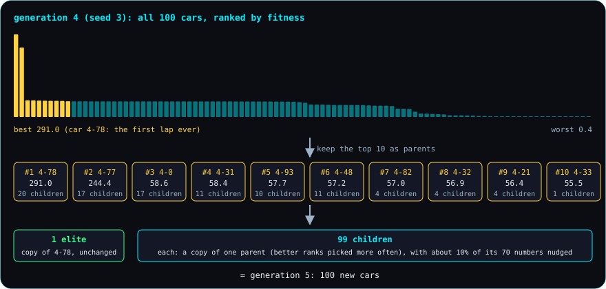

*One real generation (seed 3, generation 4). All 100 cars are ranked, the top 10 become parents, and the next generation is 1 unchanged copy of the best plus 99 slightly changed children.*

### Fitness: "go far; if you finish, finish fast"
To pick the best, we need a score. It's called **fitness**:
- How far along the track the car got: the number of checkpoints it passed in order, plus how far it was toward the next one.
- If it finished a lap, a bonus: 6000 divided by the lap time in seconds. The faster the lap, the bigger the bonus. A 38.18 s lap earns 157 points; a 12.53 s lap earns 479.

A car that finished a lap always beats one that didn't.

### Four steps from one generation to the next
1. **Selection:** rank all 100 by fitness and keep the top 10 as **parents**.
2. **Elitism:** the single best brain goes into the next generation unchanged. The simulation always plays out the same way, so this copy drives exactly the same run again. That means the best can never get worse.
3. **Mutation:** each of the other 99 **children** is a copy of one parent's 70 numbers. Better parents are picked more often: the best of the 10 ten times as often as the 10th. Then each of the 70 numbers has a 10% chance of a small random nudge. Most nudges are small, a few are bigger; a typical one is about 0.3.
4. **Next generation:** 1 elite + 99 children = 100 new cars. Run them, and repeat.

There is no "crossover" (mixing two parents). One parent per child keeps it simple.

**Real numbers** (seed 3, generation 4, from the figure above): car 4-78 scored 291.0, the best of the generation, because it drove the first lap ever. Car 4-77 came second with 244.4. The 10th parent scored 55.5. In generation 5, car 4-78's brain is the unchanged elite, and it also got 20 of the 99 children. The 10th parent got 1 child.
*Reproduce it: `node tools/figures.js`, then `oneGeneration` in `docs/img/figure-data.json`.*

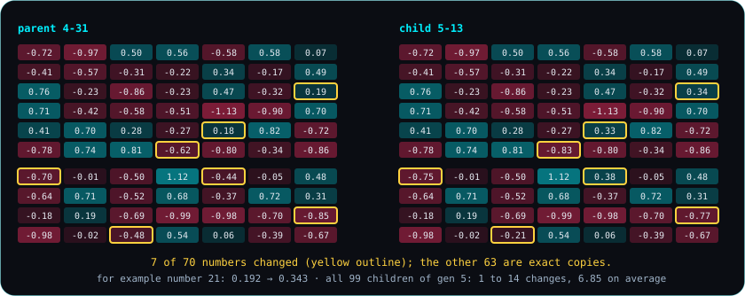

*Mutation for real: car 5-13 next to its parent, car 4-31. 7 of the 70 numbers changed (outlined); the other 63 are exact copies. Across all 99 children of generation 5, the number of changes ran from 1 to 14, 6.85 on average. That's close to the 7 you'd expect from a 10% chance on 70 numbers.*

### Seed 3: from chaos to a 12.43 s lap

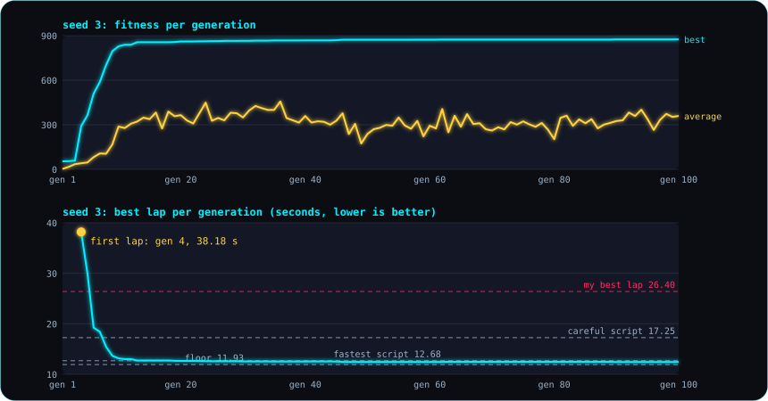

*Top: the best and the average fitness of each generation. Bottom: the best lap time of each generation, against my 26.40 s and the hand-written test driver.*

- **Generation 4:** the first lap ever, by car 4-78, in 38.18 s. Slower than me. 2 cars finished a lap that generation.
- **Generation 6:** the best lap is 19.25 s, already faster than my 26.40 s.
- **Generation 10:** 13.17 s, and 40 of the 100 cars finish a lap.
- **Generation 20:** 12.65 s, faster than the best hand-written test driver (12.68 s).
- **Generation 100:** 12.43 s, about half a second off the theoretical floor (11.93 s).

The average fitness keeps jumping around. That's because most children are a bit worse than their parents: mutation is mostly a gamble that doesn't pay. The best line only goes up, thanks to the elite copy.
*Reproduce it: `node tools/evolution-report.js 3`, then `runs/seed-3.json`.*

> **Interactive later:** run the evolution right in the page, with the generation chart drawing itself as it goes.

### Seed 1: stuck at 51.8% for 95 generations

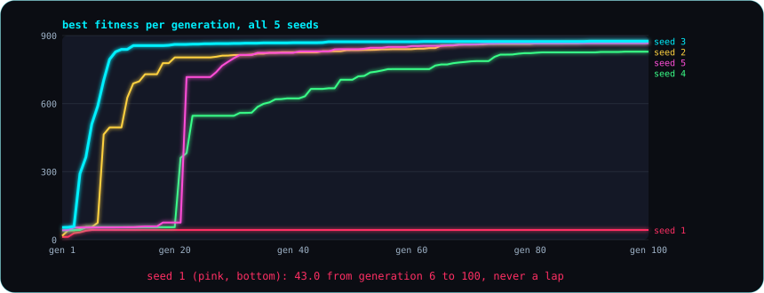

*The best fitness of every generation, for 5 seeds. Seed 1 is the flat line at the bottom.*

Seed 1 never finished a lap. Its best fitness reached 43.0 (51.8% of a lap) in generation 6, and then stayed exactly at 43.0 through generation 100. That's 95 generations at the same score. In generations 7 to 100, 9306 children were born, and not one of them got further.

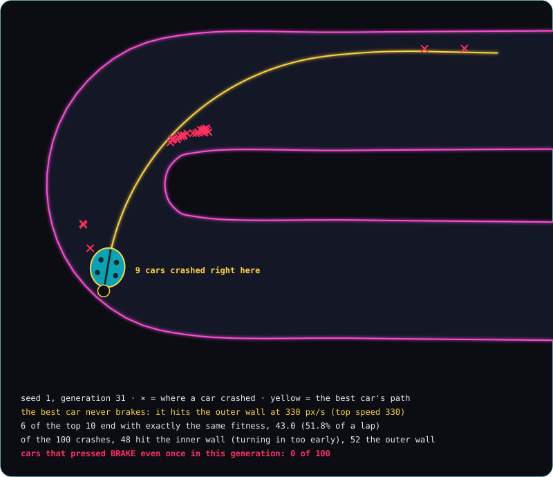

*Seed 1, generation 31. The yellow line is the best car's path. It drives flat out the whole way and hits the outer wall at the hairpin exit at 330 px/s. 9 cars crashed on exactly that spot. Not one of the 100 cars pressed BRAKE even once.*

**Why it gets stuck.** The facts above are measured. The "why" is not; it is an inference from them. Our best explanation: early on, seed 1's best brain was one that never brakes. It's fast, so it scored well, and every following generation was made from it and from brains like it. But nobody can drive this hairpin flat out. At 330 px/s the car can only turn in a wide arc, and the hairpin is far tighter. To get past, a brain would need to slow down for the hairpin (brake, or at least let go of the gas), and that's a big change, not a small nudge. So every child is still a "never brake" driver. Some turn in too early and hit the inner wall (48 of the 100 crashes in generation 31). Others go just as far and hit the outer wall (52 of them). The best score can't go up, and thanks to the elite copy it can't go down either, so it sits there. (We didn't test this explanation directly, for example by forcing a car to brake; it fits everything we measured.)

This is called a **local optimum**: a dead end that looks like the top. From where you stand, every small step goes down, even though a much higher place exists somewhere else. Evolution with small nudges is good at climbing, but it can't jump.
*Reproduce it: `node tools/evolution-report.js 1` for the flat line, `node tools/figures.js` for generation 31 (`seed1` in `docs/img/figure-data.json`).*

### All 5 seeds, and why seed 3 is the official one

| seed | first lap | best lap at gen 10 | gen 20 | gen 40 | gen 80 | gen 100 |
| --- | --- | --- | --- | --- | --- | --- |
| 1 | **never** | — | — | — | — | — |
| 2 | gen 8 (18.40 s) | 16.90 s | 13.58 s | 13.20 s | 12.58 s | 12.53 s |
| 3 | gen 4 (38.18 s) | 13.17 s | 12.65 s | 12.52 s | 12.47 s | 12.43 s |
| 4 | gen 21 (27.27 s) | — | — | 17.32 s | 13.28 s | 13.13 s |
| 5 | gen 22 (15.50 s) | — | — | 13.22 s | 12.57 s | 12.57 s |

*"First lap" is the first lap ever completed, and how long that lap took.*
*Reproduce it: `node tools/evolution-report.js <seed>` for each seed.*

We picked **seed 3** as the official one for the video, and we picked it after seeing this table. That's a choice, and we say so:
- It learned first.
- At generation 5 it already finished a lap but was still slower than me (30.02 s against 26.40 s). That's a real "I'm still winning" moment before it overtakes me.
- From generation 10 on, it's the fastest of the five at every checkpoint generation.

Four of the five seeds learned to drive. One never did.

**What actually happened:** the code worked the first time. The surprise was seed 1, and the rules say a stuck seed is part of the story, not something to fix quietly. It's in the video as its own scene.

**The prompt:** [entry 7: export my ghost, then evolution](PROMPTS.md#7-export-my-ghost-then-step-4-evolution).

**In the code**
- `fitness()` in `src/sim/generation.js`: go as far as you can; if you finish a lap, finish fast.
- `trackProgress()` in `src/sim/generation.js`: checkpoints passed in order, plus the fraction to the next one.
- `selection()` in `src/sim/evolution.js`: rank all cars, keep the top 10.
- `pickParent()` in `src/sim/evolution.js`: pick a parent, better ranks more often.
- `mutate()` in `src/sim/evolution.js`: copy 70 numbers, nudge each one with a 10% chance.
- `gaussian()` in `src/sim/evolution.js`: a random nudge, mostly small, sometimes bigger.
- `nextGeneration()` in `src/sim/evolution.js`: 1 elite + 99 mutated children.
- `finishGeneration()` in `src/sim/evolution.js`: records the stats and saves the champions of generations 1, 5, 10, 20, 40, 80.
- `stepEvolution()` and `runEvolution()` in `src/sim/evolution.js`: run it all, generation after generation.


**The full code**

`fitness()`: track progress, plus 6000 divided by the best lap time in seconds when there is one.

<!-- full-code src/sim/generation.js fitness -->
```js
// How good a car was: go as far as you can; if you finish a lap, finish fast (a bonus that grows as the lap time shrinks).
export function fitness(car) {
  let score = trackProgress(car.world);
  if (car.bestLapSteps !== null) {
    const lapSeconds = car.bestLapSteps / STEPS_PER_SECOND;
    score += LAP_BONUS / lapSeconds;
  }
  return score;
}
```
<!-- /full-code -->

`selection()`: sort a copy of the cars by score, highest first, and keep 10. JavaScript's sort is stable, so cars with equal scores keep their order and the result never depends on luck. Step 7b passes in its own score, the fitness summed over three tracks.

<!-- full-code src/sim/evolution.js selection -->
```js
// Selection: rank all cars by fitness, best first, and keep the top 10 as parents.
// (Step 7b scores a car differently, by its fitness summed over three tracks, and passes that in as `score`.)
export function selection(cars, score = fitness) {
  const ranked = cars.slice();
  ranked.sort((a, b) => score(b) - score(a));
  return ranked.slice(0, PARENTS);
}
```
<!-- /full-code -->

`mutate()`: for each of the 70 numbers, one random draw decides (10%) whether it changes. Only if it does, two more draws make a bell-curve nudge of typical size 0.3. The draws always come in the same order, so the same seed gives the same children.

<!-- full-code src/sim/evolution.js mutate -->
```js
// Mutation: copy a parent's 70 numbers, and give each one a 10% chance to be nudged a little.
export function mutate(brain, rand) {
  const child = [];
  for (const number of brain) {
    if (rand() < MUTATION_RATE) {
      child.push(number + gaussian(rand) * MUTATION_SIZE);
    } else {
      child.push(number);
    }
  }
  return child;
}
```
<!-- /full-code -->

`nextGeneration()`: the elite (an exact copy of the best) first, then 99 mutated children of parents picked by rank. The family list records each car's parent for the family tree.

<!-- full-code src/sim/evolution.js nextGeneration -->
```js
// The next generation: 1 elite (the best brain, unchanged, so the best can never get worse) + 99 mutated children.
export function nextGeneration(evo) {
  const gen = evo.gen;
  const parents = selection(gen.cars);
  const elite = parents[0];
  const brains = [elite.brain.slice()];
  const family = [{ parentId: elite.id, elite: true }];
  while (brains.length < POPULATION) {
    const parent = pickParent(parents, evo.rand);
    brains.push(mutate(parent.brain, evo.rand));
    family.push({ parentId: parent.id, elite: false });
  }
  evo.gen = createGeneration(evo.track, brains, gen.number + 1, family);
  for (const c of evo.gen.cars) evo.parentOf[c.id] = c.parentId;
  return evo.gen;
}
```
<!-- /full-code -->

---

## 5. Reading a brain

**The one idea:** we can freeze any moment and follow one decision all the way, from "the wall on my left is 23 px away" to "press LEFT", and every number on the way is the real one.

**Analogy:** a replay with the referee's notes. You don't just see the car turn. You see exactly which facts pushed which way, and by how much.

**Key figure**

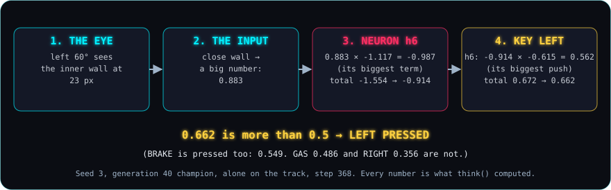

*One decision from start to end. The seed 3 generation 40 champion, alone on the track, at step 368 (the same moment as chapters 2 and 3).*

**Real numbers**, following the path:
1. **The eye.** The left 60° eye sees the hairpin's inner wall 23.3 px away.
2. **The input.** A close wall becomes a big number: 0.883.
3. **Hidden neuron h6.** Its biggest term is that eye: 0.883 × −1.117 = −0.987. With the other 5 terms and the bias, its total is −1.554. Squashed, that's −0.914.
4. **The LEFT key.** Of LEFT's 6 terms, h6's is the biggest push: −0.914 × −0.615 = +0.562. A negative times a negative is a positive, so a strongly negative h6 pushes LEFT up. LEFT's sum is 1.758, plus its bias −1.086, total 0.672. Squashed: 0.662.
5. **The decision.** 0.662 is more than 0.5, so **LEFT is pressed**. BRAKE is pressed too (0.549). GAS (0.486) and RIGHT (0.356) are not.

Every number here is exactly what the brain computed in that step. A test checks this on 100 random moments, down to the 9th decimal.
*Reproduce it: `node tools/figures.js` (`frame` in `docs/img/figure-data.json`), `node --test tests/step5.test.js`, or in the game: `index.html?champion=3-40`, then B (brain) and F (explain one decision).*

### The surprise: it hugs the inner wall
Look at the decision again. The wall on the car's left is the closest thing it sees, only 23 px away. And it turns left, toward it. Why turn toward the wall?

Because that's the inside of the hairpin. A shorter way round is a faster lap. The car is cutting the corner, the way a racing driver takes the inside line. Nobody taught it that. Its fitness only ever said "go far, finish fast".

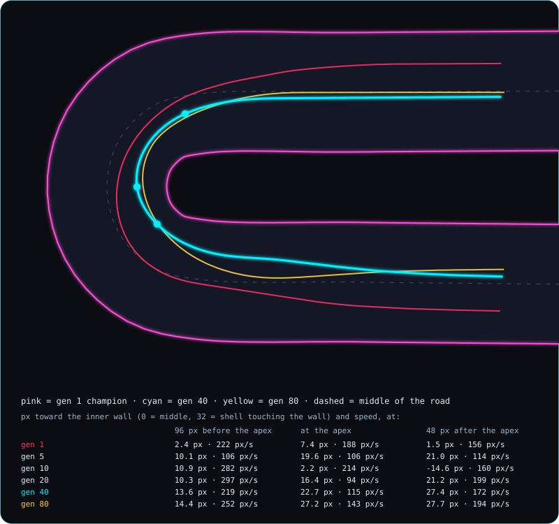

*How the champions of seed 3 drive the hairpin. Pink: generation 1. Cyan: generation 40. Yellow: generation 80. The table shows how far toward the inner wall each one passes three spots, and how fast.*

| champion | 96 px before the apex | at the apex | 48 px after the apex |
| --- | --- | --- | --- |
| gen 1 | 2.4 px · 222 px/s | 7.4 px · 188 px/s | 1.5 px · 156 px/s |
| gen 5 | 10.1 px · 106 px/s | 19.6 px · 106 px/s | 21.0 px · 114 px/s |
| gen 10 | 10.9 px · 282 px/s | 2.2 px · 214 px/s | −14.6 px · 160 px/s |
| gen 20 | 10.3 px · 297 px/s | 16.4 px · 94 px/s | 21.2 px · 199 px/s |
| gen 40 | 13.6 px · 219 px/s | 22.7 px · 115 px/s | 27.4 px · 172 px/s |
| gen 80 | 14.4 px · 252 px/s | 27.2 px · 143 px/s | 27.7 px · 194 px/s |

*0 is the middle of the road. 32 means the shell touches the inner wall. Negative means toward the outer wall. The **apex** is the innermost point of the curve.*

The honest version is a bit messier than "it learned to cut corners":
- Generation 1 drives down the middle.
- By generation 5 it already keeps to the inside, but it crawls round at about 106 px/s.
- Generation 10 drifts out toward the outer wall right after the apex.
- By generations 40 and 80 it hugs the inside every time. Generation 80 passes the apex only about 5 px from the wall, and faster than generation 40 (143 against 115 px/s).
- It's not a complete racing line. A racing driver swings wide before the turn and then cuts in. These cars don't swing wide; they just keep to the inside.

*Reproduce it: `node tools/figures.js` (`insideLine` in `docs/img/figure-data.json`).*

### Same shape, different numbers

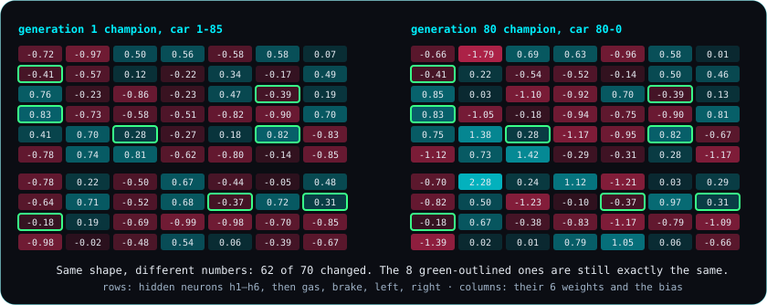

*The 70 numbers of the generation 1 champion (car 1-85) and the generation 80 champion (car 80-0) of seed 3. Same shape, same 70 slots. 62 of the 70 numbers changed. The 8 outlined ones are still exactly the same.*

The brain didn't grow or get new parts. It's the same 70 slots from the first random car to the champion. Only the numbers in them changed, a few at a time, over 80 generations.

> **Interactive later:** click any car in a running generation and see its 70 numbers and its family line light up.

### One unbroken family line

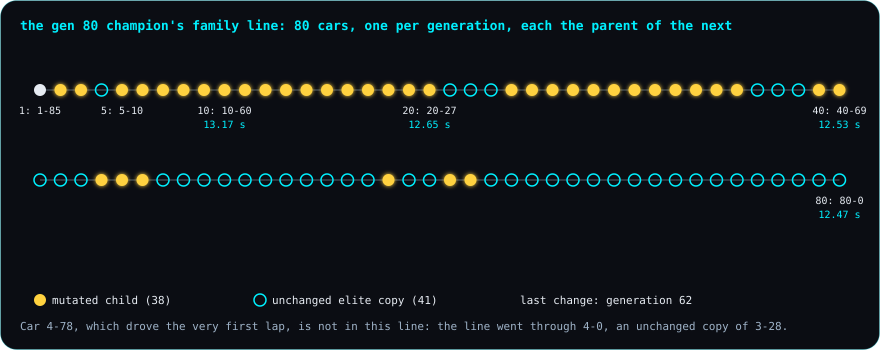

*The family line of the generation 80 champion: 80 cars, one per generation, each the parent of the next, all the way back to car 1-85 in generation 1.*

- **80 cars, no gaps.** Every car in the line is the parent of the next one, from 1-85 (a random brain from generation 1) to 80-0.
- **41 links are unchanged elite copies.** The best of a generation was simply copied into the next one.
- **38 links are mutated children.** Those are the only places where numbers changed.
- **The last change was in generation 62.** Generations 63 to 80 are the same brain, copied unchanged 18 times, because no child beat it.
- **Our hairpin car is an ancestor.** The generation 40 champion from this chapter (car 40-69) is in the line.
- **The first lap is not.** Car 4-78, which drove the very first lap in generation 4, is not an ancestor of the final champion. The line went through car 4-0, an unchanged copy of the generation 3 best. The first car to finish a lap wasn't the one whose family won.

*Reproduce it: `champions/seed-3.json` (the `ancestors` of generation 80) and `runs/seed-3.json` (each generation's champion).*

**What actually happened**
- Every saved champion, run alone, drives exactly the lap time and fitness recorded during evolution. All 30 of them (5 seeds × 6 generations) were checked to the step.
- Opening the brain panels changes nothing: with them open, the evolution still matches the recorded run row for row.
- The bugs were all on screen: a title running into a menu, a champion shown under the wrong id, a label covering a panel. Each one was found in screenshots and fixed before the commit.

**The prompt:** [entry 8: let us see the brain think](PROMPTS.md#8-step-5-let-us-see-the-brain-think).

**In the code**
- `explainThink()` in `src/sim/brain.js`: the whole calculation behind one decision, every number of it.
- `strongestHidden()` in `src/render/decision-panel.js`: the hidden neuron with the biggest say in a key.
- `drawBrainPanel()` in `src/render/brain-panel.js`: the live network (key B in the game).
- `drawDecisionPanel()` in `src/render/decision-panel.js`: "explain one decision" (key F).
- `drawWeightsGrid()` in `src/render/weights-grid.js`: the 70 numbers (key N).
- `ancestors()` in `src/sim/evolution.js`: a champion's family line, back to generation 1.


**The full code**

`outputs()`: the whole network. Layer 1 is 6 tanh neurons using numbers 0–41; layer 2 is 4 sigmoid neurons using numbers 42–69.

<!-- full-code src/sim/brain.js outputs -->
```js
// The 4 output values (0..1) for these 6 inputs: gas, brake, left, right.
export function outputs(brain, inputs) {
  const hidden = layer(inputs, brain, 0, HIDDEN, tanh);
  return layer(hidden, brain, HIDDEN * (INPUTS + 1), OUTPUTS, sigmoid);
}
```
<!-- /full-code -->

---

## 6. Me vs the AI

**The one idea:** my best lap and the AI's best lap drive at the same time, side by side, and the clock decides.

**Analogy:** racing your own ghost in a video game. Here the ghost is my recorded lap, and the challenger is a car that taught itself.

**Key figure**

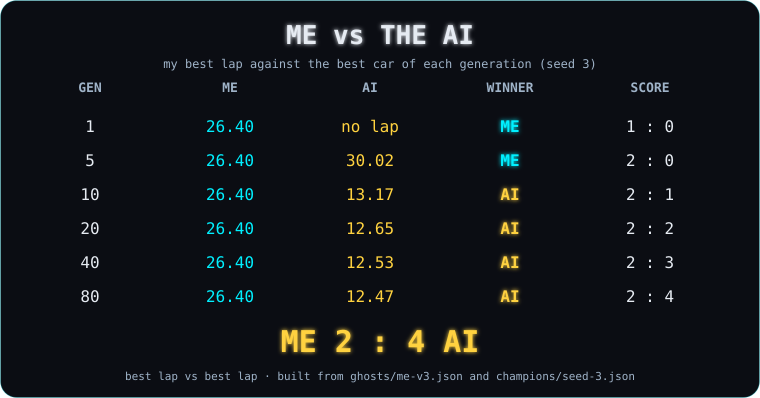

*My best lap (26.40 s) against the best car (the champion) of each of the six fixed generations of seed 3. I win generations 1 and 5; the AI wins 10, 20, 40 and 80. Final score 2 : 4 to the AI. Built only from the saved files: my ghost lap and the champions file.*

### The rules of a race
- My car (cyan) replays my ghost: the exact keys I held on each of my 1584 steps.
- The AI's car (yellow) is driven live by the champion's brain, step by step, exactly as in chapter 3.
- They start together and don't collide: each drives in its own copy of the world.
- **Best lap vs best lap.** My 26.40 s lap was a *flying lap*: I crossed the start line already moving, at 142 px/s. So the AI also drives its best lap, from exactly where that lap really began, at the speed it really had. A champion's first lap is a *standing start*: from rest, 30 px behind the line. It's always a little slower. For example, the gen 40 champion's first lap is 12.78 s and its best is 12.53 s; it races with the 12.53 s.
- A champion that never finished a lap starts from the normal start spot and drives until it crashes or stalls. I win that row by default.
- During the race the screen shows the live gap. That's the answer to "when did the leading car pass the spot where the other car is now?"

**Real numbers**

| gen | me | AI | winner | by | score |
| --- | --- | --- | --- | --- | --- |
| 1 | 26.40 s | no lap (crashes at 65% of a lap) | me | by default | 1 : 0 |
| 5 | 26.40 s | 30.02 s | me | 3.62 s | 2 : 0 |
| 10 | 26.40 s | 13.17 s | AI | 13.23 s | 2 : 1 |
| 20 | 26.40 s | 12.65 s | AI | 13.75 s | 2 : 2 |
| 40 | 26.40 s | 12.53 s | AI | 13.87 s | 2 : 3 |
| 80 | 26.40 s | 12.47 s | AI | 13.93 s | 2 : 4 |

Every race was actually driven, and each one ends with exactly the lap times recorded during evolution, to the step: 1584 steps for me, and 1801, 790, 759, 752 and 748 steps for the AI.
*Reproduce it: `node --test tests/step6.test.js`, or in the game `index.html?race=3-10&autoplay=1` (any seed-generation pair), and `index.html?scoreboard=3&autoplay=1`.*

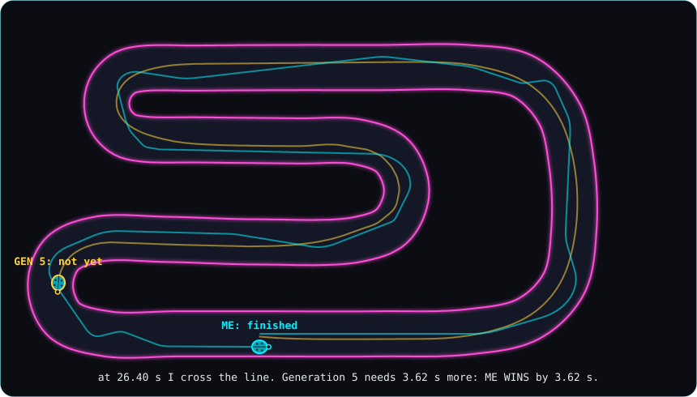

*One race as a picture: generation 5 against me. At 26.40 s I cross the line. The generation 5 car is still in the last corner and needs another 3.62 s. The thin lines are both paths. Mine wobbles; the AI's is smoother.*

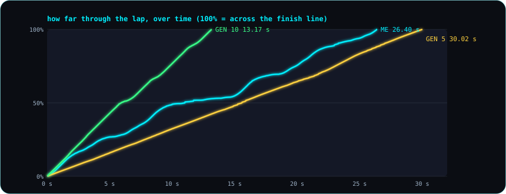

*The same races as lines. Generation 10 (green) is about twice as fast as me the whole way round. Generation 5 (yellow) is slow but steady. I (cyan) am faster than generation 5 at the start, slow down around the middle of the lap, and finish 3.62 s ahead of it.*

Where do I lose to generation 10? Everywhere, by about half. From the start to 40% of the lap I take 8.28 s, and it takes 4.65 s. From 40% to 65% (the top straight, the hairpin and the leg after it) I take 8.12 s against its 3.58 s, the biggest difference. The last 35% is 9.98 s against 4.92 s.
*Reproduce it: `node tools/figures.js` (`raceGen5` in `docs/img/figure-data.json`); the split times come from the same race, gen 10 against me.*

> **Interactive later:** pick any generation and race it against your own lap, recorded right there in the page.

**What actually happened**
- The race code matched the recorded laps on the first run. All six races end at exactly the recorded step.
- On screen, three things needed fixing after the first screenshots:
  - The live gap sat on top of the top wall.
  - At the finish, the "ME" and "GEN 10" tags covered each other.
  - The "crashed here" label hid under the generation 1 car.
- Generation 10 is the first time the AI beats me. It does it by 13.23 s, and its 13.17 s lap is half of mine.

**The prompt:** [entry 10: the guide in two levels, then me vs the AI](PROMPTS.md#10-the-guide-in-two-levels-then-step-6-me-vs-the-ai).

**In the code**
- `createRace()` in `src/sim/race.js`: my ghost and one champion, each at the start of its best lap.
- `championBestLap()` in `src/sim/race.js`: drives a champion alone and keeps its fastest lap and where it began.
- `stepRace()` and `runRace()` in `src/sim/race.js`: one step, or a whole race, for both cars.
- `raceGap()` in `src/sim/race.js`: who's ahead right now, and by how many seconds.
- `raceResult()` in `src/sim/race.js`: who won and by how much, or how the AI got out.
- `buildScoreboard()` in `src/sim/scoreboard.js`: the six rows and the running score, from the saved files only.
- `drawRaceHud()` and `drawScoreboard()` in `src/render/race-view.js`: the race screen and the scoreboard.


**The full code**

`raceResult()`: no result while racing. If the AI never finished, I win and the result says how it got out. Otherwise the winner is the car with fewer steps, and the gap is the step difference divided by 60.

<!-- full-code src/sim/race.js raceResult -->
```js
// The final result: who won, by how much, and how the AI got out if it never finished.
export function raceResult(race) {
  const { me, ai } = race;
  if (!race.over) return null;
  if (!ai.finishSteps) {
    return { winner: 'me', by: null, aiOut: ai.out, aiProgress: progressShare(ai), meSteps: me.finishSteps, aiSteps: null };
  }
  const diff = me.finishSteps - ai.finishSteps;
  let winner = 'tie';
  if (diff > 0) winner = 'ai';
  if (diff < 0) winner = 'me';
  return { winner, by: Math.abs(diff) / STEPS_PER_SECOND, meSteps: me.finishSteps, aiSteps: ai.finishSteps };
}
```
<!-- /full-code -->

---

## 7. Did it learn, or memorize?

**The one idea:** a car that really learned to drive should manage a track it has never seen; one that only memorized its home track shouldn't.

**Analogy:** a student who memorized last year's exam answers scores perfectly on last year's exam, and is lost on a new one. A student who understood the subject does fine on both.

**Key figure**

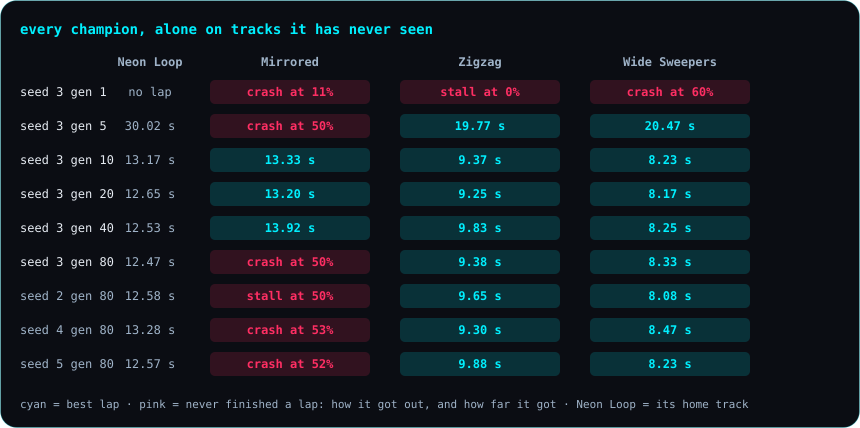

*Every tested champion, alone on three tracks it has never driven. Cyan: its best lap. Pink: it never finished a lap; the cell says how it got out and how far it got. Left column: its lap on Neon Loop, its home track, for comparison.*

### Pre-registered: the tests were fixed before any car drove
Before running anything, we added four new tracks and wrote down the exact tests in [DEVLOG.md](DEVLOG.md) ("Step 7a pre-registration", commit fa2a3a1). That way the results couldn't change the questions. All four tracks use the same 90 px road and the same frozen physics. Their data has a fingerprint (SHA-256 `f4fccfef…6a2d9c`), and a test fails if they ever change.

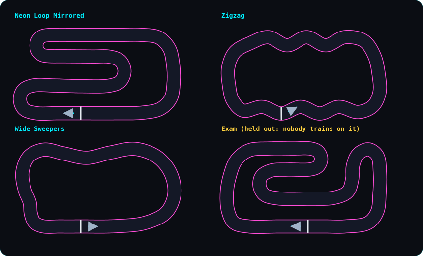

*The four new tracks.*
- **Neon Loop Mirrored** is the home track driven the other way round, so every turn goes the other way, including the hairpin, which now turns right.
- **Zigzag** has many quick left-right turns and no hairpin.
- **Wide Sweepers** has long fast curves and one tight corner at the end.
- **Exam** is held out: nobody trains on it, ever, and no AI drives it until I have.

The test: each champion drives alone, from the track's normal start, under the same rules as in evolution. It is out on a crash, after 3 s without a new checkpoint, or at 60 s.

**Real numbers**
- **Zigzag and Wide Sweepers: it learned.** Every champion from generation 5 on finishes laps on both. From generation 10 on, the best laps are 9.25–9.88 s on Zigzag and 8.08–8.47 s on Wide Sweepers, for all four seeds. Only the generation 1 champion fails: it stalls at the start of Zigzag and crashes at 60% of Wide Sweepers.
- **Neon Loop Mirrored: it's complicated.**
  - Generations 10 and 20 drive it fine: 13.33 s and 13.20 s, close to their home laps of 13.17 s and 12.65 s.
  - Generation 40 finishes one lap (13.92 s), then gets stuck in the hairpin on its second, faster lap.
  - All four generation 80 champions (seeds 2, 3, 4, 5) fail at the same place, about halfway round: the hairpin, which now turns right. Three crash and one stalls.
  - Generations 1 and 5 fail too, earlier or in the same hairpin. But they couldn't drive their home track well either: no lap, and 30.02 s.

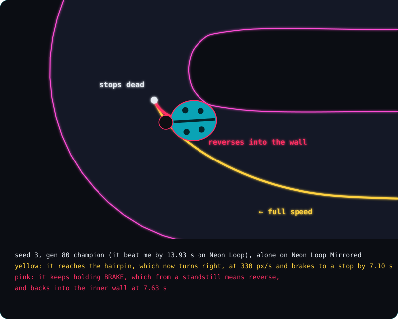

*The most telling failure: the seed 3, generation 80 champion, the one that beat me by 13.93 s on its home track. It reaches the mirrored hairpin at full speed (330 px/s) and brakes to a dead stop by 7.10 s. Then it keeps holding BRAKE. From a standstill that means reverse, so it backs into the inner wall at 7.63 s.*

*Reproduce it: `node tools/generalization-report.js` (writes `runs/step7a.json`; `tests/step7.test.js` checks it), or in the game `index.html?champion=3-80&track=neon-loop-mirrored`.*

**So, learned or memorized? Both.** Our best explanation, which is an inference and not a measurement:
- The general skills transfer: follow the road, slow down for corners, take the inside. That's why Zigzag and Wide Sweepers are no problem, even though they look nothing like Neon Loop.
- But Neon Loop has one hairpin, and it always turns left. The champions that trained longest seem to have tuned their 70 numbers to that one corner, in a way that falls apart when the corner turns the other way.
- We only tested one seed at every generation, and three more seeds at generation 80. So "longer training means more specialized" is a pattern in this data, not a proof.

### The exam (Step 7b)
**My lap first.** No AI drove Exam before I did. My first 3 completed laps there took 54.03 s, 44.30 s and 32.02 s; the best, 32.02 s (1921 steps), is my official Exam time, saved as `ghosts/me-exam.json`. It is the best of exactly those 3 laps, and it replays headless to the step (`tests/exam-ghost.test.js`). (An earlier message said 21.37 s. That lap was on Zigzag, not Exam; see DEVLOG.md.) Only then was Exam opened for the saved champions: `unlockExam()` checks the ghost first. Training on Exam is still refused, always.

**Step 7b, as pre-registered.** Seed 3 trained from scratch for 100 generations on three tracks at once: Neon Loop, Zigzag and Wide Sweepers. Every car drove all three, and its fitness was the sum of its three single-track fitness scores. Everything else was unchanged: 100 cars, top 10 parents, 1 elite, mutation 10% with sigma 0.3. At home the three-track champion of generation 100 drives Neon Loop in 13.17 s, slower than the one-track generation 80 champion (12.47 s), and Zigzag and Wide Sweepers in 8.15 s and 8.17 s.

The exam: the one-track champions of generations 10, 20 and 80, and the three-track champions of generations 10, 20, 80 and 100, each alone on Exam and on Neon Loop Mirrored, under the evolution rules.

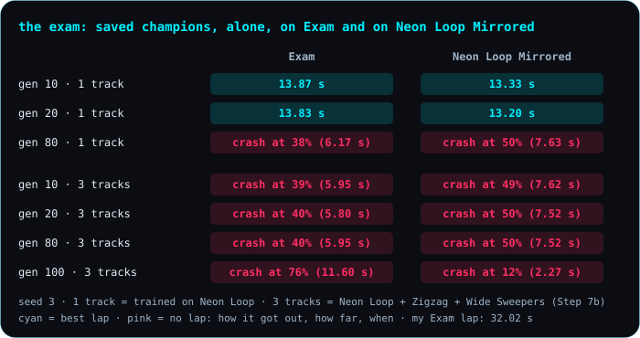

*Every tested champion on Exam and on Neon Loop Mirrored. Cyan: its best lap. Pink: it never finished a lap; the cell says how it got out, how far it got and when.*

**Real numbers**
- **One-track generations 10 and 20 pass.** Exam: 4 laps each, best 13.87 s and 13.83 s. Mirrored: 13.33 s and 13.20 s.
- **One-track generation 80 fails both, the same way.** On Exam it brakes to a dead stop in the hairpin that turns right at 5.60 s, keeps holding BRAKE, which from a standstill means reverse, and backs into the wall at 6.17 s, 38.4% of a lap. On Mirrored: a dead stop at 7.10 s and the wall at 7.63 s.
- **The three-track champions fail both, all four of them.**
  - On Exam, generations 10, 20 and 80 crash in the hairpin at 5.80–5.95 s (38.9–40.2% of a lap). They never slow below 173–195 px/s: they go in too fast, with no dead stop.
  - Generation 100 gets round the hairpin, then crashes in the right-hand corner at the top right at 11.60 s (75.8%).
  - On Mirrored, generations 10, 20 and 80 crash in the hairpin at 7.52–7.62 s. Generation 100 crashes in the very first corner, at 2.27 s (12.3%).

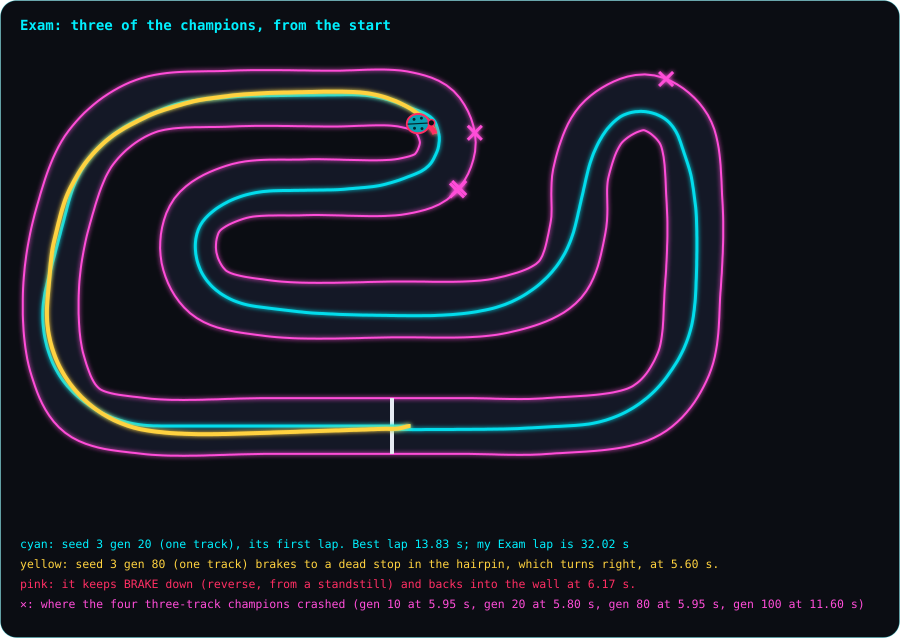

*Exam from the start. Cyan: the one-track generation 20 champion's first lap. Yellow, then pink: the one-track generation 80 champion stops dead in the hairpin and reverses into the wall. ✕: where the four three-track champions crashed.*

**The race.** My Exam lap (32.02 s) against the best of them on Exam, the one-track generation 20 champion (13.83 s), best lap against best lap as in every race: **the AI wins by 18.18 s.** Watch it: `index.html?race=exam&champion=3-20`.

**Did training on three tracks help? No.** On Exam none of the four three-track champions finished a lap, and two of the three one-track champions did.

**Our best explanation** (an inference, not a measurement): none of the three training tracks has a hairpin that turns right. Neon Loop's only hairpin turns left, and Zigzag and Wide Sweepers have none. Training on more tracks taught the cars to go faster through the turns they already knew, not to handle a turn none of them had. We saw this risk after Step 7a and wrote it down before running the exam (DEVLOG.md, the Step 7b entry), but kept the pre-registered plan. So this result is the plan's honest outcome. It's one seed, so it's a pattern, not a proof. Chapter 8's Paperclip, a drawn track with a right-hand hairpin, shows the same thing.

*Reproduce it: `node tools/exam-report.js` (writes `runs/exam.json`; `tests/exam.test.js` checks every result and the race).*

> **Now in the game:** pick any champion and any track, and watch it try. See chapter 8.

**What actually happened**
- **While designing the tracks**, before registering them: Wide Sweepers' tight corner was so tight that its inner wall crossed itself, so the corner was opened up a little. Zigzag was raised 8 px so its wall clears the key hints at the bottom of the screen.
- **After registering**, nothing changed. The results are as they came out.
- **The prediction was wrong in an interesting way.** We expected the best car to crash "in the first corner of a track it has never seen". It never did. It handled the first corners of every new track; it was the mirrored hairpin that broke it.

**The prompt:** [entry 14: did it learn, or memorize?](PROMPTS.md#14-step-7a-did-it-learn-or-memorize), [entry 15: my Exam lap, Step 7b, and the exam](PROMPTS.md#15-my-exam-lap-step-7b-and-the-exam) and [entry 18: my Exam ghost](PROMPTS.md#18-my-exam-ghost).

**In the code**
- `trackDef()` in `src/sim/track.js`: a track's data by its id (Neon Loop, Mirrored, Zigzag, Wide Sweepers, Exam).
- `trackData()` and `sha256()` in `tools/track-hash.js`: the frozen tracks' fingerprint.
- `trialRun()` in `tools/generalization-report.js`: one champion alone on one track, under the evolution rules.
- `countExamLap()`, `bestExamLap()` and `examGhost()` in `src/sim/exam.js`: my first 3 Exam laps, the best of them, and the ghost file.
- `createMultiEvolution()` and `multiTrackFitness()` in `src/sim/multi-evolution.js`: Step 7b, training on three tracks with the summed fitness.
- `unlockExam()` and `refuseTraining()` in `src/sim/held-out.js`: Exam opens for testing champions only after my lap is checked, and never for training.
- `tools/exam-report.js`: the exam and the race.


**The full code**

`countExamLap()`: a lap is kept only while fewer than 3 have been kept. Anything after that doesn't count.

<!-- full-code src/sim/exam.js countExamLap -->
```js
// Adds a completed lap if fewer than 3 have counted so far. Returns true if it counted.
export function countExamLap(record, lap) {
  if (record.laps.length >= COUNTED_LAPS) return false;
  record.laps.push({ steps: lap.steps, start: lap.start, inputs: lap.inputs });
  return true;
}
```
<!-- /full-code -->

---

## 8. Make your own track

**The one idea:** a track is just a list of points. Everything else is the same rules on every track: the road width, the start line, the checkpoints and the physics. So anyone can draw a new one, it can be checked automatically, and it fits in a link.

**Analogy:** a toy train set. You choose the layout; the rails, the train and the rules of the track are the same on every layout.

**Key figure**

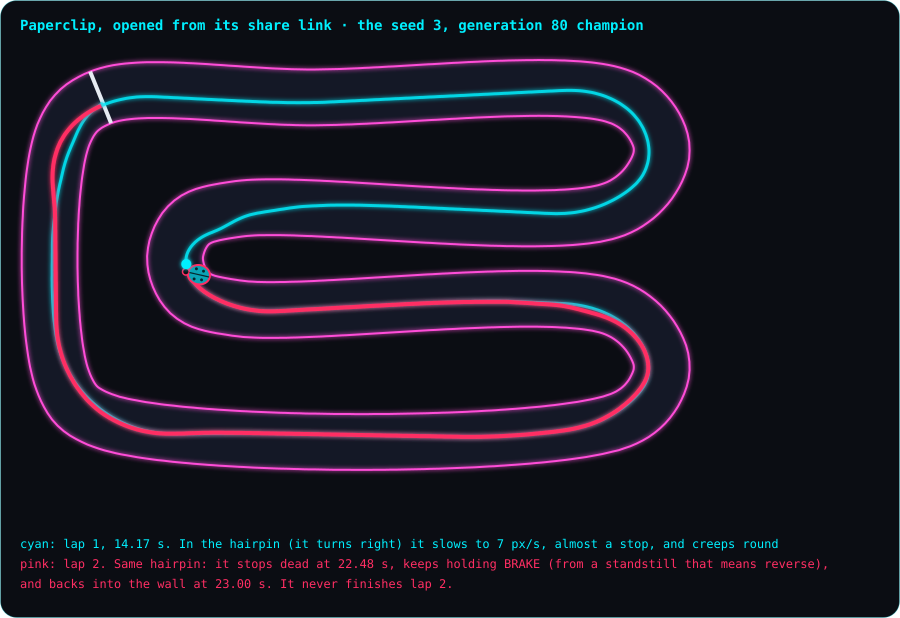

*Paperclip, a track drawn in the editor and opened from its share link, with the seed 3, generation 80 champion alone on it. Cyan: lap 1 (14.17 s), a crawl through the right-hand hairpin. Pink: lap 2, which ends in reverse against the wall.*

### The editor
Press T, then "Edit / new track". It opens on a copy of the current track (the built-in tracks themselves stay frozen), or empty after "Clear". Exam never opens in the editor.
- **Click** to add a point at the end of the loop, **drag** a point to move it, **right-click** a point to delete it, **Backspace** to undo the last one.
- The loop always closes: the last point joins the first.
- **The start line is at the first point**, and you drive towards the second.
- The road is always 90 px wide, the car and its physics are the frozen ones (PHYSICS_VERSION 3), and the checkpoints are made exactly as on every track: one every 48 px along the middle of the road (`buildTrack()`, unchanged).
- At most 60 points. Coordinates are whole pixels on the 1280 × 720 screen.
- Every valid track is kept in the browser as "My track". "Drive it" and "Let the AI train on it" only work while the track is valid.

### The track check
Every change is checked at once (`checkTrack()` in `src/sim/track-check.js`). Each problem comes with a plain message and the spot where it is, which the editor circles in pink.

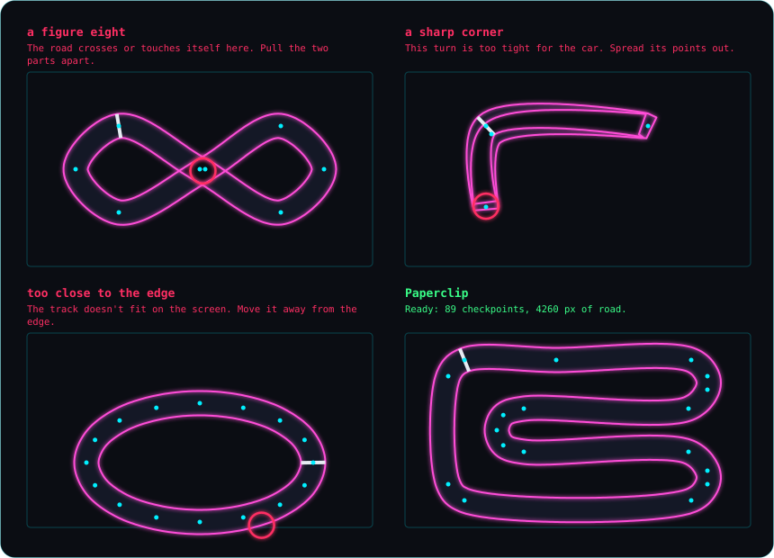

*One real example of each problem, with the exact message the editor shows, and a track that passes.*

The rules, in the order they are checked:
- **Points:** at least 4 and at most 60, all on the screen, and no two neighbouring points closer than 16 px ("Two points are on top of each other").
- **Fits on the screen:** both walls stay at least 10 px inside the edge of the screen.
- **Too tight for the car:** the sharpest bend of the road's middle line must have a radius of at least 45 px, half the road width. It's measured with the circle through every three neighbouring samples, 8 px apart. Any tighter and the inside wall folds over itself, so the road stops being a road. (The car alone could turn tighter: at walking pace its middle can follow a circle of about 19.5 px radius, worked out from its turn rate of 3.6 radians per second and the steering rules. So in practice the road's shape is the limit, not the car.)
- **Crosses or touches itself:** two parts of the road that are more than 180 px apart along the road must be at least 100 px apart on screen. That leaves at least 10 px of ground between their walls.
- **Exam:** refused, also any track with exactly Exam's points in another order.

All four built-in tracks a car may drive pass this check (a test makes sure). Their tightest bends: Zigzag 46.2 px, Neon Loop 53.4 px, Wide Sweepers 55.2 px.

### Share links
A link carries only the points: `?t=` followed by `1` (the version) and 4 letters per point, 2 for x and 2 for y.

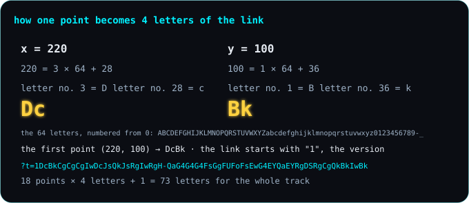

*The first point of Paperclip, (220, 100), becomes `DcBk`. Each letter stands for a number from 0 to 63 (A is 0, B is 1, …, _ is 63), so 2 letters hold any number from 0 to 4095: the first letter is how many whole 64s fit in, the second is what's left over. All 64 letters are safe in a web address as they are.*
- Paperclip has 18 points, so its link is 18 × 4 + 1 = 73 letters.
- **Opening a link checks everything** (`decodeTrack()`): the version letter, a length that is a multiple of 4, only the 64 allowed letters, and then the whole track check. Any problem gives a friendly message ("This track link is cut off or has extra letters. Copy the whole link again.") and Neon Loop opens instead. It never crashes: a test feeds it 2000 random strings and a dozen broken links.
- **Round trip:** every built-in track a car may drive, turned into a link and back, gives exactly the same walls, checkpoints and start position (tested).
- **Copy link** in the track menu copies the link of the current track. With a champion running, a second button copies "this track + this champion" (`?t=…&champion=3-80`), so a link can say "watch my car fail on your track". Built-in tracks get a short link (`?track=zigzag`). Exam never gets one.

### On any track
On every track except Exam, built-in, drawn or opened from a link:
- **Drive it yourself:** the lap timer, and your best lap saved for that exact track (by its fingerprint, so a changed track starts with no best lap).
- **Test a saved champion:** the picker in the bottom-right corner lists all 30 one-track champions (seeds 1–5, generations 1, 5, 10, 20, 40, 80) and the 7 multi-track ones of Step 7b.
- **Train from scratch, live:** "train from scratch" in the picker, with the seed box, the speed keys (1, 2, 3) and the fitness chart. On a new track the chart goes wherever it covers the least road.
- **Same track + same seed = same result.** Checked on Paperclip with seed 3: generations 1 and 2 in the browser and in Node give the same numbers to the last digit.

On Exam you can only drive. Every AI car in the game is created by `createGeneration()`, which refuses Exam until my Exam lap is saved (ghosts/me-exam.json).

### The replay check
`node tools/replay-check.js` runs six fixed scenarios headless and compares them with the stored golden results in `tools/replay-golden.json`:
1. My Neon Loop ghost (ghosts/me-v3.json).
2. Three champion laps on Neon Loop: seed 3 generation 20, generation 80, and the multi-track generation 100.
3. The first 3 generations of seed 3's evolution: every stats row, the champions, and the 100 brains of generation 4.
4. Paperclip, opened from its share link: its walls and checkpoints, and the generation 80 champion on it.

It doesn't only compare lap times. Every car's path is kept as a fingerprint of its exact position, heading and speed on every step. That matters: when we changed the car's turn rate by 0.0000001 (in a throwaway copy), all 6 scenarios came out different, but my ghost still finished in exactly 1584 steps. A check of lap times alone would have missed it. It runs in about 2 seconds and is part of `npm test`. `--update` stores new golden results, only for a change we mean, with a DEVLOG note.

**Real numbers**

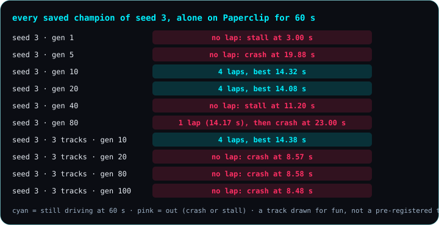

*Every saved seed 3 champion alone on Paperclip for 60 s. This is not a pre-registered test, just a track drawn for fun.*
- **Generation 80 (one track):** lap 1 in 14.17 s. In the right-hand hairpin it slows to 7 px/s, almost a stop, and creeps round. On lap 2 it stops dead in the same hairpin at 22.48 s, keeps holding BRAKE, which from a standstill means reverse, and backs into the wall at 23.00 s (out by crash at 155.8% of a lap).
- **Generations 10 and 20 (one track):** 4 laps each, best 14.32 s and 14.08 s.
- **Generation 40:** stops in the hairpin on its first visit and stalls at 11.20 s.
- **Generations 1 and 5:** no lap (stall at 3.00 s, crash at 19.88 s).
- **Multi-track (Step 7b):** generation 10 drives 4 laps (best 14.38 s). Generations 20, 80 and 100 crash in the hairpin on their first visit, at 8.57, 8.58 and 8.48 s.

**Our best explanation** (an inference, not a measurement): it's the same weakness as in chapter 7. Neon Loop's only hairpin turns left, and none of the three Step 7b training tracks has a right-hand hairpin either, so the later champions never needed one. This was found before the exam, which chapter 7 now has, and it showed the same pattern.

**What actually happened**
- **How Paperclip was found.** We drew tracks until one broke the champion, and logged every try, with three champions (seed 3 generation 20, generation 80, and multi-track generation 100):
  - An oval, a small circle and a rounded square, each driven both ways round: all three champions drove all six for the full 60 s.
  - Six "paperclip" shapes, a loop with a notch whose end is a hairpin. With the hairpin turning left (two shapes), all three drove them. Of the four with a right-hand hairpin, one was too tight to be valid. On the other three, generation 20 always got round, generation 80 failed on two, and multi-track generation 100 failed on all three.
  - Paperclip is the one where generation 80 gets round once and fails on lap 2, so it's the one we kept.
- **The first replay check missed something.** It compared only my ghost's lap time. The deliberate 0.0000001 change showed that the time didn't move while the path did, so the ghost's path fingerprint was added before anything was committed.
- **An old bug turned up:** pressing R on a multi-track champion restarted the one-track champion of the same generation. Fixed, because the game now remembers each champion by its full name.
- **Small layout fixes:** the editor's buttons first covered the start point, and on a crowded track the chart landed on the start line. Both moved.

**The prompt:** [entry 17: make your own track](PROMPTS.md#17-step-8-things-for-viewers).

**In the code**
- `openEditor()` and `customTrack()` in `src/game/editor.js`: the editor. `drawEditor()` in `src/render/editor-view.js` draws it.
- `checkTrack()` and `tightestTurn()` in `src/sim/track-check.js`: the track check.
- `encodeTrack()` and `decodeTrack()` in `src/sim/share-link.js`: track to link and back.
- `isHeldOut()`, `isExamShape()` and `refuseHeldOut()` in `src/sim/held-out.js`: the Exam rule, in one place.
- `openTrackMenu()` and `linkFor()` in `src/game/track-menu.js`: the T menu and the share links.
- `runScenarios()` and `compareWithGolden()` in `tools/replay-check.js`: the replay check.

**The full code**

`encodeTrack()`: refuse Exam, then write "1" and, for every point, x and y as two letters each.

<!-- full-code src/sim/share-link.js encodeTrack -->
```js
// Turns a track's points into the text that goes in the link.
export function encodeTrack(points) {
  if (isExamShape(points)) throw new Error('Exam is held out: it never goes in a link');
  let link = LINK_VERSION;
  for (const [x, y] of points) {
    for (const n of [x, y]) {
      link += LETTERS[Math.floor(n / 64)];
      link += LETTERS[n % 64];
    }
  }
  return link;
}
```
<!-- /full-code -->

`decodeTrack()`: the same steps backwards, checking each one, and finally the whole track check. Every way out is a plain message; nothing in it can crash on a bad link.

<!-- full-code src/sim/share-link.js decodeTrack -->
```js
// The other way: link text -> {track} (a track definition, already checked) or {error} (a plain message).
// It never throws: a broken or edited link only ever gets a friendly message.
export function decodeTrack(text) {
  if (typeof text !== 'string' || text.length === 0) return { error: 'This link has no track in it.' };
  if (text[0] !== LINK_VERSION) return { error: "This link isn't a Bug Driver track, or it's from a newer version of the game." };
  const body = text.slice(1);
  if (body.length % 4 !== 0) return { error: 'This track link is cut off or has extra letters. Copy the whole link again.' };
  const numbers = [];
  for (const letter of body) {
    const n = LETTERS.indexOf(letter);
    if (n < 0) return { error: "This track link has letters in it that don't belong. Copy the whole link again." };
    numbers.push(n);
  }
  const points = [];
  for (let i = 0; i < numbers.length; i += 4) {
    points.push([numbers[i] * 64 + numbers[i + 1], numbers[i + 2] * 64 + numbers[i + 3]]);
  }
  const def = { id: 'custom', name: 'Shared track', width: ROAD_WIDTH, points };
  let check;
  try {
    check = checkTrack(def);
  } catch {
    return { error: "This track link opens a track that can't be built." };
  }
  if (!check.ok) return { error: `This track link opens a track that can't be driven: ${check.problems[0].message}` };
  return { track: def };
}
```
<!-- /full-code -->

---

## Glossary

- **Activation function:** another name for a squash function. See *squash*.
- **Apex:** the innermost point of a curve.
- **Best lap:** a car's fastest lap. In races, both sides drive their best lap.
- **Bias:** one extra number a neuron adds after summing up. It shifts the neuron's result up or down, whatever the inputs are.
- **Brain:** here, a neural network of 70 numbers that turns 6 inputs into 4 key presses.
- **Champion:** the car with the highest fitness in its generation.
- **Checkpoint:** an invisible line across the road. There are 82, and a lap only counts if the car crosses them all, in order.
- **Child:** a car of the next generation, made from a copy of one parent's numbers with small changes.
- **Crossover:** mixing the numbers of two parents into one child. We don't use it.
- **Elitism:** copying the single best brain into the next generation unchanged, so the best can never get worse.
- **Evolution:** keep the best, copy them with small changes, repeat.
- **Fitness:** the score that decides who becomes a parent. Here: how far along the track, plus a bonus for a fast lap.
- **Flying lap:** a lap that starts with the car already moving across the line, like my 26.40 s lap.
- **Fixed timestep:** the simulation always moves forward in steps of the same length (one sixtieth of a second), whatever the screen does.
- **Function:** a small, named piece of code that does one job.
- **Generalize:** do well on something new, not just on what you trained on. A car that generalizes can drive tracks it has never seen.
- **Generation:** one round of 100 cars driving at the same time.
- **Golden results:** the stored, known-good results the replay check compares against (`tools/replay-golden.json`).
- **Ghost:** a recorded lap: the starting position plus the keys held on every step. Replaying it drives exactly the same lap.
- **Held out:** kept aside on purpose and never used for training, so it can be a fair test later. The Exam track is held out.
- **Hidden neuron:** a neuron between the inputs and the outputs. It's "hidden" because you never see it from outside.
- **Hitbox:** the shape the program uses to decide whether the car touched a wall.
- **Input:** one of the 6 numbers the brain gets: 5 eyes and the speed, each between 0 and 1.
- **Layer:** a group of neurons that all look at the same inputs.
- **Local optimum:** a dead end that looks like the top. Every small change makes things worse, even though something much better exists.
- **Mutation:** a small random change to some of a child's numbers. Here, each number has a 10% chance.
- **Neural network:** many neurons connected in layers. Ours has 6 inputs, 6 hidden neurons and 4 outputs.
- **Neuron:** multiplies each input by its weight, adds them up, adds the bias, and squashes the result.
- **Normalize:** turn a number into a common range, here 0 to 1, so that every input gets a fair say.
- **Output:** one of the 4 numbers the brain produces, one per key. Above 0.5 means that key is pressed.
- **Parent:** one of the top 10 cars of a generation, whose numbers are copied into the next one.
- **Pre-register:** write down the exact test before running it, so the results can't change the question.
- **Population:** all the cars of one generation, here 100.
- **px (pixel):** one dot on the screen. The screen is 1280 × 720 px.
- **Race:** my ghost lap and a champion's best lap, driven at the same time on the same track. They can't collide.
- **Replay check:** a fixed set of runs whose results must never change unless we mean them to (`tools/replay-check.js`).
- **Ray:** one of the car's 5 eyes: a line that goes out until it hits a wall, up to 200 px.
- **Seed:** the starting number for the random number generator. The same seed always gives the same "random" numbers.
- **Scoreboard:** my best lap against the champion of each of the six fixed generations (1, 5, 10, 20, 40, 80), and the running score.
- **Selection:** ranking the cars by fitness and keeping the best as parents.
- **Share link:** a web address that carries a whole track as letters, 4 per point, so it opens exactly that track.
- **Sigmoid:** a squash function whose result is always between 0 and 1. Used for the 4 keys.
- **Simulation:** a pretend world inside the computer that follows fixed rules.
- **Squash:** turn any number into one in a fixed range, so nothing runs off to infinity.
- **Stall:** a car that goes 3 seconds without reaching a new checkpoint is out.
- **Standing start:** a lap that starts from rest, 30 px behind the line. A champion's first lap is one.
- **Step:** one tick of the simulation, one sixtieth of a second.
- **Track check:** the automatic test of a drawn track: enough points, on the screen, no turn too tight, and the road doesn't cross or touch itself.
- **Track editor:** the screen where you click points to draw your own track.
- **tanh:** a squash function whose result is always between −1 and 1. Used for the hidden neurons.
- **Weight:** the number a neuron multiplies one input by. A big weight means "this input matters a lot". A negative weight means "this input pushes the other way".
