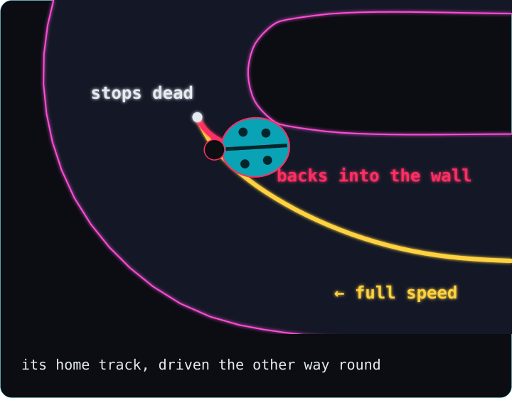

# How a little car taught itself to drive

> **In 30 seconds**
> - A tiny ladybug car drives around a race track in your web browser.
> - It can't see the track. It only feels how far away the walls are.
> - Its brain is just 70 numbers. They turn what it feels into gas, brake, left and right.
> - We start with 100 cars with random numbers. The ones that get furthest become the parents of the next 100.
> - After 4 rounds a car finishes a lap. Later the best car is about 14 seconds faster than me.

Want every detail, table and number? Read the [deep dive](DEEP-DIVE.md).

---

## 0. The big idea

**A car learns to drive with no teacher. It only has trial and error, over many generations.** (A generation is one round of 100 cars.)

Imagine 100 blindfolded drivers on a race track. Nobody tells them how to drive. Nobody gets better during a drive, either. But the ones who get furthest pass their habits on to their children, with small copying mistakes. Some of those mistakes happen to help.

Each car has eyes that feel the walls. It has a brain that decides. And it has the same 4 keys I use when I drive myself.

**What really happened:** nobody wrote a single rule like "brake before a corner". The program only says: drive, and the ones who got furthest have children. In our main run, the first car finished a full lap in the 4th round.

For the curious: [Deep dive →](DEEP-DIVE.md#0-what-were-building)

---

## 1. The track

**Before anything can learn, it needs a world whose rules never change.**

Think of a board game. If two players make exactly the same moves, the game ends exactly the same way. Our track works like that.

The walls glow pink. Touching one is a crash, and that car is out. Invisible lines across the road check that a car really drives the whole lap, in the right direction. No shortcuts.

The world moves in tiny ticks, 60 per second, the same on every computer. So the same key presses always give exactly the same lap. That matters later, when we race.

I drove it myself with the arrow keys. My best lap: about 26 seconds.

**What really happened:** the road was too narrow at first. On a test drive it felt too tight, so we made it wider and redrew the tight hairpin turn. Then we froze the rules for good.

For the curious: [Deep dive →](DEEP-DIVE.md#1-the-world)

---

## 2. Eyes

**The car can't see. It only knows how far away the wall is in 5 directions, and how fast it's going.**

It's like the parking sensors on a real car. They don't show a picture. They only beep: something is close, over there.

Five invisible lines go out from the car, like whiskers. Each one stops at the first wall it meets. The closer the wall, the bigger the number that eye sends. Add the speed, and that's 6 numbers.

Those 6 numbers are everything the car will ever know. It has no map. It has no idea where the finish line is.

**What really happened:** we froze one moment in the tight hairpin turn. The car's left eye saw the wall only about 23 pixels away. That's less than its own width.

For the curious: [Deep dive →](DEEP-DIVE.md#2-eyes)

---

## 3. The brain

**The brain is 70 numbers. They turn the 6 things the car feels into 4 key presses.**

Picture a mixing desk full of knobs. The car's 6 feelings come in on one side. The knobs decide how much each one counts. The keys come out on the other side.

The brain is made of small parts called **neurons**. A neuron takes some numbers in, gives each one a weight, adds it all up, and keeps the result between two limits. A **weight** is how much the neuron cares about one input. A big weight means a lot. A negative weight means it pushes the other way.

The last neurons are the keys: one for gas, one for brake, one for left, one for right. When a key's neuron ends up past halfway, that key is pressed. Count every weight, plus one extra number per neuron, and you get exactly 70 numbers.

**What really happened:** the first brains got random numbers, and it was chaos. In one run, more than a quarter of the cars crashed in the first couple of seconds, and almost half barely moved at all.

For the curious: [Deep dive →](DEEP-DIVE.md#3-brain)

---

## 4. Evolution

**Keep the cars that got furthest, copy their numbers with tiny changes, and repeat.**

It's like breeding. A farmer doesn't design a faster horse. They let the fastest horses have foals, again and again.

One round of 100 cars driving together is a **generation**. Each car gets a score, its **fitness**: how far it got, plus a bonus for a fast lap. The best 10 become parents. The very best one is copied exactly, so the best can never get worse. Every other child is a copy of a parent with a few numbers nudged a little. That nudge is a **mutation**.

**What really happened:** the first full lap came in generation 4, and it was slower than mine. But one of our runs never learned at all. For 95 generations it was stuck at the same spot. In one of those generations, not a single car ever touched the brake. Its best car drove flat out all the way, and the hairpin is far too tight to take flat out. Our best guess: it got stuck on a hill that isn't the top. Every small change made things worse, and the real top was too far away to reach in tiny steps.

For the curious: [Deep dive →](DEEP-DIVE.md#4-evolution)

---

## 5. Reading a brain

**We can freeze one moment and see exactly why the car pressed a key.**

It's like a sports replay with the referee's notes. You don't just see the turn. You see what pushed the car into it.

In the hairpin, the wall on the car's left was about 23 pixels away. You might expect it to steer away. Instead, the numbers flowed through the brain, and LEFT came out on. It turned toward that wall.

Why? That wall is the inside of the corner, and the inside is the shortest way round. The best car of generation 80 passes just a few pixels from it. The best car of generation 1 drove down the middle.

Nobody taught it that. The only rule was "go far, and finish fast". It isn't a perfect racing line, though. A real racing driver swings wide before the turn, and our cars don't.

**What really happened:** every number we show when we freeze a moment is checked by a test. It's exactly what the brain computed in that tick.

For the curious: [Deep dive →](DEEP-DIVE.md#5-reading-a-brain)

---

## 6. Me vs the AI

**My best lap against the best car of each generation, side by side.**

It's like racing your own ghost in a video game. Here, the ghost is me. The challenger is a car that taught itself.

Both cars drive their best lap at the same moment, and they can't bump into each other. In generation 1 the AI never finishes a lap, so I win. In generation 5 it finishes, but I'm still faster, by about 4 seconds. From generation 10 on, it wins every race.

**Final score: me 2, AI 4.**

**What really happened:** the first time the AI beat me, in generation 10, it won by about 13 seconds. Its lap took half as long as mine. And it's a fair fight: both cars drive their best lap, and each one starts exactly where that lap really began.

For the curious: [Deep dive →](DEEP-DIVE.md#6-me-vs-the-ai)

---

## 7. Did it learn, or memorize?

**A car that really learned to drive should handle a track it has never seen.**

Think of a student who memorized last year's exam answers. They score perfectly on last year's exam, and they're lost on a new one.

We built new tracks with the same road and the same rules, and let the best cars try them with no practice. On a wiggly track and on a fast, curvy one, almost every car drove fine. Then we turned the home track around and drove it the other way. The best car of generation 80, the one that beat me by 14 seconds, reached the hairpin at full speed. It stopped dead, kept holding the brake (which in this game means reverse), and backed into the wall.

**What really happened:** some earlier champions did get round that backwards track. So the honest answer is: both. It learned to drive, and the cars that trained the longest also learned tricks that only work at home. That last part is our best guess, not something we measured. Next comes a final exam track that nobody has trained on, and I drive it first.

For the curious: [Deep dive →](DEEP-DIVE.md#7-did-it-learn-or-memorize)

---

*Simple, but never wrong: every number here is real and comes from the actual program. The [deep dive](DEEP-DIVE.md) has the precise values and how to check each one yourself.*
