# How a little car taught itself to drive

> **In 30 seconds**
> - A tiny ladybug car drives a race track in your web browser. Its "brain" is a neural network of just 70 numbers.
> - Nobody wrote it any driving rules. It feels the walls with 5 invisible whiskers and presses the same 4 keys you would.
> - Evolution found the 70 numbers: 100 cars drive, the best become parents, their children get a few numbers nudged, and it all repeats.
> - It got fast: faster than me, and faster than the best setting of a hand-written driving program.
> - Then we tested it on tracks it had never seen. The fastest car failed. That's the most useful lesson in the whole project.

This guide follows the video chapter by chapter, with the same numbers. Each chapter links to its part of the video and to the [deep dive](DEEP-DIVE.md), where every detail lives. Claude Code, an AI that writes programs, wrote all the code; the car itself is driven by a separate, tiny neural network.

---

## 1. Three words

[▶ watch this part](VIDEO_URL&t=51)

**Artificial intelligence.** A regular program does exactly what it's told: "if there's a wall ahead, slow down". Here we don't write any driving rules at all. We give the car sensors, four buttons and a score: who got the furthest. How to actually drive gets found on its own, by trial and error.

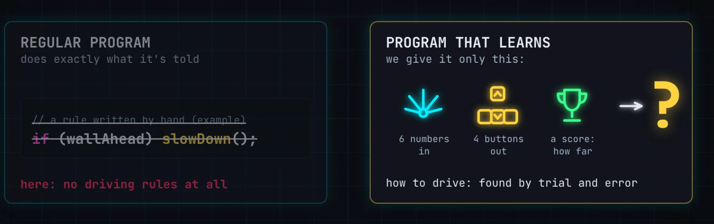

*Left: a rule written by hand. Right: what our car gets instead, and nothing more.*

**Neural network.** Picture a set of water pipes. A pipe runs from each of the car's sensors: the closer the wall, the stronger the flow. The pipes lead into four tanks: gas, brake, left and right. Every pipe has a tap. Some taps fill the tank. Others do the opposite and drain it: the stronger the signal, the more water flows out. If the water in a tank rises above the halfway mark, that button is pressed. That's the whole decision. And the setting of every tap is just a number. Our car has 70 of them.

**Training** is the search for the right tap settings. We take a hundred cars with random taps, keep the ones that got the furthest, and give them "children" with a few taps nudged at random. Then again and again, just like in nature: that's why it's called evolution.

For the curious: [Deep dive →](DEEP-DIVE.md#0-what-were-building)

---

## 2. The World

[▶ watch this part](VIDEO_URL&t=171)

To learn anything you need a place to learn: a track, some walls, and a little bug of a car you can also drive yourself.

This world runs in **ticks**: sixty times a second, the car takes one small step, the same way on every computer. Every tick is the same four things: read the buttons, move the car, check for a wall, check for a checkpoint line. Drive it twice with the same key presses, and you get exactly the same run, down to the pixel.

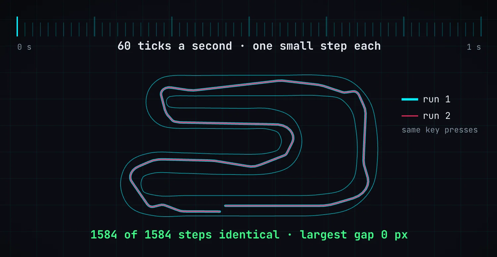

*Same key presses, same run, every time. If the world were even slightly random, evolution would be picking the lucky cars instead of the skilled ones.*

**What broke:** at first the road was too narrow, only 64 pixels; even I felt cramped. We widened it to 90. Then we froze the rules of the world, because if the physics changed later, old results couldn't be compared any more. On that final track I drove it myself. My best lap: 26.40 seconds.

For the curious: [Deep dive →](DEEP-DIVE.md#1-the-world)

---

## 3. Eyes

[▶ watch this part](VIDEO_URL&t=242)

What does the car actually see? Nothing. It has no camera and no map. All it has are five invisible whiskers, like a cat. Each one reaches forward until it hits a wall, up to 200 pixels, and reports how far away that wall is. It's like the parking sensors on a real car: they don't show you a picture, they just beep, close or far.

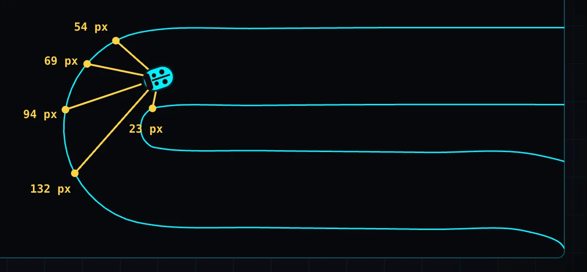

*The five whiskers at a real moment in the hairpin, with the real distance each one measured.*

Five distances plus the speed: six numbers, sixty times a second. That's everything the car knows. It doesn't know where the finish is, or that it's in a race.

All six are squeezed between 0 and 1 first: a wall right up close is 1, no wall in sight is 0; standing still is 0, flat out is 1. A distance can be 200 and the speed 330, and fed in as they are, the big numbers would drown out the small ones. This way every sensor gets an equal voice.

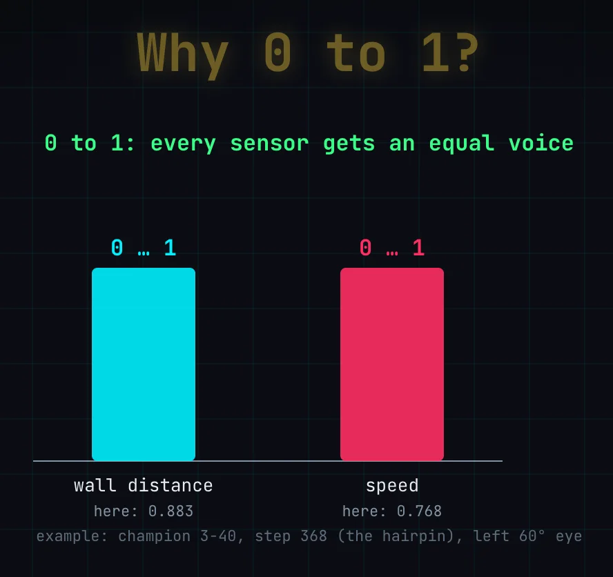

*Squeezed between 0 and 1, a distance and a speed can finally be compared fairly.*

**The real moment:** in the hairpin, the left whisker sees a wall 23 pixels away. That's less than the width of the car itself. The flow is almost at maximum: 0.88.

For the curious: [Deep dive →](DEEP-DIVE.md#2-eyes)

---

## 4. Generation 1

[▶ watch this part](VIDEO_URL&t=325)

What does the brain do when every tap is set at random? A hundred cars, a hundred random brains. They pass through each other; only the walls matter. Hit a wall and you're out. Sit for three seconds without progress, and you're out too, so cars spinning in place don't drive forever.

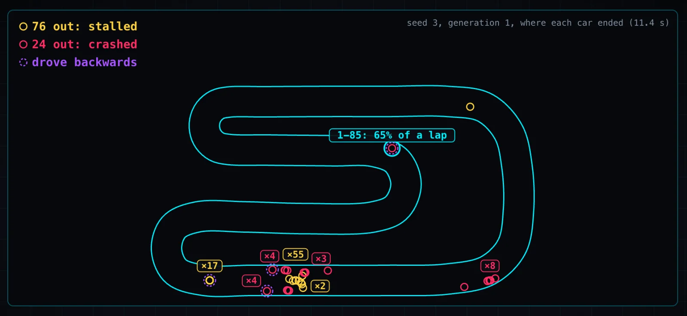

*Generation 1 at the end: who stalled, who crashed, who drove off backwards, and the one lucky car.*

**What happened:** 76 cars barely went anywhere, and the three-second rule took them out. 24 drove into a wall. Some even drove off backwards. But one of them, car 1-85, by pure luck made it almost two-thirds of the way around: 65% of a lap. No training at all, just lucky random taps.

Nobody in the first generation finished a lap. To get better, the cars need evolution.

For the curious: [Deep dive →](DEEP-DIVE.md#generation-1-random-brains-glorious-chaos)

---

## 5. The Brain

[▶ watch this part](VIDEO_URL&t=378)

One tank with its pipes is a **neuron**, the smallest part of the brain. A neuron does just four things, always the same four:

1. It takes the signal from each pipe.
2. It runs that signal through a tap. The tap is the **weight**: how much this pipe matters. Wide open, the signal counts a lot. A drain tap works against it.
3. It adds one more number of its own: the **bias**. Every tank has its own, and it doesn't depend on the sensors.
4. It squeezes the result into a narrow range, so the numbers can't grow forever.

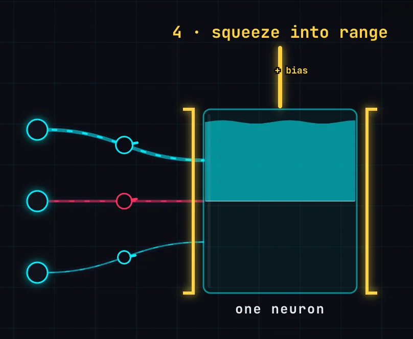

*One neuron: signals in, taps, one number of its own, and a squeeze.*

<!-- look-at-the-code
file: src/sim/brain.js
function: neuron
title: one neuron, the real function from the game
export function neuron(inputs, brain, start, squash) { => A neuron gets the signals, the car's 70 numbers, where its own taps start in that list, and how to squeeze.
  let sum = 0; => Start at zero.
  for (let i = 0; i < inputs.length; i++) { => For each pipe, one at a time…
    const weight = brain[start + i]; => …look at how far its tap is open…
    sum += inputs[i] * weight; => …and add the signal times the tap; a drain tap is a negative number, so the total goes down.
  } => That was the last pipe.
  const bias = brain[start + inputs.length]; => The next number in the list is this tank's own number, the bias.
  sum += bias; => Add the bias.
  return squash(sum); => Squeeze the total into range and hand it on.
} => Nine lines: that's an entire neuron.
-->
> **Look at the code: one neuron, the real function from the game**
>
> ```js
> export function neuron(inputs, brain, start, squash) {
>   let sum = 0;
>   for (let i = 0; i < inputs.length; i++) {
>     const weight = brain[start + i];
>     sum += inputs[i] * weight;
>   }
>   const bias = brain[start + inputs.length];
>   sum += bias;
>   return squash(sum);
> }
> ```
>
> 1. `export function neuron(inputs, brain, start, squash) {` — A neuron gets the signals, the car's 70 numbers, where its own taps start in that list, and how to squeeze.
> 2. `let sum = 0;` — Start at zero.
> 3. `for (let i = 0; i < inputs.length; i++) {` — For each pipe, one at a time…
> 4. `const weight = brain[start + i];` — …look at how far its tap is open…
> 5. `sum += inputs[i] * weight;` — …and add the signal times the tap; a drain tap is a negative number, so the total goes down.
> 6. `}` — That was the last pipe.
> 7. `const bias = brain[start + inputs.length];` — The next number in the list is this tank's own number, the bias.
> 8. `sum += bias;` — Add the bias.
> 9. `return squash(sum);` — Squeeze the total into range and hand it on.
> 10. `}` — Nine lines: that's an entire neuron.
<!-- /look-at-the-code -->

**The real car has more tanks.** The six sensor signals first gather in six middle tanks, and only from there flow into the four button tanks. The middle tanks mix signals. One of them listens mostly to two things: the wall ahead fills it, and the left whisker drains it. No single pipe can tell you that.

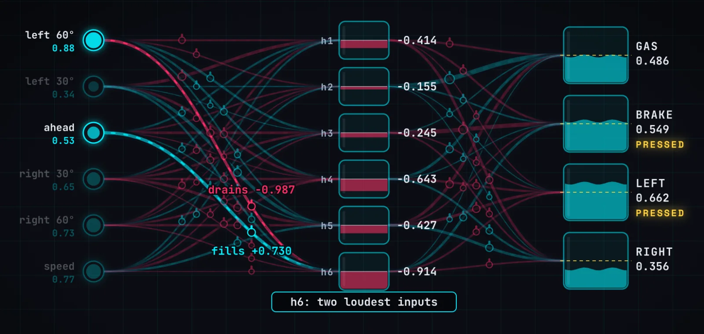

*A middle tank at a real moment: the wall ahead pushes it up, the left whisker pulls it down.*

**One honest caveat.** The water pipes are a simplification. What really flows through them is numbers, and in the middle tanks those numbers can be negative. A drain tap simply flips the sign: a negative going through a drain tap becomes a positive.

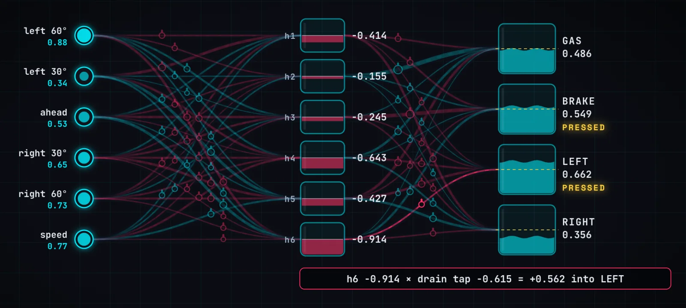

*Where the water picture stops working: numbers can go below zero.*

**Count the taps.** From six sensors to six middle tanks: 36 taps, plus 6 biases. From six tanks to four buttons: another 24, plus 4. That's 70 in total. In the code it's literally one list of 70 numbers, everything training is allowed to change.

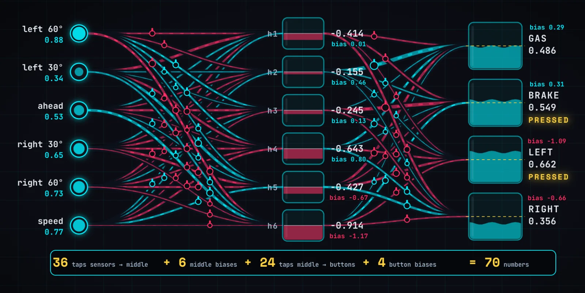

*The whole brain: 70 numbers, nothing else.*

Networks for images or text (ChatGPT and Claude run on a kind called transformers) are far bigger. We only need the simplest kind, six numbers in and four buttons out, so we can show you every single tap.

For the curious: [Deep dive →](DEEP-DIVE.md#3-brain)

---

## 6. Evolution

[▶ watch this part](VIDEO_URL&t=597)

You could train a network by showing it thousands of correct answers: "in this situation, press left". But where would those come from? Recorded from me, it would learn my mistakes too. Evolution needs no correct answers, only a score, and it's just three steps, repeated many times.

**Step one: score.** Every car gets a score. Got further, more points. If it finished a whole lap, it gets a bonus, and the faster the lap, the bigger the bonus.

<!-- look-at-the-code
file: src/sim/generation.js
function: fitness
title: the score, called fitness
export function fitness(car) { => How good was this car?
  let score = trackProgress(car.world); => How many checkpoint lines it crossed, in order, plus how close it got to the next one.
  if (car.bestLapSteps !== null) { => If it finished a lap…
    const lapSeconds = car.bestLapSteps / STEPS_PER_SECOND; => …turn its best lap into seconds…
    score += LAP_BONUS / lapSeconds; => …and add a bonus: 6000 divided by the lap time, so a faster lap means a bigger bonus.
  } => No lap, no bonus.
  return score; => That's the car's score.
} => The end of the recipe.
-->
> **Look at the code: the score, called fitness**
>
> ```js
> export function fitness(car) {
>   let score = trackProgress(car.world);
>   if (car.bestLapSteps !== null) {
>     const lapSeconds = car.bestLapSteps / STEPS_PER_SECOND;
>     score += LAP_BONUS / lapSeconds;
>   }
>   return score;
> }
> ```
>
> 1. `export function fitness(car) {` — How good was this car?
> 2. `let score = trackProgress(car.world);` — How many checkpoint lines it crossed, in order, plus how close it got to the next one.
> 3. `if (car.bestLapSteps !== null) {` — If it finished a lap…
> 4. `const lapSeconds = car.bestLapSteps / STEPS_PER_SECOND;` — …turn its best lap into seconds…
> 5. `score += LAP_BONUS / lapSeconds;` — …and add a bonus: 6000 divided by the lap time, so a faster lap means a bigger bonus.
> 6. `}` — No lap, no bonus.
> 7. `return score;` — That's the car's score.
> 8. `}` — The end of the recipe.
<!-- /look-at-the-code -->

**Step two: select.** The top ten become parents. The other ninety, that's it for them. The very best car is copied into the next generation exactly as it is. That's why the best result on the training track can never get worse.

**Step three: children with typos.** The other 99 cars are copies of the parents, with a few taps nudged at random. The better the parent, the better its chances to have children. Chances, not a fixed share: in one real generation the best parent got 20 of the 99 children and the tenth got 1.

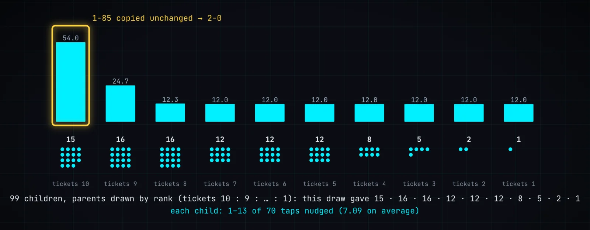

*Score, select, copy: one real step from generation 1 to generation 2.*

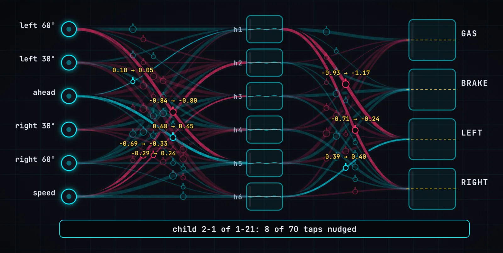

*A real child and its parent: most taps are exact copies, a few are nudged.*

**What happened:** generation after generation, the cars got further and further. In generation four, one of them finished a full lap for the first time: 38 seconds, slower than me. By generation six, the best lap was 19.25 seconds. Faster.

For the curious: [Deep dive →](DEEP-DIVE.md#4-evolution)

---

## 7. Stuck

[▶ watch this part](VIDEO_URL&t=686)

Evolution doesn't always work. We ran it five times, each with a different random start. Four learned to drive. One got stuck: 95 generations in a row with exactly the same result.

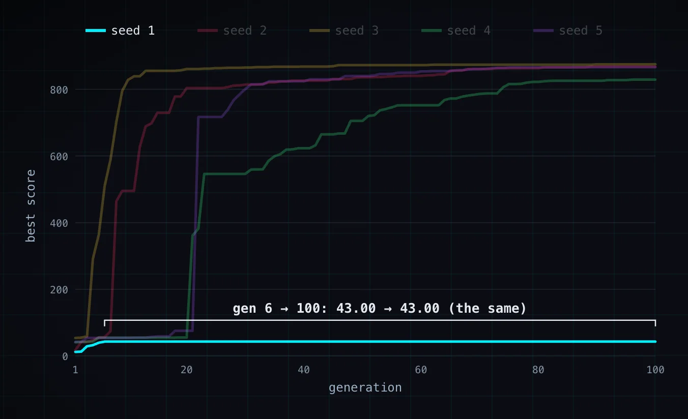

*Five runs, five random starts. Four climb, one stays flat for 95 generations.*

Generation after generation, its best car crashes in the very same spot: the exit of the hairpin, flat out. In one of those generations, not one of the hundred cars ever pressed the brake.

**Our best explanation** (an explanation, not a measurement): early on, the top car was one that never brakes. Fast, lots of points. Every descendant came from it. But getting through this hairpin means learning to brake, and that's a big step, not a small typo. Evolution got stuck on a hill that looks like the summit, and small steps can't get you off it.

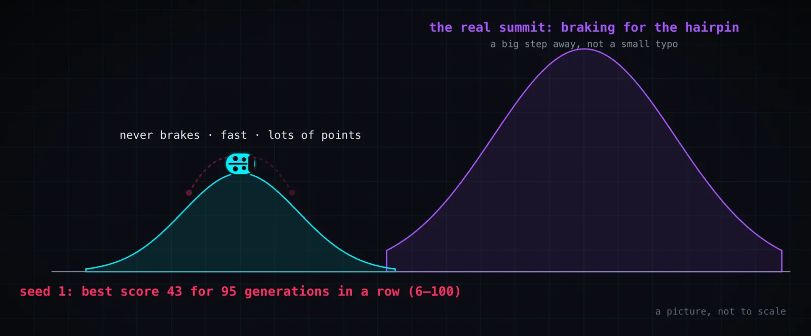

*Every small step from the top of the small hill goes down, so evolution stays there.*

Why are the steps so small? Here is how a child is made:

<!-- look-at-the-code
file: src/sim/evolution.js
function: mutate
title: children with typos
export function mutate(brain, rand) { => Make a child from a parent's 70 numbers.
  const child = []; => Start with an empty list.
  for (const number of brain) { => Go through all 70 of the parent's taps.
    if (rand() < MUTATION_RATE) { => For each one, roll the dice: one time in ten…
      child.push(number + gaussian(rand) * MUTATION_SIZE); => …nudge the tap a little, usually just slightly.
    } else { => …and the other nine times…
      child.push(number); => …copy it as it is.
    } => That was one tap.
  } => All 70 done.
  return child; => The result: almost the parent, but not quite.
} => The end of the recipe.
-->
> **Look at the code: children with typos**
>
> ```js
> export function mutate(brain, rand) {
>   const child = [];
>   for (const number of brain) {
>     if (rand() < MUTATION_RATE) {
>       child.push(number + gaussian(rand) * MUTATION_SIZE);
>     } else {
>       child.push(number);
>     }
>   }
>   return child;
> }
> ```
>
> 1. `export function mutate(brain, rand) {` — Make a child from a parent's 70 numbers.
> 2. `const child = [];` — Start with an empty list.
> 3. `for (const number of brain) {` — Go through all 70 of the parent's taps.
> 4. `if (rand() < MUTATION_RATE) {` — For each one, roll the dice: one time in ten…
> 5. `child.push(number + gaussian(rand) * MUTATION_SIZE);` — …nudge the tap a little, usually just slightly.
> 6. `} else {` — …and the other nine times…
> 7. `child.push(number);` — …copy it as it is.
> 8. `}` — That was one tap.
> 9. `}` — All 70 done.
> 10. `return child;` — The result: almost the parent, but not quite.
> 11. `}` — The end of the recipe.
<!-- /look-at-the-code -->

So from here on, we follow a run that did learn. To be honest: we picked it after seeing all five.

For the curious: [Deep dive →](DEEP-DIVE.md#seed-1-stuck-at-518-for-95-generations)

---

## 8. Reading the Brain

[▶ watch this part](VIDEO_URL&t=742)

Back to that hairpin, with the left whisker 23 pixels from the wall. We froze time and traced how this one decision was calculated.

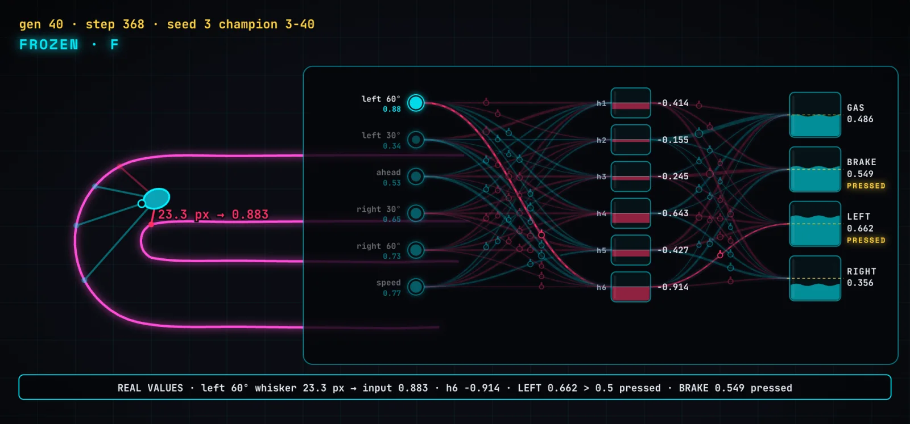

*One decision, traced through the real network. Every number is what the brain calculated at that moment.*

Every sensor plays a part, but the biggest contribution comes from the left whisker: its path through a middle tank gives the biggest push toward the "left" tank. The LEFT tank ends at 0.66, above halfway: button pressed.

<!-- look-at-the-code
file: src/sim/brain.js
function: think
title: think(): which buttons get pressed
export function think(brain, inputs) { => The brain's whole job: six numbers in, buttons out.
  const [gas, brake, left, right] = outputs(brain, inputs); => Push the signals through all the tanks; four button tanks come out.
  let keys = 0; => Start with no buttons pressed.
  if (gas > 0.5) keys += UP; => Gas tank above halfway? Press gas.
  if (brake > 0.5) keys += DOWN; => Brake tank above halfway? Press brake.
  if (left > 0.5) keys += LEFT; => Left tank above halfway? Steer left.
  if (right > 0.5) keys += RIGHT; => Right tank above halfway? Steer right.
  return keys; => Those are the buttons for this tick.
} => Then it all happens again, sixty times a second.
-->
> **Look at the code: think(): which buttons get pressed**
>
> ```js
> export function think(brain, inputs) {
>   const [gas, brake, left, right] = outputs(brain, inputs);
>   let keys = 0;
>   if (gas > 0.5) keys += UP;
>   if (brake > 0.5) keys += DOWN;
>   if (left > 0.5) keys += LEFT;
>   if (right > 0.5) keys += RIGHT;
>   return keys;
> }
> ```
>
> 1. `export function think(brain, inputs) {` — The brain's whole job: six numbers in, buttons out.
> 2. `const [gas, brake, left, right] = outputs(brain, inputs);` — Push the signals through all the tanks; four button tanks come out.
> 3. `let keys = 0;` — Start with no buttons pressed.
> 4. `if (gas > 0.5) keys += UP;` — Gas tank above halfway? Press gas.
> 5. `if (brake > 0.5) keys += DOWN;` — Brake tank above halfway? Press brake.
> 6. `if (left > 0.5) keys += LEFT;` — Left tank above halfway? Steer left.
> 7. `if (right > 0.5) keys += RIGHT;` — Right tank above halfway? Steer right.
> 8. `return keys;` — Those are the buttons for this tick.
> 9. `}` — Then it all happens again, sixty times a second.
<!-- /look-at-the-code -->

Wait. The wall is on the left, and the car turns left. Toward the wall? Yes, because that's the inside of the turn, and the inside line is shorter. The car is cutting the corner, like a racer. Nobody explained that to it. We told it only one thing: get further, and finish faster. It found the rest on its own.

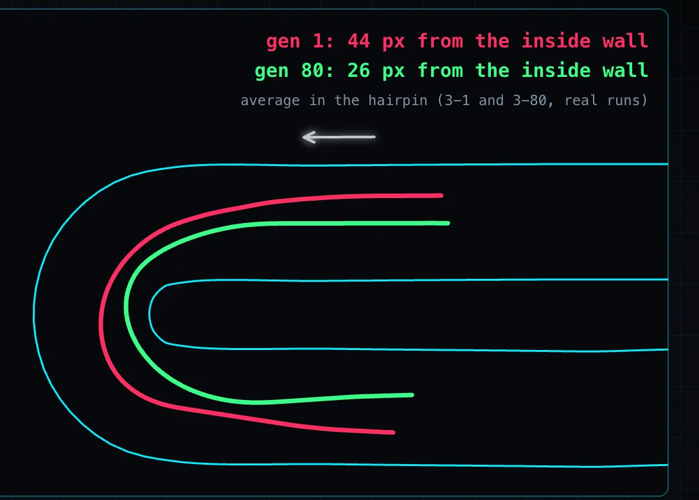

*Generation 1 drives down the middle; generation 80 hugs the inside wall.*

To be fair, it's not a perfect racing line. A real racer swings wide before the turn; ours just hugs the inside wall. Nobody taught it that either.

And the surprising part: the brain of the generation 80 champion is the same 70 taps as its random ancestor from generation 1. Nothing was added. 62 of the 70 taps are just turned differently.

For the curious: [Deep dive →](DEEP-DIVE.md#5-reading-a-brain)

---

## 9. How well did it learn?

[▶ watch this part](VIDEO_URL&t=823)

How well does it drive? "Fast" isn't enough; we need something to compare it to. So we set up four benchmarks:

- **Someone driving this game for the first time** (that's me): 26.40 seconds.
- **A regular program with no AI at all**, following the rule "stay in the middle and brake before turns". A careful setting: 17.25 seconds. The best of 980 settings: 12.68 seconds.
- **The floor for driving down the middle**: stay in the center at full speed, no brakes: 11.93 seconds. You can't go faster down the middle. Cutting corners, you can.

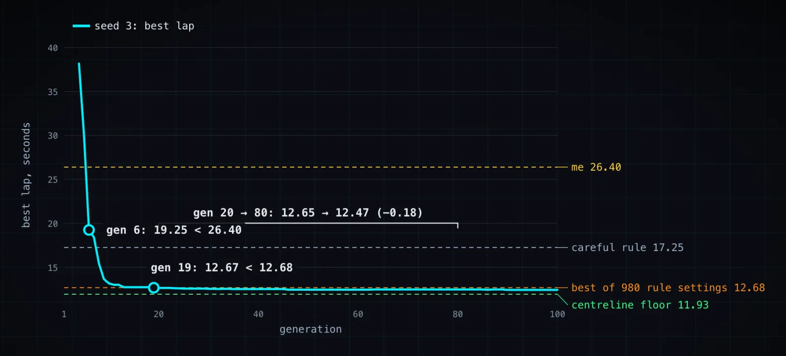

*The best lap time of every generation, with the four benchmarks as lines.*

Now watch the time drop. Generation 6 is the first faster than me. Around generation 20, it's faster than the best setting of the rule-based program; the first one under 12.68 seconds is generation 19, at 12.67. Without a single rule.

After that, almost nothing changes. From generation 20 to generation 80, the best lap went from 12.65 to 12.47 seconds: less than two tenths. In this run it went like this: a fast jump first, then slow polishing.

But every one of these measurements was on the track it trained on. That turns out to be a very important catch.

For the curious: [Deep dive →](DEEP-DIVE.md#6-how-well-did-it-learn)

---

## 10. Learned or memorized?

[▶ watch this part](VIDEO_URL&t=894)

A student who memorized last year's exam gets an A on that exam. On a new one? With AI too, you have to test on something it has never seen, or you can't tell learning from memorizing.

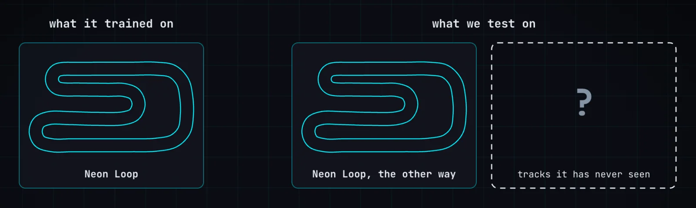

*Train on one thing, test on another: the only way to tell learning from memorizing.*

The simplest test: the same track, driven the other way. Now the hairpin turns right instead of left.

The champions of generations 10 and 20 drive it almost as fast as their home track: 13.33 and 13.20 seconds. They really did carry something over to the new track.

But the champion of generation 80, the fastest of them all, flies into the hairpin, brakes to a full stop, and keeps holding the brake. From a standstill, the brake means reverse, so it backs straight into the wall.

Why it won't let go of the brake, we don't know for sure. We do know this: when the car is reversing, its speed sensor reads zero. That's how we built it, so to the car, "standing still" and "going backwards" look exactly the same. A network only knows what its sensors tell it; a bad sensor is a blind spot.

And the bigger point: the longer the car trained on one track, the more it tuned itself to the turns of that one track. This is called **overfitting**: the model learned what it saw so well that it handles new things worse.

For the curious: [Deep dive →](DEEP-DIVE.md#7-did-it-learn-or-memorize)

---

## 11. The exam

[▶ watch this part](VIDEO_URL&t=975)

To make the test fair, we built one more track: the exam. And before any testing, we wrote down a rule: nobody trains on this track, ever. It's only for testing.

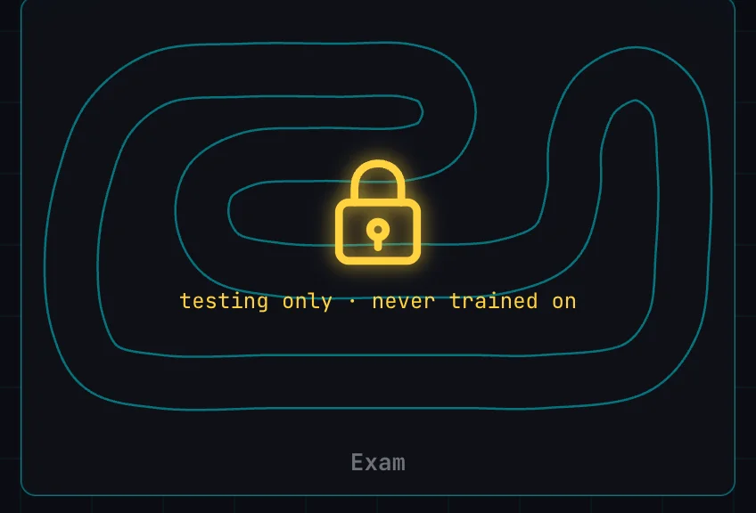

*The exam track. Locked for training, open only for testing.*

First, I drove it myself, also for the first time: 54.03 seconds, then 44.30, then 32.02. In three laps I got almost twice as fast.

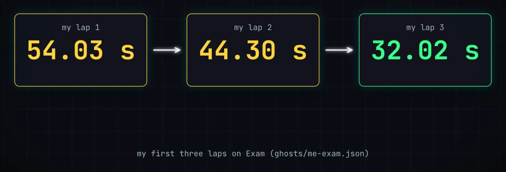

*My first three laps on the exam track. I learned while I drove.*

I was learning while I drove. The car can't: its taps don't change during a run; only its descendants learn.

Then the cars. Generations 10 and 20 pass the exam. Generation 80 backs into the wall again, the same way as on the reversed track. The more "experienced" champion failed where the "half-trained" ones made it.

For the curious: [Deep dive →](DEEP-DIVE.md#the-exam-step-7b)

---

## 12. The fix

[▶ watch this part](VIDEO_URL&t=1022)

The obvious fix: train on several tracks. We wrote this plan down before the exam: add two new tracks, retrain from scratch, and score each car by the sum of its scores on all three.

We tested the champions of generations 10, 20, 80 and 100 from that training run on the exam. Zero out of four. Three of them crash right in the right-hand hairpin. The fourth gets through it, and crashes a few turns later.

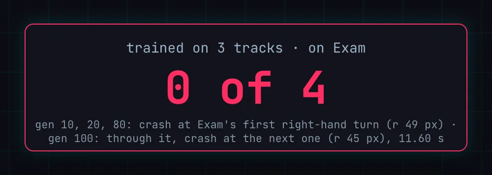

*Trained on three tracks, tested on the exam: none of the four finished a lap.*

Why? Look at the training tracks. Not one of them has a turn to the right this tight. More tracks didn't help, because the case it needed wasn't among them.

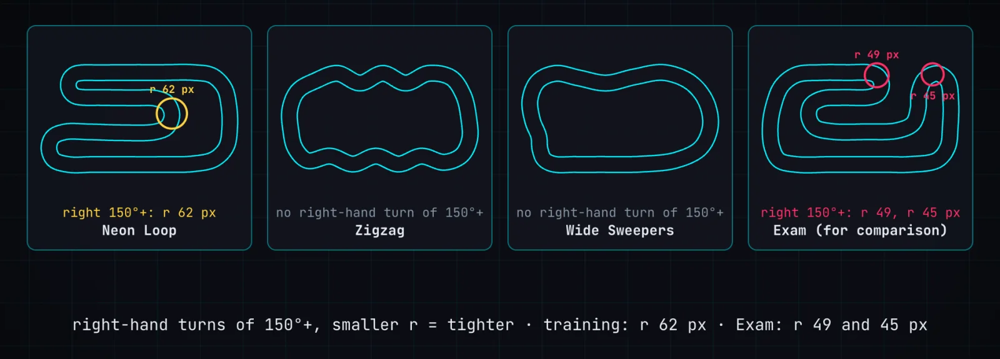

*The sharpest right-hand turn in training is wider than both of the exam's.*

So we added the reversed track, the one with the right-hand hairpin, to training. We made this decision after the exam. The same four generations on the exam: four out of four. And the fastest exam lap of any car so far: 13.25 seconds.

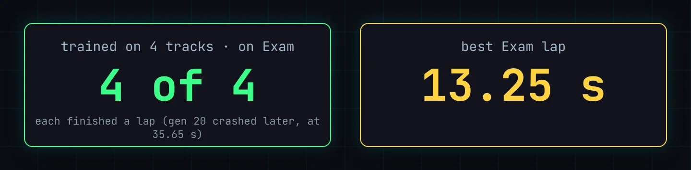

*Trained on four tracks, one of them with a right-hand hairpin: all four pass.*

The car didn't get smarter. It just saw the right kind of turn.

To be honest: we adjusted training based on the exam results, so the exam is no longer an independent test. A real test now needs a new track nobody has seen. That's a core rule of machine learning: a test you've fixed things against isn't a test any more.

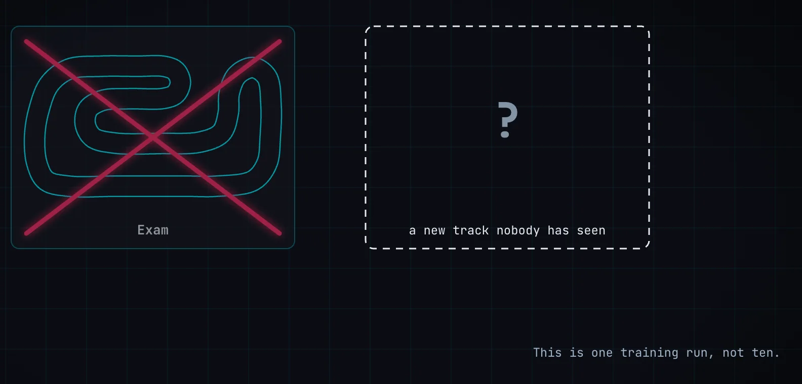

*Once we fixed things against the exam, it stopped being a fair test.*

For the curious: [Deep dive →](DEEP-DIVE.md#step-7c-one-more-try-decided-after-the-exam)

---

## 13. Retro

[▶ watch this part](VIDEO_URL&t=1114)

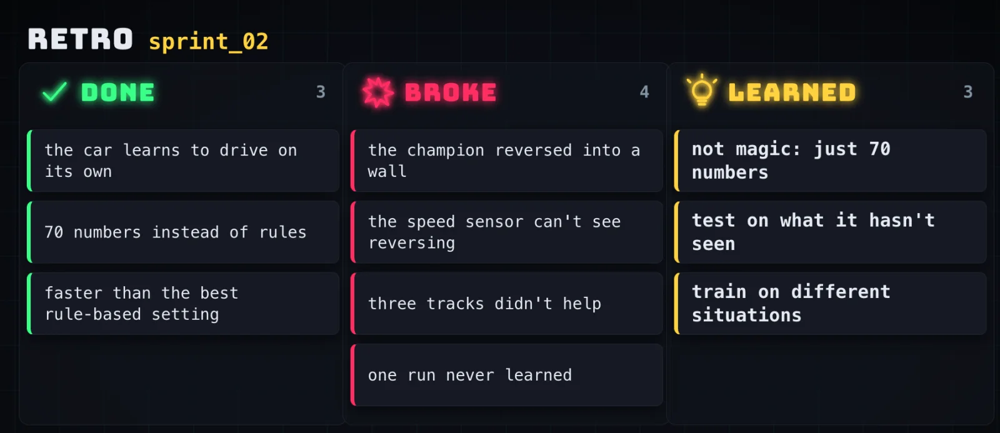

*Done, broke, learned: the whole project on one board.*

Three things to take away:

1. **A neural network isn't magic.** Ours is 70 numbers that turn sensor readings into button presses. Training finds those numbers. We did it with evolution: score, select, copy with typos.
2. **Test on what the model hasn't seen.** The fastest car on its own track turned out to be the worst on a new one.
3. **Train on different situations.** More tracks didn't help, until one of them had the right kind of turn.

For the curious: [Deep dive →](DEEP-DIVE.md)

---

## 14. Your turn: the track editor

[▶ watch this part](VIDEO_URL&t=1146)

The game has a track editor: press T, choose "Edit / new track", and click to add points. It checks the track as you draw and says, in plain words, when a turn is too tight or the road runs into itself. A ready track can be driven, given to a champion, or shared as a link.

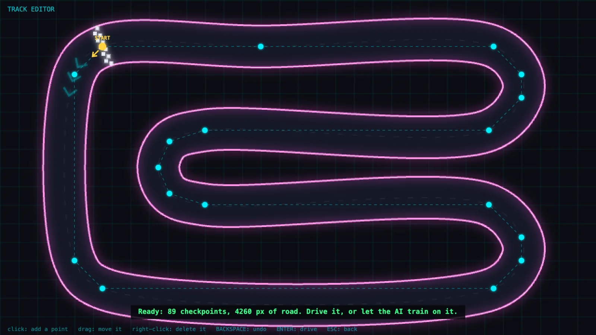

*A drawn track that passed every check: "Ready". Its right-hand hairpin is the trap.*

**The challenge:** draw a track that makes the generation 80 champion crash, and drop the link in the comments under the video.

The links to the game, this guide and every prompt are in the video description. With the code on your computer, run `npx serve` in its folder and open the address it prints; press Tab to let the AI drive.

For the curious: [Deep dive →](DEEP-DIVE.md#8-make-your-own-track)
