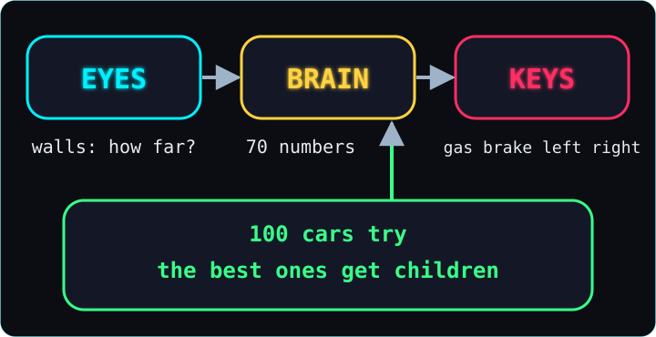
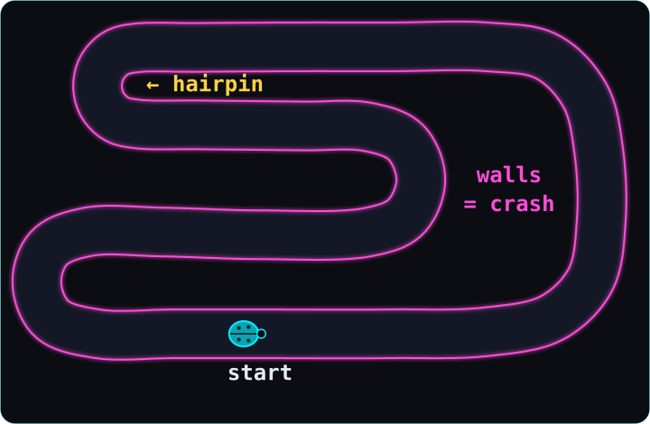
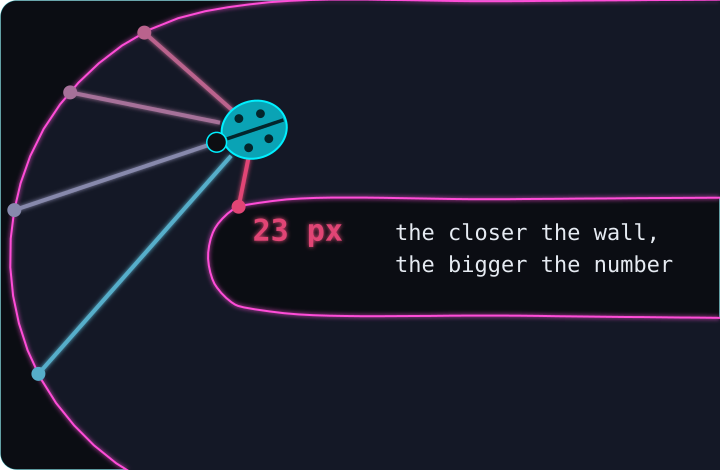
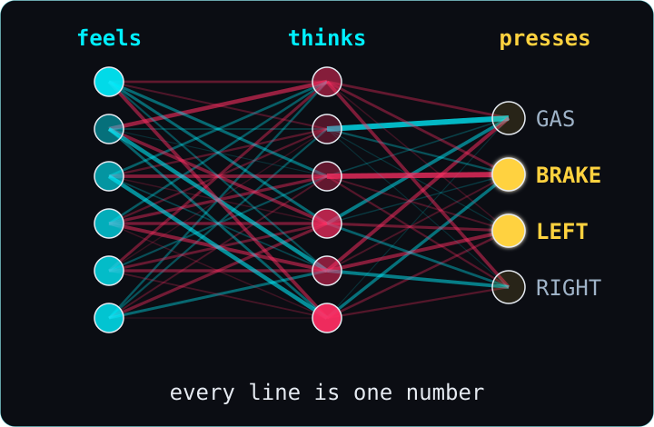
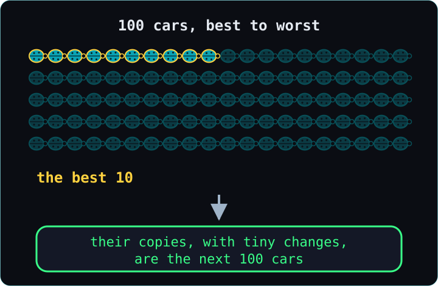
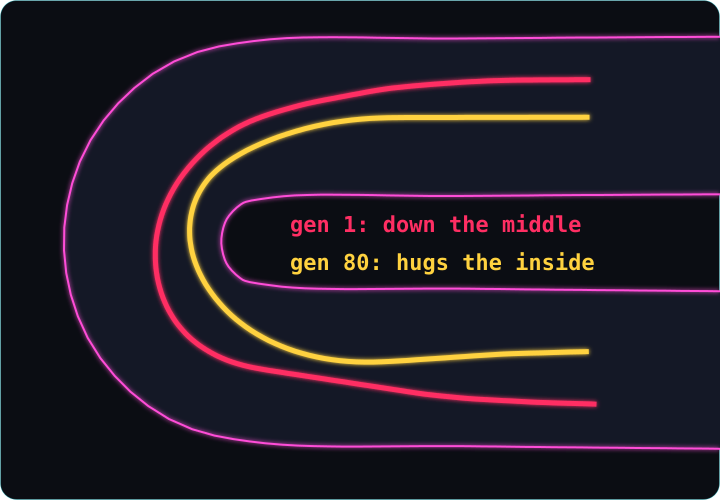
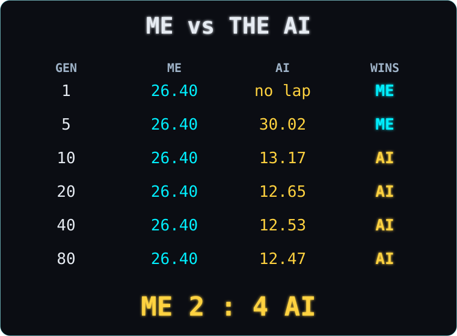
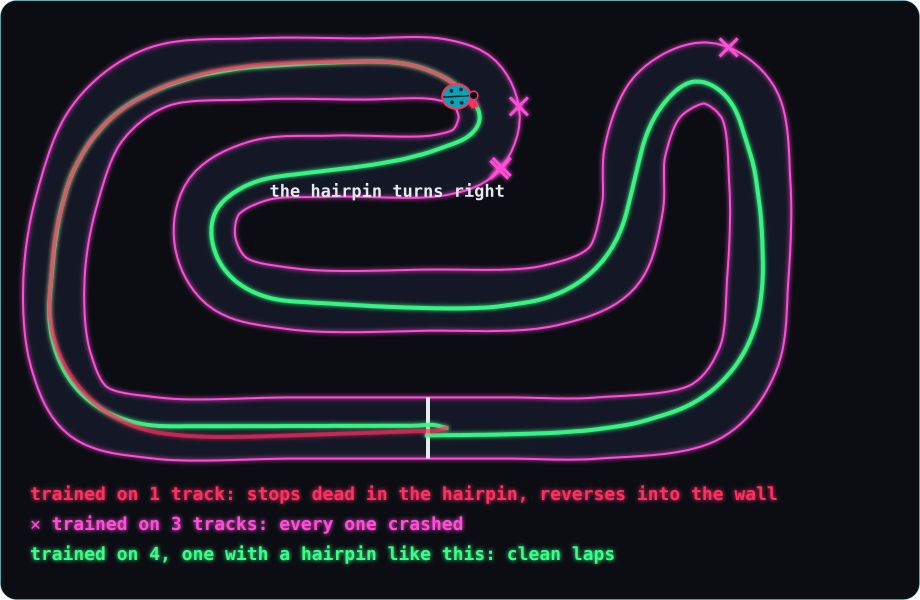
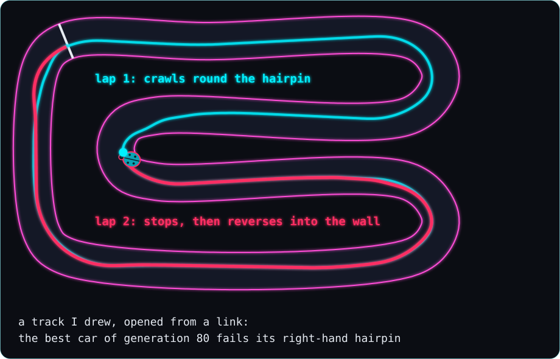

# How a little car taught itself to drive

> **In 30 seconds**
> - A tiny ladybug car drives around a race track in your web browser.
> - It can't see the track. It only feels how far away the walls are.
> - Its brain is just 70 numbers. They turn what it feels into gas, brake, left and right.
> - We start with 100 cars with random numbers. The ones that get furthest become the parents of the next 100.
> - After 4 rounds a car finishes a lap. Later the best car is about 14 seconds faster than me.

Want every detail, table and number? Read the [deep dive](DEEP-DIVE.md).

---

## Start here: what is all this?

**What "AI" means here.** A program that gets better at a job by trying, instead of being told the rules. Nobody tells our car "brake before a corner". It finds that out.

**What a "neural network" is.** A small calculator full of adjustable numbers. Ours has 70 of them. What the car feels goes in, a few multiplications and additions happen, and out come the keys to press. Change the numbers and you change how it drives.

**What "learning" means here.** Not studying. The car never gets better during a drive. Instead, we keep the numbers of the cars that drove furthest, copy them with tiny random changes, and try again. Over many rounds, the numbers get good. That's evolution.

**What Claude Code is.** An AI assistant that writes code. I describe what I want in plain English, and it writes the program, runs it and checks it. Every line of this project was made that way, and every prompt I wrote is published with it.

**What you need to do it yourself:** a computer with a web browser, Claude Code, and one evening.

**How to run it on your computer.** Type these in a terminal, the text window where you give your computer commands:
- `git clone https://github.com/codemaskdev/bug-driver.git` copies the project to your computer (once the project is public).
- `cd bug-driver` steps into the project's folder.
- `npx serve` starts a tiny web server on your computer. The game needs one; double-clicking the file won't work.
- Open `http://localhost:3000` in your browser. That's the game. Press Tab to let the AI drive.
- `npm test` runs all the checks that prove the numbers in this guide. You don't have to.

### How to read the code in this guide
Every chapter has a "Look at the code" box. It shows the real code from the game, never a simplified copy, and explains every line. These few symbols are all you need:
- `function think(brain, inputs) { … }` is a **function**: a named recipe. What it needs goes in the round brackets `( )`, and its steps go in the curly brackets `{ }`.
- `export` in front of a function means other files may use this recipe.
- `const total = 0;` gives a value a name. `let` does the same for a value that will change later. The `;` just ends the step.
- `total += 5;` adds 5 to total.
- `[1, 2, 3]` is a **list**. `list[0]` is its first item, because counting starts at 0. `list.push(x)` adds x at the end.
- `car.speed` means "the speed that belongs to the car".
- `for (const eye of eyes) { … }` is a **loop**: do the steps once for every item in the list. `for (let i = 0; i < 6; i++)` counts i from 0 up to 5.
- `if (speed > 100) { … } else { … }` does the first part only if the condition is true, and the second part otherwise.
- `return answer;` hands the answer back to whoever asked.
- `// a note` is a note for humans. The computer skips it.
- `>` is "more than", `<` is "less than", `===` is "exactly the same as", and `!` means "not".

---

## 0. The big idea

**A car learns to drive with no teacher. It only has trial and error, over many generations.** (A generation is one round of 100 cars.)

Imagine 100 blindfolded drivers on a race track. Nobody tells them how to drive. Nobody gets better during a drive, either. But the ones who get furthest pass their habits on to their children, with small copying mistakes. Some of those mistakes happen to help.



Each car has eyes that feel the walls. It has a brain that decides. And it has the same 4 keys I use when I drive myself.

**What really happened:** nobody wrote a single rule like "brake before a corner". The program only says: drive, and the ones who got furthest have children. In our main run, the first car finished a full lap in the 4th round.

<!-- look-at-the-code
file: src/sim/generation.js
function: stepGeneration
title: what happens 60 times a second
intro: This runs once every tick, for all 100 cars. It's the whole idea in a few lines.
export function stepGeneration(gen) { => One tick of the race, for a whole generation of cars.
... => First it counts the tick and gets ready to collect what happens.
  for (let index = 0; index < gen.cars.length; index++) { => Now go through the cars one by one.
    const c = gen.cars[index]; => Call the car we're looking at `c`.
    if (c.out) continue; => If it has crashed or got stuck, skip it: it just stands where it stopped.
    c.view = readSensors(c.world.car, gen.track.walls); => Look: the 5 eyes measure how far away the walls are.
    c.inputs = inputsFromView(c.view, c.world.car.speed); => Turn those distances, plus the speed, into the brain's 6 numbers.
    c.keys = think(c.brain, c.inputs); => Think: the brain decides which keys to press.
    const happened = stepWorld(c.world, c.keys); => Drive: move the car one tick with those keys, and note what happened (a crash, a lap).
... => Then it keeps score: a finished lap, a new checkpoint, or whether the car is now out (crashed, stuck for 3 seconds, or out of time).
  } => That's every car done for this tick.
... => If no car is still driving, this generation is over.
} => The end of the recipe. Then the screen draws everything, and it all happens again.
-->
> **Look at the code: what happens 60 times a second**
> This runs once every tick, for all 100 cars. It's the whole idea in a few lines.
>
> ```js
> export function stepGeneration(gen) {
>   …
>   for (let index = 0; index < gen.cars.length; index++) {
>     const c = gen.cars[index];
>     if (c.out) continue;
>     c.view = readSensors(c.world.car, gen.track.walls);
>     c.inputs = inputsFromView(c.view, c.world.car.speed);
>     c.keys = think(c.brain, c.inputs);
>     const happened = stepWorld(c.world, c.keys);
>     …
>   }
>   …
> }
> ```
>
> 1. `export function stepGeneration(gen) {` — One tick of the race, for a whole generation of cars.
> 2. `…` — First it counts the tick and gets ready to collect what happens.
> 3. `for (let index = 0; index < gen.cars.length; index++) {` — Now go through the cars one by one.
> 4. `const c = gen.cars[index];` — Call the car we're looking at `c`.
> 5. `if (c.out) continue;` — If it has crashed or got stuck, skip it: it just stands where it stopped.
> 6. `c.view = readSensors(c.world.car, gen.track.walls);` — Look: the 5 eyes measure how far away the walls are.
> 7. `c.inputs = inputsFromView(c.view, c.world.car.speed);` — Turn those distances, plus the speed, into the brain's 6 numbers.
> 8. `c.keys = think(c.brain, c.inputs);` — Think: the brain decides which keys to press.
> 9. `const happened = stepWorld(c.world, c.keys);` — Drive: move the car one tick with those keys, and note what happened (a crash, a lap).
> 10. `…` — Then it keeps score: a finished lap, a new checkpoint, or whether the car is now out (crashed, stuck for 3 seconds, or out of time).
> 11. `}` — That's every car done for this tick.
> 12. `…` — If no car is still driving, this generation is over.
> 13. `}` — The end of the recipe. Then the screen draws everything, and it all happens again.
<!-- /look-at-the-code -->

For the curious: [Deep dive →](DEEP-DIVE.md#0-what-were-building)

---

## 1. The track

**Before anything can learn, it needs a world whose rules never change.**

Think of a board game. If two players make exactly the same moves, the game ends exactly the same way. Our track works like that.



The walls glow pink. Touching one is a crash, and that car is out. Invisible lines across the road check that a car really drives the whole lap, in the right direction. No shortcuts.

The world moves in tiny ticks, 60 per second, the same on every computer. So the same key presses always give exactly the same lap. That matters later, when we race.

I drove it myself with the arrow keys. My best lap: about 26 seconds.

**What really happened:** the road was too narrow at first. On a test drive it felt too tight, so we made it wider and redrew the tight hairpin turn. Then we froze the rules for good.

<!-- look-at-the-code
file: src/sim/laps.js
function: crossedCheckpoint
title: no shortcuts, no driving backwards
intro: Every tick, the game asks this about the next checkpoint.
export function crossedCheckpoint(car, cp) { => Did this car just cross this checkpoint line, going the right way?
  const movedX = car.x - car.prevX; => How far the car moved sideways on the screen during the last tick...
  const movedY = car.y - car.prevY; => ...and how far up or down.
  const forward = movedX * cp.tx + movedY * cp.ty; => How much of that movement went along the track's direction. A positive number means forwards.
  if (forward <= 0) return false; => Standing still or going backwards never counts.
  return segmentHit(car.prevX, car.prevY, car.x, car.y, cp.ax, cp.ay, cp.bx, cp.by) >= 0; => Does the little line from where the car was to where it is now cross the checkpoint line? Then yes.
} => End.
-->
> **Look at the code: no shortcuts, no driving backwards**
> Every tick, the game asks this about the next checkpoint.
>
> ```js
> export function crossedCheckpoint(car, cp) {
>   const movedX = car.x - car.prevX;
>   const movedY = car.y - car.prevY;
>   const forward = movedX * cp.tx + movedY * cp.ty;
>   if (forward <= 0) return false;
>   return segmentHit(car.prevX, car.prevY, car.x, car.y, cp.ax, cp.ay, cp.bx, cp.by) >= 0;
> }
> ```
>
> 1. `export function crossedCheckpoint(car, cp) {` — Did this car just cross this checkpoint line, going the right way?
> 2. `const movedX = car.x - car.prevX;` — How far the car moved sideways on the screen during the last tick...
> 3. `const movedY = car.y - car.prevY;` — ...and how far up or down.
> 4. `const forward = movedX * cp.tx + movedY * cp.ty;` — How much of that movement went along the track's direction. A positive number means forwards.
> 5. `if (forward <= 0) return false;` — Standing still or going backwards never counts.
> 6. `return segmentHit(car.prevX, car.prevY, car.x, car.y, cp.ax, cp.ay, cp.bx, cp.by) >= 0;` — Does the little line from where the car was to where it is now cross the checkpoint line? Then yes.
> 7. `}` — End.
<!-- /look-at-the-code -->

For the curious: [Deep dive →](DEEP-DIVE.md#1-the-world)

---

## 2. Eyes

**The car can't see. It only knows how far away the wall is in 5 directions, and how fast it's going.**

It's like the parking sensors on a real car. They don't show a picture. They only beep: something is close, over there.



Five invisible lines go out from the car, like whiskers. Each one stops at the first wall it meets. The closer the wall, the bigger the number that eye sends. Add the speed, and that's 6 numbers.

Those 6 numbers are everything the car will ever know. It has no map. It has no idea where the finish line is.

**What really happened:** we froze one moment in the tight hairpin turn. The car's left eye saw the wall only about 23 pixels away. That's less than its own width.

<!-- look-at-the-code
file: src/sim/sensors.js
function: getInputs
title: the 6 numbers, part 1
intro: What the brain gets, every tick.
export function getInputs(car, walls) { => Everything the car will ever know, worked out from the car and the walls.
  return inputsFromView(readSensors(car, walls), car.speed); => Measure the 5 distances with the eyes, then turn them, plus the speed, into 6 numbers (below).
} => End.
-->
> **Look at the code: the 6 numbers, part 1**
> What the brain gets, every tick.
>
> ```js
> export function getInputs(car, walls) {
>   return inputsFromView(readSensors(car, walls), car.speed);
> }
> ```
>
> 1. `export function getInputs(car, walls) {` — Everything the car will ever know, worked out from the car and the walls.
> 2. `return inputsFromView(readSensors(car, walls), car.speed);` — Measure the 5 distances with the eyes, then turn them, plus the speed, into 6 numbers (below).
> 3. `}` — End.
<!-- /look-at-the-code -->

<!-- look-at-the-code
file: src/sim/sensors.js
function: inputsFromView
title: the 6 numbers, part 2
intro: This is where distances turn into numbers between 0 and 1.
export function inputsFromView(distances, speed) { => It gets the 5 distances and the car's speed.
  const inputs = []; => Start an empty list for the brain's numbers.
  for (const distance of distances) { => For each of the 5 eyes:
    inputs.push(1 - distance / SENSOR_RANGE); => 200 pixels or more becomes 0, touching becomes 1, and the closer the wall, the bigger the number.
  } => All 5 eyes done.
  const speedShare = speed / CAR.maxSpeed; => The speed as a share of top speed: 0 is standing still, 1 is flat out.
  inputs.push(Math.max(0, Math.min(1, speedShare))); => Keep it between 0 and 1 (driving backwards counts as 0), and add it as number 6.
  return inputs; => Hand the 6 numbers to the brain.
} => End.
-->
> **Look at the code: the 6 numbers, part 2**
> This is where distances turn into numbers between 0 and 1.
>
> ```js
> export function inputsFromView(distances, speed) {
>   const inputs = [];
>   for (const distance of distances) {
>     inputs.push(1 - distance / SENSOR_RANGE);
>   }
>   const speedShare = speed / CAR.maxSpeed;
>   inputs.push(Math.max(0, Math.min(1, speedShare)));
>   return inputs;
> }
> ```
>
> 1. `export function inputsFromView(distances, speed) {` — It gets the 5 distances and the car's speed.
> 2. `const inputs = [];` — Start an empty list for the brain's numbers.
> 3. `for (const distance of distances) {` — For each of the 5 eyes:
> 4. `inputs.push(1 - distance / SENSOR_RANGE);` — 200 pixels or more becomes 0, touching becomes 1, and the closer the wall, the bigger the number.
> 5. `}` — All 5 eyes done.
> 6. `const speedShare = speed / CAR.maxSpeed;` — The speed as a share of top speed: 0 is standing still, 1 is flat out.
> 7. `inputs.push(Math.max(0, Math.min(1, speedShare)));` — Keep it between 0 and 1 (driving backwards counts as 0), and add it as number 6.
> 8. `return inputs;` — Hand the 6 numbers to the brain.
> 9. `}` — End.
<!-- /look-at-the-code -->

For the curious: [Deep dive →](DEEP-DIVE.md#2-eyes)

---

## 3. The brain

**The brain is 70 numbers. They turn the 6 things the car feels into 4 key presses.**

Picture a mixing desk full of knobs. The car's 6 feelings come in on one side. The knobs decide how much each one counts. The keys come out on the other side.



The brain is made of small parts called **neurons**. A neuron takes some numbers in, gives each one a weight, adds it all up, and keeps the result between two limits. A **weight** is how much the neuron cares about one input. A big weight means a lot. A negative weight means it pushes the other way.

The last neurons are the keys: one for gas, one for brake, one for left, one for right. When a key's neuron ends up past halfway, that key is pressed. Count every weight, plus one extra number per neuron, and you get exactly 70 numbers.

**What really happened:** the first brains got random numbers, and it was chaos. In one run, more than a quarter of the cars crashed in the first couple of seconds, and almost half barely moved at all.

<!-- look-at-the-code
file: src/sim/brain.js
function: neuron
title: one neuron
intro: The smallest part of the brain. The whole brain is just this, done 10 times.
export function neuron(inputs, brain, start, squash) { => A neuron gets the numbers coming in, the brain's 70 numbers, where its own weights start in that list, and how to squash the result.
  let sum = 0; => Start a running total at zero.
  for (let i = 0; i < inputs.length; i++) { => Go through what comes in, one number at a time.
    const weight = brain[start + i]; => Look up how much this neuron cares about this input: its weight.
    sum += inputs[i] * weight; => Multiply what comes in by how much it matters, and add that to the total.
  } => Every input has had its say.
  const bias = brain[start + inputs.length]; => Right after the weights comes one more number, the bias...
  sum += bias; => ...which is added on top, whatever the inputs were.
  return squash(sum); => Squash the total (keep it within small limits, as explained above) and pass it on.
} => End.
-->
> **Look at the code: one neuron**
> The smallest part of the brain. The whole brain is just this, done 10 times.
>
> ```js
> export function neuron(inputs, brain, start, squash) {
>   let sum = 0;
>   for (let i = 0; i < inputs.length; i++) {
>     const weight = brain[start + i];
>     sum += inputs[i] * weight;
>   }
>   const bias = brain[start + inputs.length];
>   sum += bias;
>   return squash(sum);
> }
> ```
>
> 1. `export function neuron(inputs, brain, start, squash) {` — A neuron gets the numbers coming in, the brain's 70 numbers, where its own weights start in that list, and how to squash the result.
> 2. `let sum = 0;` — Start a running total at zero.
> 3. `for (let i = 0; i < inputs.length; i++) {` — Go through what comes in, one number at a time.
> 4. `const weight = brain[start + i];` — Look up how much this neuron cares about this input: its weight.
> 5. `sum += inputs[i] * weight;` — Multiply what comes in by how much it matters, and add that to the total.
> 6. `}` — Every input has had its say.
> 7. `const bias = brain[start + inputs.length];` — Right after the weights comes one more number, the bias...
> 8. `sum += bias;` — ...which is added on top, whatever the inputs were.
> 9. `return squash(sum);` — Squash the total (keep it within small limits, as explained above) and pass it on.
> 10. `}` — End.
<!-- /look-at-the-code -->

<!-- look-at-the-code
file: src/sim/brain.js
function: think
title: from numbers to keys
intro: After the neurons have done their sums, this decides what to press.
export function think(brain, inputs) { => Given its 70 numbers and the 6 things it feels, which keys does the car press?
  const [gas, brake, left, right] = outputs(brain, inputs); => Run the numbers through all the neurons. Four numbers come out; call them gas, brake, left and right.
  let keys = 0; => Start with no keys pressed.
  if (gas > 0.5) keys += UP; => If the gas number is past halfway, press gas.
  if (brake > 0.5) keys += DOWN; => Same for brake...
  if (left > 0.5) keys += LEFT; => ...for left...
  if (right > 0.5) keys += RIGHT; => ...and for right. Gas and brake can both be on, just like with my fingers.
  return keys; => These are the keys held down for this tick.
} => End.
-->
> **Look at the code: from numbers to keys**
> After the neurons have done their sums, this decides what to press.
>
> ```js
> export function think(brain, inputs) {
>   const [gas, brake, left, right] = outputs(brain, inputs);
>   let keys = 0;
>   if (gas > 0.5) keys += UP;
>   if (brake > 0.5) keys += DOWN;
>   if (left > 0.5) keys += LEFT;
>   if (right > 0.5) keys += RIGHT;
>   return keys;
> }
> ```
>
> 1. `export function think(brain, inputs) {` — Given its 70 numbers and the 6 things it feels, which keys does the car press?
> 2. `const [gas, brake, left, right] = outputs(brain, inputs);` — Run the numbers through all the neurons. Four numbers come out; call them gas, brake, left and right.
> 3. `let keys = 0;` — Start with no keys pressed.
> 4. `if (gas > 0.5) keys += UP;` — If the gas number is past halfway, press gas.
> 5. `if (brake > 0.5) keys += DOWN;` — Same for brake...
> 6. `if (left > 0.5) keys += LEFT;` — ...for left...
> 7. `if (right > 0.5) keys += RIGHT;` — ...and for right. Gas and brake can both be on, just like with my fingers.
> 8. `return keys;` — These are the keys held down for this tick.
> 9. `}` — End.
<!-- /look-at-the-code -->

For the curious: [Deep dive →](DEEP-DIVE.md#3-brain)

---

## 4. Evolution

**Keep the cars that got furthest, copy their numbers with tiny changes, and repeat.**

It's like breeding. A farmer doesn't design a faster horse. They let the fastest horses have foals, again and again.



One round of 100 cars driving together is a **generation**. Each car gets a score, its **fitness**: how far it got, plus a bonus for a fast lap. The best 10 become parents. The very best one is copied exactly, so the best can never get worse. Every other child is a copy of a parent with a few numbers nudged a little. That nudge is a **mutation**.

**What really happened:** the first full lap came in generation 4, and it was slower than mine. But one of our runs never learned at all. For 95 generations it was stuck at the same spot. In one of those generations, not a single car ever touched the brake. Its best car drove flat out all the way, and the hairpin is far too tight to take flat out. Our best guess: it got stuck on a hill that isn't the top. Every small change made things worse, and the real top was too far away to reach in tiny steps.

<!-- look-at-the-code
file: src/sim/generation.js
function: fitness
title: the score
intro: Every car gets a score when its run ends.
export function fitness(car) { => How good was this car's run?
  let score = trackProgress(car.world); => Start with how far along the track it got: checkpoints passed, plus part of the way to the next.
  if (car.bestLapSteps !== null) { => If it finished at least one lap...
    const lapSeconds = car.bestLapSteps / STEPS_PER_SECOND; => ...work out its best lap time in seconds...
    score += LAP_BONUS / lapSeconds; => ...and add a bonus: 6000 divided by that time. The faster the lap, the bigger the bonus.
  } => No lap, no bonus.
  return score; => That's its fitness.
} => End.
-->
> **Look at the code: the score**
> Every car gets a score when its run ends.
>
> ```js
> export function fitness(car) {
>   let score = trackProgress(car.world);
>   if (car.bestLapSteps !== null) {
>     const lapSeconds = car.bestLapSteps / STEPS_PER_SECOND;
>     score += LAP_BONUS / lapSeconds;
>   }
>   return score;
> }
> ```
>
> 1. `export function fitness(car) {` — How good was this car's run?
> 2. `let score = trackProgress(car.world);` — Start with how far along the track it got: checkpoints passed, plus part of the way to the next.
> 3. `if (car.bestLapSteps !== null) {` — If it finished at least one lap...
> 4. `const lapSeconds = car.bestLapSteps / STEPS_PER_SECOND;` — ...work out its best lap time in seconds...
> 5. `score += LAP_BONUS / lapSeconds;` — ...and add a bonus: 6000 divided by that time. The faster the lap, the bigger the bonus.
> 6. `}` — No lap, no bonus.
> 7. `return score;` — That's its fitness.
> 8. `}` — End.
<!-- /look-at-the-code -->

<!-- look-at-the-code
file: src/sim/evolution.js
function: selection
title: picking the parents
intro: When all 100 cars are out, this picks who gets to have children.
export function selection(cars, score = fitness) { => It gets all the cars. Unless told otherwise, it scores them by fitness.
  const ranked = cars.slice(); => Make a copy of the list, so the original order isn't touched.
  ranked.sort((a, b) => score(b) - score(a)); => Sort the copy: for any two cars, the one with the higher score goes first.
  return ranked.slice(0, PARENTS); => Keep the first 10. Those are the parents.
} => End.
-->
> **Look at the code: picking the parents**
> When all 100 cars are out, this picks who gets to have children.
>
> ```js
> export function selection(cars, score = fitness) {
>   const ranked = cars.slice();
>   ranked.sort((a, b) => score(b) - score(a));
>   return ranked.slice(0, PARENTS);
> }
> ```
>
> 1. `export function selection(cars, score = fitness) {` — It gets all the cars. Unless told otherwise, it scores them by fitness.
> 2. `const ranked = cars.slice();` — Make a copy of the list, so the original order isn't touched.
> 3. `ranked.sort((a, b) => score(b) - score(a));` — Sort the copy: for any two cars, the one with the higher score goes first.
> 4. `return ranked.slice(0, PARENTS);` — Keep the first 10. Those are the parents.
> 5. `}` — End.
<!-- /look-at-the-code -->

<!-- look-at-the-code
file: src/sim/evolution.js
function: mutate
title: tiny copying mistakes
intro: Every child starts as a copy of one parent, made by this.
export function mutate(brain, rand) { => It gets a parent's 70 numbers, and the game's random number maker.
  const child = []; => Start the child's list of numbers, empty.
  for (const number of brain) { => Go through the parent's 70 numbers, one by one.
    if (rand() < MUTATION_RATE) { => Roll a die. 1 time in 10 (a 10% chance)...
      child.push(number + gaussian(rand) * MUTATION_SIZE); => ...the child gets this number nudged up or down a little: usually by about 0.3 or less, now and then by more.
    } else { => The other 9 times in 10...
      child.push(number); => ...the child gets the number exactly as it was.
    } => One number done.
  } => All 70 done.
  return child; => The child's brain: almost the parent's, but not quite.
} => End.
-->
> **Look at the code: tiny copying mistakes**
> Every child starts as a copy of one parent, made by this.
>
> ```js
> export function mutate(brain, rand) {
>   const child = [];
>   for (const number of brain) {
>     if (rand() < MUTATION_RATE) {
>       child.push(number + gaussian(rand) * MUTATION_SIZE);
>     } else {
>       child.push(number);
>     }
>   }
>   return child;
> }
> ```
>
> 1. `export function mutate(brain, rand) {` — It gets a parent's 70 numbers, and the game's random number maker.
> 2. `const child = [];` — Start the child's list of numbers, empty.
> 3. `for (const number of brain) {` — Go through the parent's 70 numbers, one by one.
> 4. `if (rand() < MUTATION_RATE) {` — Roll a die. 1 time in 10 (a 10% chance)...
> 5. `child.push(number + gaussian(rand) * MUTATION_SIZE);` — ...the child gets this number nudged up or down a little: usually by about 0.3 or less, now and then by more.
> 6. `} else {` — The other 9 times in 10...
> 7. `child.push(number);` — ...the child gets the number exactly as it was.
> 8. `}` — One number done.
> 9. `}` — All 70 done.
> 10. `return child;` — The child's brain: almost the parent's, but not quite.
> 11. `}` — End.
<!-- /look-at-the-code -->

<!-- look-at-the-code
file: src/sim/evolution.js
function: nextGeneration
title: the next 100 cars
intro: This puts it all together: from one generation to the next.
export function nextGeneration(evo) { => Make the next generation.
  const gen = evo.gen; => The generation that just finished.
  const parents = selection(gen.cars); => Pick its 10 best cars as parents.
  const elite = parents[0]; => The very best one...
  const brains = [elite.brain.slice()]; => ...goes first into the new list, as an exact copy. That way the best can never get worse.
... => (It also writes down who is whose parent, for the family tree.)
  while (brains.length < POPULATION) { => Until there are 100 brains:
    const parent = pickParent(parents, evo.rand); => pick a parent (the better ones are picked more often)...
    brains.push(mutate(parent.brain, evo.rand)); => ...and add a slightly changed copy of it.
... => (Again, it notes the parent.)
  } => 100 brains.
  evo.gen = createGeneration(evo.track, brains, gen.number + 1, family); => Give each brain a car on the start line: that's the new generation.
... => (It writes the family tree down.)
  return evo.gen; => Ready to race.
} => End.
-->
> **Look at the code: the next 100 cars**
> This puts it all together: from one generation to the next.
>
> ```js
> export function nextGeneration(evo) {
>   const gen = evo.gen;
>   const parents = selection(gen.cars);
>   const elite = parents[0];
>   const brains = [elite.brain.slice()];
>   …
>   while (brains.length < POPULATION) {
>     const parent = pickParent(parents, evo.rand);
>     brains.push(mutate(parent.brain, evo.rand));
>     …
>   }
>   evo.gen = createGeneration(evo.track, brains, gen.number + 1, family);
>   …
>   return evo.gen;
> }
> ```
>
> 1. `export function nextGeneration(evo) {` — Make the next generation.
> 2. `const gen = evo.gen;` — The generation that just finished.
> 3. `const parents = selection(gen.cars);` — Pick its 10 best cars as parents.
> 4. `const elite = parents[0];` — The very best one...
> 5. `const brains = [elite.brain.slice()];` — ...goes first into the new list, as an exact copy. That way the best can never get worse.
> 6. `…` — (It also writes down who is whose parent, for the family tree.)
> 7. `while (brains.length < POPULATION) {` — Until there are 100 brains:
> 8. `const parent = pickParent(parents, evo.rand);` — pick a parent (the better ones are picked more often)...
> 9. `brains.push(mutate(parent.brain, evo.rand));` — ...and add a slightly changed copy of it.
> 10. `…` — (Again, it notes the parent.)
> 11. `}` — 100 brains.
> 12. `evo.gen = createGeneration(evo.track, brains, gen.number + 1, family);` — Give each brain a car on the start line: that's the new generation.
> 13. `…` — (It writes the family tree down.)
> 14. `return evo.gen;` — Ready to race.
> 15. `}` — End.
<!-- /look-at-the-code -->

For the curious: [Deep dive →](DEEP-DIVE.md#4-evolution)

---

## 5. Reading a brain

**We can freeze one moment and see exactly why the car pressed a key.**

It's like a sports replay with the referee's notes. You don't just see the turn. You see what pushed the car into it.



In the hairpin, the wall on the car's left was about 23 pixels away. You might expect it to steer away. Instead, the numbers flowed through the brain, and LEFT came out on. It turned toward that wall.

Why? That wall is the inside of the corner, and the inside is the shortest way round. The best car of generation 80 passes just a few pixels from it. The best car of generation 1 drove down the middle.

Nobody taught it that. The only rule was "go far, and finish fast". It isn't a perfect racing line, though. A real racing driver swings wide before the turn, and our cars don't.

**What really happened:** every number we show when we freeze a moment is checked by a test. It's exactly what the brain computed in that tick.

<!-- look-at-the-code
file: src/sim/brain.js
function: outputs
title: the whole brain in two lines
intro: Freezing a moment means following exactly these two lines, with real numbers.
export function outputs(brain, inputs) { => From the 6 numbers the car feels to the 4 numbers for the keys.
  const hidden = layer(inputs, brain, 0, HIDDEN, tanh); => The first 6 neurons each look at the 6 inputs, using the first 42 of the 70 numbers. Their results are squashed between -1 and 1.
  return layer(hidden, brain, HIDDEN * (INPUTS + 1), OUTPUTS, sigmoid); => The 4 key neurons look at those 6 results, using the last 28 numbers. Their results are squashed between 0 and 1.
} => End.
-->
> **Look at the code: the whole brain in two lines**
> Freezing a moment means following exactly these two lines, with real numbers.
>
> ```js
> export function outputs(brain, inputs) {
>   const hidden = layer(inputs, brain, 0, HIDDEN, tanh);
>   return layer(hidden, brain, HIDDEN * (INPUTS + 1), OUTPUTS, sigmoid);
> }
> ```
>
> 1. `export function outputs(brain, inputs) {` — From the 6 numbers the car feels to the 4 numbers for the keys.
> 2. `const hidden = layer(inputs, brain, 0, HIDDEN, tanh);` — The first 6 neurons each look at the 6 inputs, using the first 42 of the 70 numbers. Their results are squashed between -1 and 1.
> 3. `return layer(hidden, brain, HIDDEN * (INPUTS + 1), OUTPUTS, sigmoid);` — The 4 key neurons look at those 6 results, using the last 28 numbers. Their results are squashed between 0 and 1.
> 4. `}` — End.
<!-- /look-at-the-code -->

For the curious: [Deep dive →](DEEP-DIVE.md#5-reading-a-brain)

---

## 6. Me vs the AI

**My best lap against the best car of each generation, side by side.**

It's like racing your own ghost in a video game. Here, the ghost is me. The challenger is a car that taught itself.



Both cars drive their best lap at the same moment, and they can't bump into each other. In generation 1 the AI never finishes a lap, so I win. In generation 5 it finishes, but I'm still faster, by about 4 seconds. From generation 10 on, it wins every race.

**Final score: me 2, AI 4.**

**What really happened:** the first time the AI beat me, in generation 10, it won by about 13 seconds. Its lap took half as long as mine. And it's a fair fight: both cars drive their best lap, and each one starts exactly where that lap really began.

<!-- look-at-the-code
file: src/sim/race.js
function: raceResult
title: who won?
intro: When both cars are done, this decides the race.
export function raceResult(race) { => Who won this race, and by how much?
  const { me, ai } = race; => Take my car and the AI's car out of the race.
  if (!race.over) return null; => Still racing: no result yet.
  if (!ai.finishSteps) { => If the AI never finished its lap...
    return { winner: 'me', by: null, aiOut: ai.out, aiProgress: progressShare(ai), meSteps: me.finishSteps, aiSteps: null }; => ...I win by default. Note how it got out and how far it got.
  } => Otherwise both finished:
  const diff = me.finishSteps - ai.finishSteps; => How many more ticks my lap took than the AI's.
  let winner = 'tie'; => Start by calling it a tie.
  if (diff > 0) winner = 'ai'; => If my lap took longer, the AI wins.
  if (diff < 0) winner = 'me'; => If mine was shorter, I win.
  return { winner, by: Math.abs(diff) / STEPS_PER_SECOND, meSteps: me.finishSteps, aiSteps: ai.finishSteps }; => The winner, and the gap in seconds (60 ticks are 1 second).
} => End.
-->
> **Look at the code: who won?**
> When both cars are done, this decides the race.
>
> ```js
> export function raceResult(race) {
>   const { me, ai } = race;
>   if (!race.over) return null;
>   if (!ai.finishSteps) {
>     return { winner: 'me', by: null, aiOut: ai.out, aiProgress: progressShare(ai), meSteps: me.finishSteps, aiSteps: null };
>   }
>   const diff = me.finishSteps - ai.finishSteps;
>   let winner = 'tie';
>   if (diff > 0) winner = 'ai';
>   if (diff < 0) winner = 'me';
>   return { winner, by: Math.abs(diff) / STEPS_PER_SECOND, meSteps: me.finishSteps, aiSteps: ai.finishSteps };
> }
> ```
>
> 1. `export function raceResult(race) {` — Who won this race, and by how much?
> 2. `const { me, ai } = race;` — Take my car and the AI's car out of the race.
> 3. `if (!race.over) return null;` — Still racing: no result yet.
> 4. `if (!ai.finishSteps) {` — If the AI never finished its lap...
> 5. `return { winner: 'me', by: null, aiOut: ai.out, aiProgress: progressShare(ai), meSteps: me.finishSteps, aiSteps: null };` — ...I win by default. Note how it got out and how far it got.
> 6. `}` — Otherwise both finished:
> 7. `const diff = me.finishSteps - ai.finishSteps;` — How many more ticks my lap took than the AI's.
> 8. `let winner = 'tie';` — Start by calling it a tie.
> 9. `if (diff > 0) winner = 'ai';` — If my lap took longer, the AI wins.
> 10. `if (diff < 0) winner = 'me';` — If mine was shorter, I win.
> 11. `return { winner, by: Math.abs(diff) / STEPS_PER_SECOND, meSteps: me.finishSteps, aiSteps: ai.finishSteps };` — The winner, and the gap in seconds (60 ticks are 1 second).
> 12. `}` — End.
<!-- /look-at-the-code -->

For the curious: [Deep dive →](DEEP-DIVE.md#6-me-vs-the-ai)

---

## 7. Did it learn, or memorize?

**A car that really learned to drive should handle a track it has never seen.**

Think of a student who memorized last year's exam answers. They score perfectly on last year's exam, and they're lost on a new one.



We built new tracks with the same road and the same rules, and let the best cars try them with no practice. On a wiggly track and on a fast, curvy one, almost every car drove fine. Then we turned the home track around and drove it the other way. The best car of generation 80, the one that beat me by 14 seconds, reached the hairpin at full speed. It stopped dead, kept holding the brake (which in this game means reverse), and backed into the wall.

**What really happened:** some earlier champions did get round that backwards track. So the honest answer is: both. It learned to drive, and the cars that trained the longest also learned tricks that only work at home. That last part is our best guess, not something we measured.

Then came the final exam: a track nobody had ever trained on, with a hairpin that turns right. I drove it first, and my best lap took 32 seconds. Then the champions tried. The early ones drove clean laps, more than twice as fast as me, and in a race against my lap the car won easily. The champion of generation 80 did exactly what it did on the backwards track: it stopped dead in the hairpin and reversed into the wall.

We had also trained new cars on three different tracks at once, hoping that would make them better drivers. It didn't: every one of them crashed on the exam. Our best guess is that none of those three tracks has a hairpin that turns right, so they never learned one.

<!-- look-at-the-code
file: src/sim/exam.js
function: countExamLap
title: my first 3 laps, and not one more
intro: This is how the game makes sure only my first 3 laps on Exam count.
export function countExamLap(record, lap) { => A lap on Exam just ended. Does it count?
  if (record.laps.length >= COUNTED_LAPS) return false; => If 3 laps have already counted, no. However fast this one was.
  record.laps.push({ steps: lap.steps, start: lap.start, inputs: lap.inputs }); => Otherwise, save it: its time, where it started, and every key I pressed.
  return true; => Yes, it counted.
} => End.
-->
> **Look at the code: my first 3 laps, and not one more**
> This is how the game makes sure only my first 3 laps on Exam count.
>
> ```js
> export function countExamLap(record, lap) {
>   if (record.laps.length >= COUNTED_LAPS) return false;
>   record.laps.push({ steps: lap.steps, start: lap.start, inputs: lap.inputs });
>   return true;
> }
> ```
>
> 1. `export function countExamLap(record, lap) {` — A lap on Exam just ended. Does it count?
> 2. `if (record.laps.length >= COUNTED_LAPS) return false;` — If 3 laps have already counted, no. However fast this one was.
> 3. `record.laps.push({ steps: lap.steps, start: lap.start, inputs: lap.inputs });` — Otherwise, save it: its time, where it started, and every key I pressed.
> 4. `return true;` — Yes, it counted.
> 5. `}` — End.
<!-- /look-at-the-code -->

For the curious: [Deep dive →](DEEP-DIVE.md#7-did-it-learn-or-memorize)

---

## 8. Make your own track

**Draw any track you like. The cars can drive it, learn it, or fail on it, and a link carries it to a friend.**

Think of a toy train set. You lay the rails in any shape you want, and the same little train runs on every layout.



Press T in the game and pick "Edit / new track". Click on the screen to place points, and the road joins them into a loop. Drag a point to move it. The road is always the same width, and the car is the same car. The first point is the start line.

The game checks your track while you draw. If the road crosses itself, a turn is too tight, or the track runs off the screen, it says so in plain words, and you can't drive it until it's fixed.

Then the whole track fits in a link: every point becomes 4 letters. Send the link, and a friend opens exactly your track. On it you can drive, let a saved champion try, or let new cars learn it from scratch.

**What really happened:** I drew a track with a hairpin that turns right, and called it Paperclip. The best car of generation 80 crawled round that hairpin on its first lap. On the second lap it stopped in the same hairpin, kept holding the brake, and reversed into the wall. Some older champions drove it without a problem.

<!-- look-at-the-code
file: src/sim/share-link.js
function: encodeTrack
title: how a track becomes a link
intro: The points you clicked go in, and the letters for the link come out.
export function encodeTrack(points) { => It gets the points you clicked. Each point is two numbers: x (how far across the screen) and y (how far down).
  if (isExamShape(points)) throw new Error('Exam is held out: it never goes in a link'); => If these are exactly the Exam track's points, stop with an error: Exam stays secret, so it never goes in a link. (`throw` means "stop everything and report a problem".)
  let link = LINK_VERSION; => The link starts with "1": which version of this recipe wrote it.
  for (const [x, y] of points) { => For every point, take out its two numbers, x and y.
    for (const n of [x, y]) { => Do the same thing for x and then for y:
      link += LETTERS[Math.floor(n / 64)]; => How many whole 64s fit into the number? (`Math.floor` rounds down.) Add the letter at that place in the list of 64 letters...
      link += LETTERS[n % 64]; => ...then add the letter for what's left over. (`%` means "the leftover after dividing".) Two letters can stand for any number up to 4095.
    } => Both numbers done: 4 letters for this point.
  } => Every point done.
  return link; => The finished letters. In the web address they go after "?t=".
} => End.
-->
> **Look at the code: how a track becomes a link**
> The points you clicked go in, and the letters for the link come out.
>
> ```js
> export function encodeTrack(points) {
>   if (isExamShape(points)) throw new Error('Exam is held out: it never goes in a link');
>   let link = LINK_VERSION;
>   for (const [x, y] of points) {
>     for (const n of [x, y]) {
>       link += LETTERS[Math.floor(n / 64)];
>       link += LETTERS[n % 64];
>     }
>   }
>   return link;
> }
> ```
>
> 1. `export function encodeTrack(points) {` — It gets the points you clicked. Each point is two numbers: x (how far across the screen) and y (how far down).
> 2. `if (isExamShape(points)) throw new Error('Exam is held out: it never goes in a link');` — If these are exactly the Exam track's points, stop with an error: Exam stays secret, so it never goes in a link. (`throw` means "stop everything and report a problem".)
> 3. `let link = LINK_VERSION;` — The link starts with "1": which version of this recipe wrote it.
> 4. `for (const [x, y] of points) {` — For every point, take out its two numbers, x and y.
> 5. `for (const n of [x, y]) {` — Do the same thing for x and then for y:
> 6. `link += LETTERS[Math.floor(n / 64)];` — How many whole 64s fit into the number? (`Math.floor` rounds down.) Add the letter at that place in the list of 64 letters...
> 7. `link += LETTERS[n % 64];` — ...then add the letter for what's left over. (`%` means "the leftover after dividing".) Two letters can stand for any number up to 4095.
> 8. `}` — Both numbers done: 4 letters for this point.
> 9. `}` — Every point done.
> 10. `return link;` — The finished letters. In the web address they go after "?t=".
> 11. `}` — End.
<!-- /look-at-the-code -->

For the curious: [Deep dive →](DEEP-DIVE.md#8-make-your-own-track)

---

*Simple, but never wrong: every number here is real and comes from the actual program. The [deep dive](DEEP-DIVE.md) has the precise values and how to check each one yourself.*
